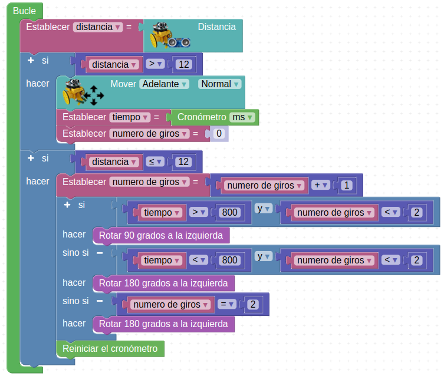

# Actividades 3DBot

  
*Robot 3DBot*  

## **A_05. Robot seguidor de línea**
Podemos hacer que el robot Imagina 3DBot se comporte como seguidor de línea utilizando los sensores de línea fotoeléctricos. Para ello, nos ayudaremos de las señales del sensor de línea izquierdo (SE), conectado a SL (Sensor Left) y el sensor de línea derecho (SD), conectado a SR (Sensor Right). Estos dos sensores ópticos permiten distinguir entre superficies de colores claros y superficies de colores oscuros.

El sensor de línea que usamos es un módulo TCRT5000, un sensor de módulo óptico (reflexivo) con comparador LM393, que detecta obstáculos con alta precisión. El sensor tiene una construcción compacta dónde el emisor de luz y el receptor se colocan en la misma dirección para detectar la presencia de un objeto utilizando la reflexión del infrarrojo sobre el objeto. La longitud de onda de trabajo es 950nm.

El transmisor es LED de infrarrojos y el receptor fototransistor. Mediante el uso del comparador LM393 el módulo tiene una salida binaria (D0) que esta en nivel 1 (objeto es detectado). El sensor permite la detección de un objeto a una distancia de hasta 12 mm. El módulo tiene un potenciómetro para el ajuste de la sensibilidad y los LED que indican el estado de alimentación y el sensor. El módulo dispone de salidas: analógicos y digitales.

  
*Sensor IR TCRT5000*  

Para entender el programa, vamos a representar los dos sensores ópticos con la siguiente figura:

  
*Representación de los sensores IR TCRT5000*  

Al ponerlos sobre una línea negra, se pueden dar los siguientes casos:

  
*Sensores sobre línea negra*  

En el caso A de la imagen superior, el robot se ha salido hacia la izquierda, por lo que habrá que girar a la derecha hasta que ambos sensores vuelva a encontrarse en la línea negra.

En el caso B el robot debe avanzar en línea recta porque va bien, y en el caso C deberá girar hacia la izquierda para corregir su rumbo, ya que se ha salido por la derecha. Con las curvas el funcionamiento es el mismo.

Además, cabe añadir el caso en el que el robot se sale totalmente de la línea negra (D), momento en el que ambos sensores están en superficie blanca.

### A_05_1. Primera versión de seguidor de línea
Para empezar, vamos a realizar un programa que actúe ante los casos A, B y C. Para el caso D, en el que el robot pierde totalmente la referencia de la línea, vamos a hacer simplemente que se detenga.

Lo primero que hacemos al iniciar el programa es guardar el estado de cada sensor de línea en una variable booleana, que son aquellas que sólo pueden tomar como valores 0 y 1. Esto significa que, o se detecta línea negra, o se detecta línea blanca. ¡Aquí no hay medias tintas!

Las variables booleanas las encontramos, al igual que las demás, en el apartado "Variables" de Arduinoblocks.

También vamos a utilizar el bloque correspondiente a los sensores ópticos "Línea negra detectada". Este bloque nos permite diferenciar entre una superficie negra y una blanca, y podemos encontrarlo en el apartado “3dBot”:

  
*Bloque línea negra detectada*  

Es importante tener en cuenta que este bloque indica señal de activación cuando se encuentra sobre línea negra.

Así, al guardar las lecturas del sensor de línea en una variable booleana, cuando el sensor esté sobre línea negra, esta variable valdrá 1. Sobre línea blanca valdrá 0.

La combinación de estas variables con los condicionales “si… hacer…” funciona de forma directa, sin tener que utilizar bloque de comparación. En la siguiente imagen vemos una condición que expresa directamente que, si la variable “Sensor derecho” vale 1, entonces que se ejecute la acción…

  
*Bloque si...hacer para variable booleana*  

Para completar el proceso, cabe señalar también el uso del bloque “no”, situado en el apartado “Lógica” de Arduinoblocks, que lo que hace es negar lo que se coloque detrás de él.

Por tanto, el siguiente condicional indica que, si el valor de “Sensor derecho” NO es 1, es decir, es 0, entonces que se ejecute la acción. Esta condición, que es el caso contrario a la anterior, se cumplirá cuando el sensor esté sobre superficie blanca.

  
*Bloque si...hacer para variable booleana negada*  

El programa para la actividad es el siguiente:

  
*A_05_1_3DBot*  
[Acceder al programa](http://www.arduinoblocks.com/web/project/1706012)

Es importante destacar que, dependiendo de la velocidad del robot y de lo cerradas que sean las curvas, es posible que en alguna de ellas el robot se pierda y se pare. Esto se debe a que, como decíamos, todavía no le hemos dicho qué hacer si ambos sensores detectan superficie blanca a la vez. ¡Vamos a solucionarlo!

### A_05_2. Segunda versión de seguidor de línea
Si ahora se pierde, es decir, si se encuentran ambos sensores en superficie blanca, empezará a girar en el último sentido que lo ha hecho justo antes de perderse. Para ello, cada vez que ejecute un movimiento debe memorizar que lo ha ejecutado.

Vamos a utilizar la variable de texto “Último movimiento” para memorizar cuál ha sido el último movimiento realizado.

  
*A_05_2_3DBot*  
[Acceder al programa](http://www.arduinoblocks.com/web/project/1803697)

## **A_06. Control por Bluetooth 1**
En esta actividad aprenderemos a controlar a nuestro robot con un dispositivo móvil Android a través de la funcionalidad Bluetooth del ESP32 STEAMakers.

Para la gestión de las órdenes en el móvil disponemos de la aplicación “[Imagina 3dBot](./APP/Imagina3dbot.apk)” (descarga el apk e instálala en un dispositivo móvil Android), hecha por Innova Didactic expresamente para nuestro robot:

  
*Aplicación Imagina 3DBot*  

Para decidir qué letras o números son los que hacen avanzar o girar, debemos consultar el apartado de información del aplicación:

  
*Información de la aplicación Imagina 3DBot*  

Teniendo en cuenta esta información vamos a realizar un programa que lea los datos recibidos por Bluetooth y ejecute un movimiento en función del dato recibido.

Además del bloque “Iniciar (Esclavo) Nombre”, con el que identificaremos nuestro robot en las conexiones Bluetooth, vamos a leer los datos procedentes del Bluetooth con el bloque “Recibir byte”, también ubicado en el apartado “Comunicaciones → Bluetooth ”.

Trabajar con lecturas en bytes nos obliga a leer los caracteres en código ASCII. Este código es una forma de codificar en números los caracteres y símbolos del lenguaje. Tranquilo, porque Arduinoblocks dispone de un bloque para hacer la traducción inmediata, por lo que no deberemos dar ningún paso extra.

Si la app indica que, cuando pulsas la flecha de movimiento hacia delante, envía por Bluetooth una U, por ejemplo, nosotros deberemos seleccionar una U en la programación en Arduinoblocks mediante el siguiente bloque:

  
*Bloque para traducir valor ASCII*  

El bloque para traducir los datos leídos en bytes (valores ASCII) se encuentra al final del menú “Text”.

El programa que debemos cargar en el robot queda de la siguiente manera:

  
*A_06_3DBot*  
[Acceder al programa](http://www.arduinoblocks.com/web/project/1707450)

Para vincular el dispositivo móvil con nuestro robot activaremos la función Bluetooth de nuestro dispositivo. Cuando aparezcan los diferentes dispositivos disponibles seleccionaremos nuestro robot según el nombre que hayamos escogido en el bloque "Iniciar (Esclavo) Nombre" e introducimos la contraseña si hemos puesto alguna. Una vez aceptada ya debería aparecer el robot en dispositivos vinculados.

Ahora repetimos la operación de conexión en la aplicación Imagina 3dBot. Pulsa el botón “Connect” situado junto al título de la misma y vuelve a seleccionar el nombre de tu robot.

>>
*Con la aplicación “Imagina 3dBot” puedes controlar otros elementos del robot, como la velocidad de los motores, el zumbador, los 3 LED y el emisor IR, y leer los datos de los sensores de ultrasonidos, de luz, de temperatura, de IR y seguidor de línea, del pulsador y de la entrada analógica A1.*

También puedes controlar el robot por Bluetooth con [Serial Bluetooth Terminal](https://play.google.com/store/apps/details?id=de.kai_morich.serial_bluetooth_terminal&hl=ca_ES) o con una aplicación creada con App Inventor o Thunkable. A continuación tienes un ejemplo desarrollado con App Inventor.

## **A_07. Control por Bluetooth 2**
Desarrollamos la aplicación en base al documento '**Control del 3DBot per Bluetooth**' publicado por Toni Hortal bajo licencia CC BY-SA NC.

Las instrucciones generales son:

* Crea y sube el programa al ESP32 STEAMakers
* Crea la aplicación con App Inventor
* Empareja el Bluetooth con tu dispositivo móvil
* Conecta la aplicación a tu dispositivo móvil
    * o con MIT AI2 Companion (Android) (RECOMENDADO!) / AppInventor (iOS)
    * o generando el APK
* Pulsa en el botón Conectar de la aplicación
* Selecciona el módulo Bluetooth
* Ya puedes utilizar la aplicación para controlar el robot!!!!

El programa en Arduinoblocks es:

  
*A_07_3DBot*  
[Acceder al programa](http://www.arduinoblocks.com/web/project/1707567)

Para el desarrollo de la app vamos a necesitar las imágenes que se ponen en los enlaces para descargarlas en formato png o formato svg por si queremos editarlas desde Inkscape.

|Archivo|Descripción|
|:-:|---|
|[Formato png](../img/app_inventor/png.zip)|Archivo comprimido con todas las imágenes|
|[Formato svg](../img/app_inventor/svg.zip)|Archivo que contiene los originales de giros y stop|

Una vez descargadas las imágenes y descomprimido el archivo .zip podemos subirlas mediante el botón "Subir archivo..." que tenemos en "Medios". En fase de diseño la app nos va a quedar con este aspecto:

  
*App en fase de diseño*  

Añade al "Visor" un cliente Bluetooth y un notificador (ambos componentes no visibles).  
Añade al "Visor" todos los elementos de la lista "Componentes".  
El contenedor "Tabular" es de 3 columnas por 3 filas.  
Añade al "Visor" un "SelectorDeLista" y hazlo invisible desmarcando su propiedad "Visible". En la imagen anterior esta propiedad aún lo hace visible.

Asigna a cada botón su imagen correspondiente.  
Cambia la propiedad "DispHorizontal" de "Screen1" a "Centro:3".

Modifica los textos de las etiquetas título.

Ahora cambiamos al modo "Bloques" para iniciar la programación que hacemos paso a paso:

* Comenzamos por programar el comportamiento de la ventana "Screen1" así como la conexión Bluetooth.

  
*Bloques App ventana "Screen1" y Bluetooth*  
Clic sobre la imagen para ver a tamaño completo

* A continuación vemos los bloques que definen el comportamiento de los botones.

  
*Bloques App botones*  
Clic sobre la imagen para ver a tamaño completo

A continuación tenemos los ficheros de descarga:

* [Descargar la app para Android .apk](./APP/Imagina3dbot.apk)
* [Descargar el proyecto .aia](./APP/Imagina_TRESDBot.aia)

## **A_08. Robot explorador autónomo**
En esta actividad equiparemos de “ojos” al robot con el sensor de ultrasonidos HC-SR04 y haremos que funcione autónomamente explorando su entorno sin chocar. Para evitar el choque iremos utilizando diversas estrategias, de la más simple a la más complicada.

  
*Sensor HC-SR04 en el robot*  

El bloque a usar se encuentra en el apartado “3dBot” de Arduinoblocks:

  
*Bloque "Distancia"*  

### A_08_1. Explorador simple
Primero haremos un programa para que el robot siempre vaya hacia delante y que cuando encuentre un objeto, a menos de 20 cm, se detenga. Y si el objeto desaparece debe volver a avanzar.

  
*A_08_1. Explorador simple*  
[Acceder al programa](http://www.arduinoblocks.com/web/project/1714806)

### A_08_2. Explorador con giros
La segunda estrategia consistirá en que, cuando se detenga, gire a la izquierda (el encoder está colocado en la rueda derecha) 90 grados y siga adelante. Para ello será especialmente importante utilizar el encoder que hemos explicado en la actividad [A_03. Control del robot con un encoder](http://127.0.0.1:8000/3DBot-con-ESP32-STEAMakers/3DBot/AI_3DBot/#a_03-control-del-robot-con-un-encoder)

Hemos visto también en esa actividad que, para girar 90 grados en la derecha, basta con girar a la derecha durante 6 pasos (aproximadamente).

  
*A_08_2. Explorador con giros*  
[Acceder al programa](http://www.arduinoblocks.com/web/project/1714808)

### A_08_3. Explorador con rotaciones
En lugar de la función “girar”, que sólo mueve una rueda, se puede utilizarse la función “rotar”, en la que giran ambas ruedas en sentido contrario.

  
*A_08_3. Explorador con rotaciones*  
[Acceder al programa](http://www.arduinoblocks.com/web/project/1714829)

Si comparamos los dos últimos ejemplos, vemos que el número de pasos necesario para rotar 90 grados no es igual que para girar 90 grados. Puedes probar con diferentes valores para ver los resultados.

También es muy importante tener en cuenta que sólo disponemos de encoder en la rueda derecha, y que en los giros a la derecha ésta no se mueve. Por tanto, en este giro no podremos controlar el ángulo girado. Dado que en las rotaciones sí se mueven ambas ruedas, aquí sí podemos medir el ángulo girado a la izquierda.

Por último, se puede cambiar la distancia mínima a la que detecta un obstáculo.

### A_08_4. Explorador para laberinto
En el programa anterior, él robot sólo puede esquivar obstáculos en una dirección, lo que provoca que cuando la única dirección posible es la izquierda, el robot se pierde o vuelve por dónde ha venido.

Para evitarlo vamos a utilizar dos rotaciones distintas, una de 90 grados y otra de 180 grados. Estos dos movimientos los definimos, por comodidad, en las siguientes funciones:

  
*A_08_4. Explorador para laberinto*  

Después de esto, si vamos al apartado “Funciones” veremos las nuevas funciones creadas y preparadas para insertar en cualquier parte de nuestro programa.

Además, vamos a introducir nuevas condiciones que den a nuestro robot más herramientas a la hora de enfrentarse a obstáculos.

Como antes el robot sólo giraba a la izquierda, esto provocaba que, cuando la única dirección posible estaba a la derecha, el robot se perdía o volvía por donde había venido.

Para evitarlo vamos a decirle que si gira a la izquierda e inmediatamente vuelve a encontrar otro obstáculo que vuelva a girar a la izquierda, querrá decir que realmente debía haber girado hacia la derecha (es lo más probable). Teniendo en cuenta que acaba de dar un giro de 90 grados en la dirección equivocada, le diremos que gire 180 grados para ir en la dirección opuesta.

Veremos en el programa que, para realizar esta condición explicada más efectiva, el robot tomará la decisión descrita, no sólo cuando haya interpretado dos giros inmediatamente seguidos a la izquierda, sino también cuando los haya interpretado en menos de 800 ms, aunque en este tiempo sí haya avanzado brevemente en línea recta.

  
*A_08_4. Explorador para laberinto*  
[Acceder al programa](http://www.arduinoblocks.com/web/project/1714856)

## **A_09. Control con Nunchuk**
Para utilizar el joystick debemos saber sus valores. Podemos leerlos como hemos visto anteriormente en la consola. Como referencia saber que tanto en el eje X como en el eje Y, el valor en el punto central es 128, hacia un lado 0 y en el lado contrario es 255.

  
*Valores joystick*  

Vamos a hacer un programa básico para poder controlar el robot hacia delante y atrás, y girar sobre sí mismo:

  
*A_09. Control con Nunchuk*  
[Acceder al programa](http://www.arduinoblocks.com/web/project/1714882)

