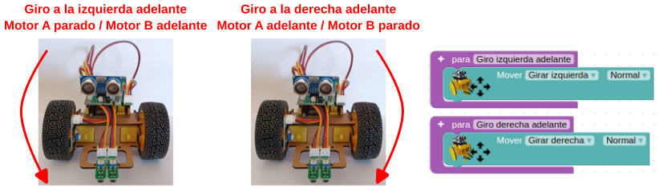

# Actividades 3DBot

  
*Robot 3DBot*  

## **A_01. Control de un motor DC**
La placa Imagina 3DBot ya lleva incorporado un driver o controlador de motores de CC. Con él podemos realizar el control de 2 motores de corriente continua (CC) de hasta 2 A (amperios).

  
*Posición de los conectores para motores*  

Seguramente habrás observado que en el menú 3DBot existen algunas instrucciones específicas para controlar el motor A o izquierdo, como la de la imagen adjunta. Cambiando la selección del motor sirve también para controlar las mismas acciones para el motor B o derecho.

  
*Bloque de control de motor del menú 3DBot*  

En el montaje del robot veíamos que, para conseguir un correcto funcionamiento con los bloques de Arduinoblocks, es necesario unir el motor izquierdo con el conector del motor A y el derecho con el conector B. Si los intercambiamos provocaremos que el robot se mueva en sentido contrario al programado.

Realizar esta práctica nos servirá para saber si hemos montado y conectado correctamente los motores. Vamos a aprender a hacer funcionar el motor A, donde está conectado el motor izquierdo. Lo haremos mover hacia delante en el sentido de la marcha, hacia atrás y lo pararemos.

  
*A_01_1_3DBot*  
[Acceder al programa](http://www.arduinoblocks.com/web/project/1699955)

Podemos observar en el funcionamiento el encendido de los LED que hay junto a los conectores para indicar el sentido de marcha del motor.

Podemos hacer funcionar cualquiera de los dos motores, en cualquier sentido, detenerlos e incluso podemos ajustar la velocidad de rotación.

* En **“Velocidad”**, valores muy pequeños no son capaces de poner en marcha el motor.
* cc
Si introducimos el siguiente programa observaremos que el motor A va hacia delante a una velocidad rápida durante 2 segundos, después a una velocidad más lenta otros 2 segundos y finalmente se detiene y repite el proceso.

  
*A_01_2_3DBot*  
[Acceder al programa](http://www.arduinoblocks.com/web/project/1699957)

Hasta aquí hemos visto que podemos controlar los motores de forma individual, pero para hacer funcionar al Imagina 3DBot existe un bloque aún más fácil que se llama “Mover”.

Ahora estamos preparados para sacarnos el carné básico de “Entrenador de robots”.

## **A_02. Control de dos motores DC**
Con un solo bloque, “Mover”, que encontramos en el apartado “3dBot”, podemos dar las órdenes de avanzar, retroceder, girar, rotar sobre sí mismo y parar. También podemos seleccionar la velocidad con tres opciones posibles.¡Así de sencillo!

  
*Bloque Mover*  

Vamos a realizar una serie de ejercicios para practicar todo lo que hemos aprendido hasta ahora y mezclar los temas de funciones, variables, etc.

### A_02_1. ¡A bailar!
El siguiente programa hace que el robot rote sobre sí mismo constantemente:

  
*A_02_1_3DBot*  
[Acceder al programa](http://www.arduinoblocks.com/web/project/1699983)

### A_02_2. ¡Creando secuencias de movimientos!
Vamos a empezar a estirar las piernas y las ruedas… con unos movimientos sencillos de calentamiento. Poco a poco haremos que estas secuencias dependan de estímulos externos y condiciones más elaboradas.

El robot realizará los siguientes movimientos:

* Ir en línea recta durante un segundo
* Girar a la izquierda durante un segundo
* Volver a ir en línea recta durante otro segundo
* Girar a la derecha durante otro segundo

  
*A_02_2_3DBot*  
[Acceder al programa](http://www.arduinoblocks.com/web/project/1699987)

### A_02_3. Giro y semáforo loco
Empieza el espectáculo: LED, cámaras y… ¡Acción!

Ahora nuestro robot rotará todo el rato a la izquierda, mientras sus 3 LED se encienden y apagan de forma secuencial. ¡Recuerda que el ritmo desenfrenado lo marcas tú!

Ten en cuenta que el robot estará rotando a la izquierda todo el rato, independientemente de lo que hagan los LED, ¡ya que nunca le ordenamos que se pare!

  
*A_02_3_3DBot*  
[Acceder al programa](http://www.arduinoblocks.com/web/project/1700217)

### A_02_4. Movimientos
Para poder conocer todos los sentidos de giro posibles que puede hacer el robot, te propongo que hagas los programas de los siguientes movimientos:

* <b>Adelante y atrás</b>

  
*Adelante y atrás*  

* <b>Pivotar</b>

  
*Pivotar*  

* <b>Giros adelante</b>

  
*Giros adelante*  

* <b>Giros atrás</b>

  
*Giros atrás*  

* <b>Parar</b>

  
*Parar*  

En el programa siguiente se ejecutan todos los movimientos de forma indefinida a intervalos de tres segundos.

  
*A_02_4_3DBot*  
[Acceder al programa](http://www.arduinoblocks.com/web/project/1700329)

### A_02_5. Señalizando la marcha atrás
Este programa tiene dos partes fundamentales:

* Avance hacia delante con el piloto verde encendido.
* Marcha atrás con el piloto rojo encendido y un silbato intermitente de señalización de maniobra "peligrosa".

Vamos a presentar una versión del programa en la que creamos dos funciones, y otra en la que se realiza el programa completo directamente en el bucle (sin funciones). La diferencia en este caso no es significativa, ya que no es un programa extenso ni se realizan muchas repeticiones.

Por cierto, cuidado, porque lo peligroso puede acabar siendo el silbato… para los oídos.

* **Programa con funciones**

Se definen dos funciones: “ir hacia delante” e “ir hacia atrás”. El programa completo es el siguiente:

  
*A_02_5_fun_3DBot*  
[Acceder al programa](http://www.arduinoblocks.com/web/project/1700363)

* **Programa sin funciones**

  
*A_02_5_3DBot*  
[Acceder al programa](http://www.arduinoblocks.com/web/project/1700364)

### A_02_6. En busca de la luz
Vamos a jugar algo con los niveles de luz. El robot Imagina 3DBot tiene un sensor de luz (LDR) que detecta las variaciones de iluminación y las "traduce" a señales de tensión. En el apartado "3dBot" se encuentra el bloque que se encarga de programar este sensor.

  
*Bloque sensor de luz*  

Además, en el apartado “Lógica” encontramos un bloque que nos permite realizar comparaciones que NO dependen de operaciones matemáticas directas, es decir, comparaciones de estados, valores, etc. Pulsando en la flecha dibujada en el bloque se abre un desplegable con diferentes opciones de comparación:

  
*Bloque comparar*  

Vamos a combinar este último bloque con funciones ya aprendidas para comparar un valor de iluminación fijado por nosotros con el valor de iluminación que lea el robot. En este caso, vamos a guardar los valores de iluminación leídos en la variable “luminosidad”. Utilizaremos también el bloque "Un número" del apartado “Matemáticas” para hacer la comparación.

Si hay luz, ¡avanza adelante!

En este caso vamos a hacer que, si el valor de luz detectado es superior a una cifra (en este ejemplo 300) el robot avance en línea recta. Si el valor es menor, que permanezca parado.

Puedes utilizarlo, por ejemplo, para que se mueva sólo cuando se le enfoca con la linterna del móvil en una habitación con poca luz y se comporte como un robot tipo polilla.

  
*A_02_6_3DBot*  
[Acceder al programa](http://www.arduinoblocks.com/web/project/1700389)

Si después de cargar el programa el robot se mueve todo el rato (aunque no se le enfoca con la linterna), querrá decir que el nivel de luz de la sala es mayor que este 300 incluido en el programa. En este caso simplemente habrá que aumentarlo hasta conseguir el resultado deseado.

Por otro lado, sólo cambiando el operando de la comparación conseguiremos el efecto contrario: que el robot avance cuando haya poca luz y se detenga cuando el nivel suba:

  
*A_02_6bis_3DBot*  
[Acceder al programa](http://www.arduinoblocks.com/web/project/1700395)

## **A_03. Control del robot con un encoder**
¿Qué es un **encoder**?

<b>Esta actividad requiere de la colocación de una pieza impresa en 3D en el interior de la rueda derecha, tal y como se describe en el apartado correspondiente de [Archivos de diseño](./archivosFab.md)</b>

En pocas palabras, un encoder es un dispositivo de detección que proporciona una respuesta. Los encoders convierten el movimiento en una señal eléctrica que puede ser leída por algún tipo de dispositivo de control en un sistema de control de movimiento, como por ejemplo nuestro robot. Nos permitirá saber cuánto avanza y retrocede nuestro robot.

Hemos visto en el montaje del robot que en la rueda derecha existe un sensor óptico con el fin de actuar como un encoder. La función del encoder es convertir en señales eléctricas el giro de la rueda, para así saber cuánto ha girado en cada momento.

Como se aprecia en la siguiente figura, el sensor óptico se activa cuando detecta un radio de nuestra rueda delante, y se desactiva cuando no hay nada (espacio entre radios).

  
*Rueda encoder*  

Teniendo en cuenta que la rueda tiene, por ejemplo, 12 radios, cuando hayamos contado 12 pulsos significará que la rueda ha dado una vuelta completa.

Podemos utilizar esta funcionalidad para controlar distancias y giros en el 3DBot. Lo hacemos con el bloque “**Esperar … pasos**” que se encuentra en el apartado “3dBot”. A cada pulso recibido se le llama "paso". Siguiendo el ejemplo de antes, una vuelta de rueda completa serán 12 "pasos".

  
*Bloque Esperar … pasos*  

Se puede comprobar experimentalmente que, aproximadamente, para dar un giro de 90 grados hacia la izquierda, la rueda derecha debe mover 4 pasos (pasan 4 radios de la rueda por delante del sensor óptico). De esta forma podemos decirle a nuestro robot que gire 90 grados, 180 grados, etc.

### A_03_1. Lectura básica del encoder
En este primer programa simplemente vamos a leer el valor analógico del pin A1 al que está conectado el sensor y convertirlo a valor Booleano. El sensor lo activamos moviendo la rueda derecha y los resultados los vemos en la Consola.

  
*A_03_1_3DBot*  
[Acceder al programa](http://www.arduinoblocks.com/web/project/1700494)

### A_03_2. Recorrido programado contando “pasos”
El programa funciona de forma similar a los juegos con LED utilizando la función “Esperar… pasos”. Aquí, el robot mantendrá la última dirección programada hasta que se dé el número de pasos descrito.

  
*A_03_2_3DBot*  
[Acceder al programa](http://www.arduinoblocks.com/web/project/1701223)

## **A_04. Control del robot por mando IR**
La placa Imagina 3DBot lleva incorporado un diodo receptor de infrarrojos. Se encuentra junto a los sensores de temperatura y luz.

  
*Posición del recptor de IR*  

Pasamos a controlar el robot en tiempo real. Vamos a utilizar inicialmente el mando de Keyestudio, que dispone de un bloque específico en Arduinoblocks, lo que hace que la programación sea muy rápida y sencilla.

[Ampliación de información sobre infrarrojos](http://127.0.0.1:8000/3DBot-con-ESP32-STEAMakers/Imagina/actividades/#a08-infrarrojos)

Posteriormente aprenderemos a utilizar cualquier mando, incluso el de la tele, que siempre está a mano.

Y finalmente haremos un programa algo más avanzado en el que no sólo cambiaremos la dirección del robot, sino también su velocidad.

### A_04_1. Control de dirección
Para este ejemplo vamos a utilizar el mando de infrarrojos (IR) de Keyestudio. Concretamente utilizaremos las teclas de dirección para mover el robot en las 4 direcciones. Además, con el botón central de “OK” haremos que se detenga. Para ello necesitamos 2 nuevos bloques:

* en el apartado “3dBot” tenemos el bloque “Receptor de IR (Texto HEX)”, que lee los datos procedentes de un mando con infrarrojos:

  
*Bloque receptor de IR*  

* en el apartado “3dBot” encontramos el bloque del mando de Keyestudio, en el que, pulsando en el desplegable, podemos seleccionar cualquiera de sus teclas:

  
*Bloque del mando de Keyestudio*  

<b><u>IMPORTANTE:</u></b><b> tienes que cambiar la versión del comando a v2</b>

Utilizaremos el bloque de comparación del apartado “Texto” que dice “igual a” para comparar el dato leído por el sensor IR con el dato seleccionado por nosotros para una función determinada.

Con un condicional “si… hacer…” decidiremos qué acción tomar.

En la variable "Mando" guardamos los valores leídos por el receptor infrarrojo, para así compararlos con los valores correspondientes al mando. El programa resultante lo podemos ver a continuación:

  
*A_04_1. Control de dirección*  
[Acceder al programa](http://www.arduinoblocks.com/web/project/1700481)

### A_04_2. Control de dirección y velocidad
Ampliamos el ejercicio anterior para introducir el control de velocidad con el mando de Keyestudio.

En el apartado “3dBot” encontraremos el bloque para controlar la dirección de cada motor y su velocidad.

  
*Bloque control dirección y velocidad*  

La velocidad del motor se controla con el dato numérico que hay en la parte derecha del bloque. Su velocidad aumenta proporcionalmente al número incluido, siendo 0 motor parado y 255 motor a su máxima velocidad. Aquí podemos incluir una variable para que esa velocidad provenga de una lectura del mando IR, por ejemplo.

En el desplegable, junto a la palabra “Motor”, seleccionamos qué motor queremos controlar.

  
*Bloque control dirección y velocidad. Motor*  

Y en el desplegable siguiente escogemos el sentido de giro:

  
*Bloque control dirección y velocidad. Giro*  

Una vez conocidos los nuevos elementos, vamos a realizar el programa. Para ello, definimos las variables que representan a los movimientos que podrá efectuar el robot. Como decíamos, la velocidad la tomaremos de una variable “Velocidad” que asignaremos en el bucle del programa.

<b><u>Funciones</b></u>

* **“Adelante”**: con los 2 motores girando en el sentido de avance, hacemos que se mueva en línea recta:

  
*Función adelante*  

* **"Giro izquierda"**: lo conseguimos avanzando con la rueda derecha y manteniendo la izquierda parada:

  
*Función giro izquierda*  

* **"Giro derecha"**: lo conseguimos avanzando con la rueda izquierda y manteniendo la derecha parada:

  
*Función giro derecha*  

* **“Parar”**: lo hacemos seleccionando en ambos motores la opción “Parar”.

  
*Función parar*  

<b><u>Bucle</b></u>

Primero leemos los datos recibidos por el receptor IR y los guardamos en la variable “Mando”. A continuación, diferenciamos los datos recibidos en 2 tipos:

* Datos para el cambio de velocidad
* Datos para el cambio de dirección

Los datos para el cambio de velocidad los guardamos en la variable numérica “Velocidad”, y los datos para el cambio de sentido de giro los guardamos en la variable de texto “Giro”.

Como hemos visto en la definición de las funciones, la variable “Velocidad” la insertamos en los bloques de movimiento de los motores, dentro de la definición de las funciones.

Por último, establecemos las condiciones para que, dependiendo del valor de la variable Giro, vaya en la dirección deseada.

  
*A_04_2_3DBot*  
[Acceder al programa](http://www.arduinoblocks.com/web/project/1701232)

### A_04_3. Lectura de los códigos de las teclas desde un mando IR cualquiera
Primero debemos ver qué código nos envía cada botón del mando que vamos a utilizar. Lo que vamos a hacer es presionar el botón del mando, leer el dato enviado e imprimirlo en la pantalla del ordenador. De ahí ya podemos copiarla para nuestro futuro programa.

Simplemente hay que recordar que para visualizar datos en la pantalla es necesario realizar el envío de datos al ordenador cada cierto tiempo (no constantemente) para no saturar la comunicación. Veamos cómo queda el programa:

  
*A_04_3_3DBot*  
[Acceder al programa](http://www.arduinoblocks.com/web/project/1702217)

Dependiendo de qué botón se pulse, aparecerá un valor u otro. Es importante tener en cuenta que si no accionamos ningún pulsador lo habitual será recibir un 0. Obtendrás algo así, después de conectarte a la “Consola serie”:

  
*A_04_3_3DBot*  

La asociación de códigos, teclas y movimientos es:

>>
Flecha arriba: E0E006F9 - Adelante  
Fleccha izquierda: E0E0A659 - Giro izquierda  
Flecha abajo: E0E08679 - Atrás  
Flecha derecha: E0E046B9 - Giro derecha  
Botón OK: E0E016E9 - Parar

### A_04_4. Control del robot con un mando IR cualquiera
Utilizando los códigos leídos con el programa anterior vamos a realizar un sistema de control de nuestro robot por mando IR. El programa es exactamente igual que el del ejercicio anterior, sólo que ahora comparemos con estos nuevos códigos.

En este caso vamos a guardar las lecturas del sensor IR en una variable llamada “Lectura mando”. Da igual el nombre, puedes poner lo que quieras.

  
*A_04_4_3DBot*  
[Acceder al programa](http://www.arduinoblocks.com/web/project/1702292)

