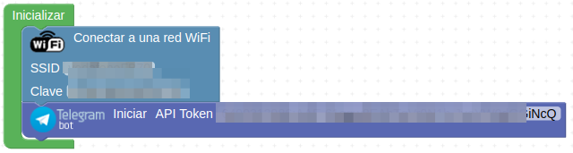
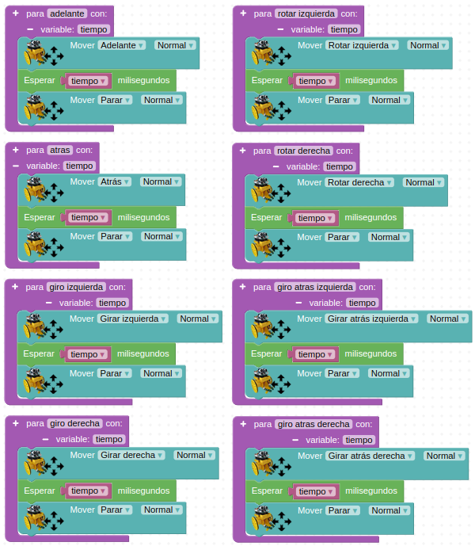
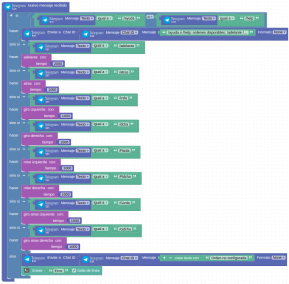
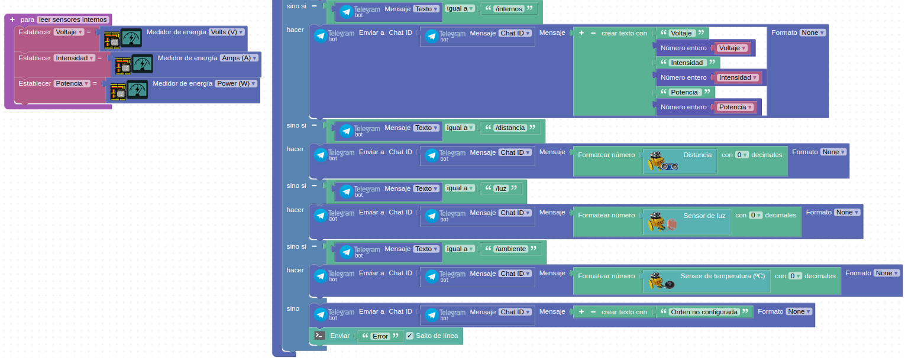

# Actividades 3DBot

  
*Robot 3DBot*  

Se recomienda revisar los contenidos en [actividades avanzadas con la placa Imagina 3DBot](../Imagina/avanzadas_imagina.md) antes de afrontar esta actividad con el robot.

## **Telegram. Movimientos 3DBot**
Ejemplo basado en el tutorial de Pedro Ruiz [Ejemplos 3DBot + ESP32 STEAMakers](https://pedroruizf.github.io/ejemplos_3dbot/index.html).

Lo que haremos será controlar los movimientos del robot mediante un bot de Telegram.

Comenzamos por configurar la conexión WiFi y el API Token de Telegram.

  
*Telegram. Movimientos 3DBot*  

Definimos las siguientes funciones con paso de valor desde una variable:

  
*Telegram. Movimientos 3DBot*  

Finalmente configuramos el evento de Telegram 'Nuevo mensaje recibido' y ya podemos subir el programa a la placa.

  
*Telegram. Movimientos 3DBot*  
Clic sobre la imagen para ampliarla  
[Acceder al programa](http://www.arduinoblocks.com/web/project/1715586)

## **Telegram. Movimientos y control de consumo 3DBot**
Ejemplo basado en el tutorial de Pedro Ruiz [Ejemplos 3DBot + ESP32 STEAMakers](https://pedroruizf.github.io/ejemplos_3dbot/index.html).

Lo que haremos será controlar los movimientos del robot y consultar los datos de sus sensores tanto internos como e la placa Imagina 3DBot mediante un bot de Telegram.

Partimos del ejemplo anterior y comenzamos por configurar la conexión WiFi y el API Token de Telegram.

  
*Telegram. Movimientos 3DBot*  

Las funciones y bloques del ejemplo anterior los dejamos como están.

Modificamos el mensaje de ayuda para que tenga estos textos:

>
/ayuda o /help: ordenes disponibles; /adelante /atras /izda /dcha /Rizda para rotar a la izquierda /Rdcha para rotar a la derecha  /Gizda para giro atras izquierda /Gdcha para giro atras derecha /internos para consultar valores de sensores internos /distancia da la distancia a objeto /luz da el valor de luminosidad /ambiente da la temperatura ambiente

Añadir la función y bloques que vemos seguidamente.

  
*Telegram. Movimientos y control de consumo 3DBot*  
[Acceder al programa](http://www.arduinoblocks.com/web/project/1715595)

## **IoT con ThingSpeak**

