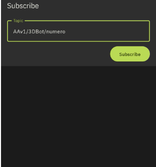

# Actividades 3DBot

  
*Robot 3DBot*  

En esta sección realizaremos ejercicios con elementos IoT, interactuar con Telegram, Bluetooth, mando Nunchuk. Todo ello basado en:

[Manual 3DBot](https://shop.innovadidactic.com/es/imagina-steam-y-makers/1598-kit-imagina-arduino-3dbot-esp32-steamakers-para-arduinoblocks.html) de [Innova Didactic](https://shop.innovadidactic.com/es/)

Tutorial de Pedro Ruiz [Ejemplos 3DBot + ESP32 STEAMakers](https://pedroruizf.github.io/ejemplos_3dbot/index.html)

Se recomienda revisar los contenidos en [actividades avanzadas con la placa Imagina 3DBot](../Imagina/avanzadas_imagina.md) antes de afrontar esta actividad con el robot.

## **Telegram. Movimientos 3DBot**
Ejemplo basado en el tutorial de Pedro Ruiz [Ejemplos 3DBot + ESP32 STEAMakers](https://pedroruizf.github.io/ejemplos_3dbot/index.html).

Lo que haremos será controlar los movimientos del robot mediante un bot de Telegram.

Comenzamos por configurar la conexión WiFi y el API Token de Telegram.

  
*Telegram. Movimientos 3DBot*  

Definimos las siguientes funciones con paso de valor desde una variable:

  
*Telegram. Movimientos 3DBot*  

Finalmente configuramos el evento de Telegram 'Nuevo mensaje recibido' y ya podemos subir el programa a la placa.

  
*Telegram. Movimientos 3DBot*  
Clic sobre la imagen para ampliarla  
[Acceder al programa](http://www.arduinoblocks.com/web/project/1715586)

## **Telegram. Movimientos y control de consumo 3DBot**
Ejemplo basado en el tutorial de Pedro Ruiz [Ejemplos 3DBot + ESP32 STEAMakers](https://pedroruizf.github.io/ejemplos_3dbot/index.html).

Lo que haremos será controlar los movimientos del robot y consultar los datos de sus sensores tanto internos como e la placa Imagina 3DBot mediante un bot de Telegram.

Partimos del ejemplo anterior y comenzamos por configurar la conexión WiFi y el API Token de Telegram.

  
*Telegram. Movimientos 3DBot*  

Las funciones y bloques del ejemplo anterior los dejamos como están.

Modificamos el mensaje de ayuda para que tenga estos textos:

>
/ayuda o /help: ordenes disponibles; /adelante /atras /izda /dcha /Rizda para rotar a la izquierda /Rdcha para rotar a la derecha  /Gizda para giro atras izquierda /Gdcha para giro atras derecha /internos para consultar valores de sensores internos /distancia da la distancia a objeto /luz da el valor de luminosidad /ambiente da la temperatura ambiente

Añadir la función y bloques que vemos seguidamente.

  
*Telegram. Movimientos y control de consumo 3DBot*  
[Acceder al programa](http://www.arduinoblocks.com/web/project/1715595)

## **MQTT. Control del 3DBot con IoT**
En [Teoría básica de IoT](../Imagina/IoT_basico.md) tienes disponible información mas extensa sobre el tema de IoT y MQTT.

**MQTT** es un protocolo de comunicación entre diferentes dispositivos (clientes, nodos) a través de un servidor (broker), mediante la publicación/suscripción de mensajes asociados a temas (topics).

Es muy ligero, consume muy pocos recursos. Esto lo hace idóneo para trabajar la IoT con sensores y dispositivos de baja potencia. El uso de entornos gráficos de programación permite trabajar con MQTT de forma creativa a muchos niveles.

El bloque 'Iniciar' de la categoría *'Comunicaciones - WiFi /IoT - MQTT Client'* permite definir los parámetros de la comunicación:

  
*MQTT. Control del 3DBot con IoT*  

Para poder trabajar con estos elementos utilizamos:

* una placa ESP32 STEAMakers que enviará datos a un broker MQTT
* un servidor MQTT que puede ser público, gratuito y sin configuración como **mqtt.eclipseprojects.io** o **broker.hivemq.com** o bien uno propio creado con [mosquitto](https://mosquitto.org/)
* un dispositivo móvil que se suscribirá a los temas publicados a través de una aplicación móvil. Existen muchas aplicaciones, unas mas completas que otras, y veremos algunas en las actividades que vamos a hacer sobre el tema, pero para mi la mas completa es **IoT MQTT Panel**.

<b>Debemos tener en cuenta que los servidores MQTT públicos gratuitos no son seguros y cualquiera puede suscribirse a nuestros mensajes y publicar en ellos, y en consecuencia podrán enviar órdenes. Se recomienda utilizar estos brokers solamente en sistemas educativos y de pruebas</b>

### MQTT_AAv1. Generar datos y publicar temas
Para explicar un poco el funcionamiento básico vamos a hacer que la placa ESP32 STEAMakers genere un dato (un número entre 1 y 100) y lo vamos a publicar en **broker.hivemq.com** para visualizarlo en tres aplicaciones diferentes.

En este primer ejemplo publica el topic la placa y se suscribe la aplicación.

Vamos a comenzar por instalar en un smartphone las siguientes apps:

  
*MQTT_AAv1. Apps*  
[IoT MQTT Panel](https://play.google.com/store/apps/details?id=snr.lab.iotmqttpanel.prod&hl=es&gl=US) -- [MyMQTT](https://play.google.com/store/apps/details?id=at.tripwire.mqtt.client&hl=es&gl=US) -- [MQTT Dashboard](https://play.google.com/store/apps/details?id=com.oytechnologyy.mqtt_dashboard)

Vamos a comenzar por crear el programa siguiente y subirlo a la placa:

  
*MQTT_AAv1*  
[Acceder al programa](http://www.arduinoblocks.com/web/project/1750268)

<b>MUY IMPORTANTE: el Client ID de Arduinoblocks NO puede ser el mismo que el Cliente Id escrito en la aplicación, ya que un broker NO puede tener dos identificadores de cliente iguales.</b>

A continuación vamos a ver resultados en las tres APPs citadas.

* <b>MyMQTT</b>

Comenzamos por configurar la APP y conectarnos al broker:

  
*MQTT_AAv1*  

Nos suscribimos al topic establecido en el programa:

  
*MQTT_AAv1*  

Una vez suscritos y configurada la conexión el topic queda habilitado:

  
*MQTT_AAv1*  

El panel o tablero (dashboard) comienza a recibir los números:

  
*MQTT_AAv1*  

* <b>MQTT Dashboard</b>

Lo primero que debemos hacer es añadir un broker:

  
*MQTT_AAv1*  

Ahora introducimos los datos del broker y lo salvamos:

  
*MQTT_AAv1*  

Ya tenemos el broker. Si entramos en el mismo ya podemos conectarnos mediante el botón 'Connect' y poder continuar:

  
*MQTT_AAv1*  

Configurado el broker y conectados al mismo, ya podemos suscribirnos al topic mediante el botón 'Subscriber':

  
*MQTT_AAv1*  

Realizada la suscripción veremos algo como:

  
*MQTT_AAv1*  

Ya podemos ver como se reciben los datos:

  
*MQTT_AAv1*  

* <b>IoT MQTT Panel</b>

Con las APPs anterior vemos los datos de forma numérica o textual. ahora vamos a ver esos mismos datos pero añadiendo objetos al panel.

Vamos a describir los pasos a seguir con **IoT MQTT Panel**. La primera vez que iniciamos la APP se nos presenta la siguiente pantalla:

  
*MQTT_AAv1*  

Indicando que debemos establecer un nombre, un broker, el puerto y añadir un panel:

  
*MQTT_AAv1*  

El 'Client ID' lo puedes dejar en blanco (la aplicación generará uno aleatoriamente) o escribir uno.

<b>MUY IMPORTANTE: este Client ID NO puede ser el mismo que el Cliente Id escrito en Arduinoblocks, ya que un broker NO puede tener dos identificadores de cliente iguales.</b>

El panel de conexiones mostrará las que tengamos configuradas:

  
*MQTT_AAv1*  

Si todo ha ido bien, verás un icono en forma de nube de color naranja en la esquina superior derecha, que indica que la aplicación se ha conectado correctamente al broker.

Si, en cambio, ves un icono en forma de nube de color gris tachado, revisa los datos de la conexión.

Pulsando sobre la nube naranja accedemos al dashboard añadido anteriormente:

  
*MQTT_AAv1*  

Pulsa el botón "ADD PANEL" y se mostrará una lista de los 21 artilugios disponibles, que son:

>
* *Button*
* *Switch*
* *Slider*
* *Text Input*
* *Text Log*
* *Node Status*
* *Combo Box*
* *Radio Buttons*
* *LED Indicator*
* *Multi-State Indicator*
* *Progress*
* *Gauge*
* *Color Picker*
* *Date & Time Picker*
* *Line Graph*
* *Bar Graph*
* *Chart*
* *Image*
* *Barcode Scanner*
* *URI Launcher*
* *Layout Decorator*

Como ejemplo añadiremos un *Progress* (barra de progreso) y un *Gauge* o indicador de aguja, como se muestra en las siguientes imágenes:

  
*MQTT_AAv1*  

A continuación vemos una captura recibiendo datos:

  
*MQTT_AAv1*  

|Icono|Significado|
|:-:|---|
||El icono naranja de la nube (parte superior derecha) indica que la conexión con el broker es correcta|
||Podemos desconectarnos pulsando el icono naranja, que cambiará a gris o conectarnos si está en gris|
||Si el icono parpadea entre estos dos significa que nuestro Cliente ID está repetido en el broker y, por tanto, debemos cambiarlo por otro|

### MQTT_AAv2. Control del LED verde desde la aplicación
Vamos a controlar desde la aplicación **IoT MQTT Panel** del móvil el LED verde (D3 / IO25) de la placa Imagina 3DBot.

Utilizamos:

* un dispositivo móvil que generará datos y publicará temas a través de una aplicación móvil
* un servidor MQTT público, gratuito y sin configuración
* una placa ESP32 STEAMakers que se suscribirá a los temas publicados y generará acciones

En este ejemplo publica el topic la aplicación y se suscribe la placa.

Comenzamos por dirigirnos a la página principal de la aplicación (donde se muestran las conexiones). Si no estamos ahí podemos escoger "All Connections" del menú que nos muestran las tres líneas de la esquina superior izquierda.

  
*MQTT_AAv2*  

Pulsamos sobre 'Pruebas 3dbot" y sobre los tres puntos a la derecha de nube, se despliega un menú en el que vamos a escoger "Add a new dashboard":

  
*MQTT_AAv2*  

Cumplimentamos los campos como vemos a continuación y pulsamos sobre el botón "CREATE":

  
*MQTT_AAv2*  

Entra en el nuevo panel pulsando el botón en la parte inferior y después pulsa el botón "ADD PANEL".

  
*MQTT_AAv2*  

Selecciona un artilugio Button para encender el LED y otro para apagar el LED:

  
*MQTT_AAv2*  

La situación de la aplicación es:

  
*MQTT_AAv2*  

Abre un nuevo proyecto en Arduinoblocks y sube el programa siguiente a la placa (<b>recuerda que el Cliente Id del blog MQTT Iniciar NO puede ser el mismo que el del aplique IoT MQTT Panel</b>):

  
*MQTT_AAv2*  
[Acceder al programa](http://www.arduinoblocks.com/web/project/1750302)

### Mejora de MQTT_AAv2
Con el ánimo de ampliar un poco el manejo de la aplicación vamos a añadirle algunos elementos a la misma sin cambiar nada en el programa que cargamos en la placa ESP32 STEAMakers. Comenzamos por añadir un "LED indicator", que simplemente nos va a mostrar el estado del diodo LED verde. Establecemos la configuración que vemos en la imagen siguiente:

  
*Mejora MQTT_AAv2*  

El segundo elemento que vamos a añadir es un "Switch" que configuramos de la forma que vemos a continuación:

  
*Mejora MQTT_AAv2*  

Al activar "Use icon switch" se permite configurar los colores de encendido y apagado y además pulsando sobre las áreas señaladas se nos despliega una ventana donde podemos elegir el icono apropiado de entre los disponibles.

  
*Mejora MQTT_AAv2*  

En la aplicación el funcionamiento es el que vemos en la animación siguiente:

  
*Mejora MQTT_AAv2*  

### MQTT_AAv3. Control del robot
Comenzamos por añadir un nuevo Dashboard a nuestro panel de control:

*MQTT_AAv3*  

Añadimos como primer elemento un "Button" que configuramos de la forma que vemos a continuación:

  
*MQTT_AAv3*  

Utilizando la herramienta de copia que está junto al signo de añadir panel copiamos el anterior y lo editamos para crear el botón atrás. En nuestro caso le cambiamos el color y el icono y obligato8riamente le asignamos su valor en "Payload". Seguimos haciendo esta operación hasta añadir todos los botones necesarios y nos quedará una configuración como la siguiente:

  
*MQTT_AAv3*  

El programa lo vemos en la imagen siguiente:

  
*MQTT_AAv3*  
[Acceder al programa](http://www.arduinoblocks.com/web/project/1766818)

### Mejora de MQTT_AAv3
Una vez comprobado que la actividad **"MQTT_AAv3. Control del robot"** funciona correctamente vamos a hacer que la placa envie a la aplicación del móvil un mensaje con la indicación del movimiento que se está realizando.

En la aplicación añadimos un panel de tipo "Text Log" que configuramos como vemos a continuación:

  
*Mejora MQTT_AAv3*  

En cada movimiento, tras realizar el mismo se actualiza el valor de la variable de texto 'estado' que es donde escribimos el movimiento que se está realizando. A continuación vemos parte de estos movimientos y valor de dicha variable.

  
*Mejora MQTT_AAv3*  

El programa lo vemos en la imagen siguiente:

  
*MQTT_AAv3*  
[Acceder al programa](http://www.arduinoblocks.com/web/project/1767444)

## **IoT con ThingSpeak**
Vamos a crear unas actividades de IoT con el robot para subir datos al broker ThingSpeak mientras el robot va siguiendo la línea negra, tal y como vimos en la [A_05_2. Segunda versión de seguidor de línea](http://127.0.0.1:8000/3DBot-con-ESP32-STEAMakers/3DBot/AAm_3DBot/#a_05_2-segunda-version-de-seguidor-de-linea).

### AAv4_IoT con 3DBot: modo dato a dato
En esta actividad vamos a crear un ejemplo en el que subimos los datos a ThinSpeak de uno en uno. Recuperamos el ejemplo para que el robot se mueva por el circuito y añadimos funciones para leer los sensores y subir datos a la nube.

En los ejemplos del apartado [Subir datos a Internet](http://127.0.0.1:8000/3DBot-con-ESP32-STEAMakers/Imagina/avanzadas_imagina/#subir-datos-a-internet) dentro de las [actividades avanzadas con la placa Imagina](http://127.0.0.1:8000/3DBot-con-ESP32-STEAMakers/Imagina/avanzadas_imagina/) tenemos descritos los pasos a seguir para subir datos a ThingSpeak. Trabajaremos también con un canal y variables ampliando a alguna mas que vemos seguidamente.

Se procede siempre a configurar la conexión WiFi y la inicialización de MQTT en el bucle 'Inicializar'. A continuación establecemos los movimientos del robot y finalmente creamos la función 'subir datos' que enviará uno a uno los valores medidos a la nube. El retardo establecido de 2000 ms es posible porque las pruebas se realizan en una cuenta de pago. A continuación tenemos el programa que soluciona la actividad.

  
*MQTT_AAv4*  
[Acceder al programa](http://www.arduinoblocks.com/web/project/1803671)

La imagen siguiente muestra algunos resultados obtenidos:

  
*MQTT_AAv4*  

### AAv5_IoT con 3DBot: publicacion multiple
En Arduinoblocks se han creado unos nuevos bloques que permiten publicar múltiples valores vía MQTT con ThingSpeak. Ahora se permite enviar varios datos a la vez sin tener en cuenta las restricciones de tiempo mínimo entre publicaciones impuestas por el broker. Es decir, se suben todos los datos al mismo tiempo debiendose mantener el tiempo entre subidas.

En la imagen podemos observar la nueva forma que toma la función 'subir datos' con estos nuevos bloques.

  
*MQTT_AAv5*  

El programa es el siguiente:

  
*MQTT_AAv5*  
[Acceder al programa](http://www.arduinoblocks.com/web/project/1807003)

La imagen siguiente muestra algunos resultados obtenidos:

  
*MQTT_AAv5*  

