# Estructura 3DBot
Aquí vamos a informar y poner enlaces de descarga de los ficheros actualizados para imprimir en 3D o cortar con laser la estructura necesaria para realizar el montaje del robot.

También vamos a hacer lo mismo pero con los ficheros correspondientes para impresión 3D del accesorio encoder para las ruedas del robot.

## **Estructura**
El aspecto de las piezas 3D necesarias para el montaje de la estructura las vemos en la imagen siguiente:

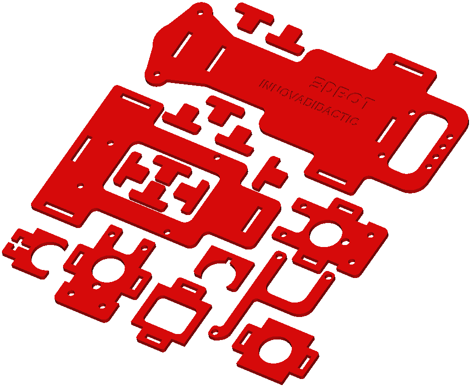  
*Piezas para impresión 3D*  

La estructura montada sin vitaminas (componentes) queda así:

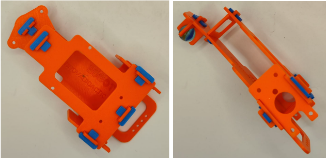  
*Estructura montada*  

A continuación se dan los enlaces para descargar los archivos de impresión:

* [Aquí está el archivo stl con todas las piezas](./Estructura/3DBot_Impresio_3D.stl) listo para laminar e imprimir.

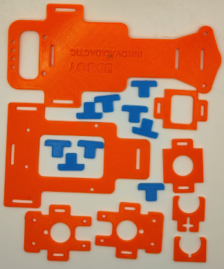  
*Piezas impresas*  

* [Un archivo comprimido con las piezas individuales](./Estructura/partes.zip) por si necesitamos imprimir alguna de manera individual. En el nombre del archivo se indica el número de piezas necesario.

|Pieza| Archivo |Pieza| Archivo |
|:-:|:-:|:-:|:-:|
|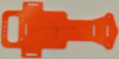|3DBot_basex1.stl |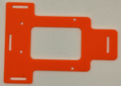|3DBot_soporte_electronicax1.stl |
|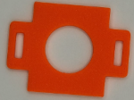|3DBot_tope_posterior_pbx1.stl |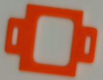|3DBot_tope_delantero_pbx1.stl |
|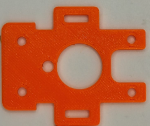|3DBot_soporte_motorx2.stl |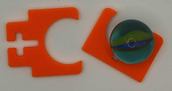|3DBot_bola_loca_soportex1.stl |
|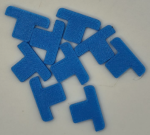|3DBot_Tx10.stl |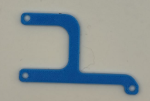|3DBot_hx1.stl |

* [Archivo stl con un complemento para el 3DBot, una bandeja](./Estructura/Bandeja.STL).

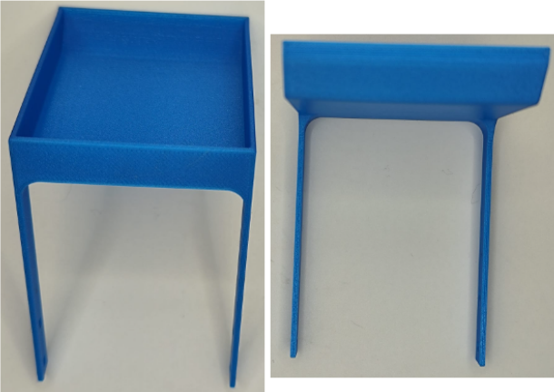  
*Complemento bandeja*  

En la imagen siguiente vemos la posición de la bandeja sobre la estructura.

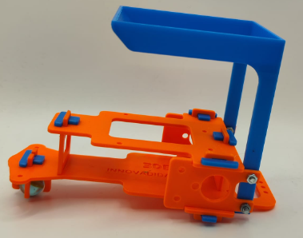  
*Estructura con bandeja*  

Otra opción para obtener estas piezas (excepto la bandeja) es el corte láser dado que están diseñadas para ello. El archivo que se enlaza a continuación es para utilizar en la cortadora láser Oku Desk de NomadTech que dispone de una versión propia de Inkscape con la extensión para la generación de GCodes. <b><u>Desafortunadamente no tiene en su zona de [descargas](https://nomadtech.es/es/content/18-descargas) una versión para Linux.</b></u> Lógicamente se puede utilizar para llevar los trayectos en Inkscape con alguna otra extensión para generación de GCode como [JTech](https://jtechphotonics.com/?page_id=2012)

* [Enlace al archivo vectorial](./Estructura/3DBot_corte_laser.svg). Estas son las piezas que se utilizan en el montaje versión corte en madera.

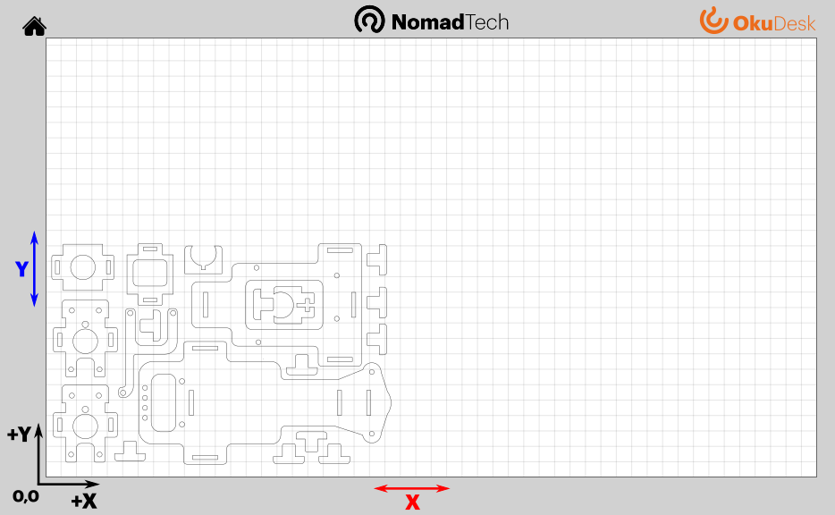  
*Archivo vectorial de corte láser*  
Clica sobre la imagen para ampliarla  

## **Encoder**
En este apartado vamos a mostrar y enlazar los archivos de diseño de una rueda impresa en 3D similar a la de la vista en el montaje de la versión impresa y también los de un accesorio para el encoder óptico que se adapte a la rueda que viene con el nuevo kit de 3DBot.

El aspecto de la rueda impresa en la que los radios hacen de encoder es:

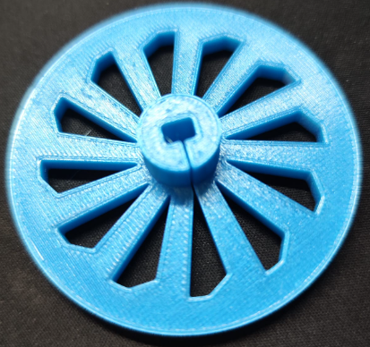  
*Rueda*  

* [Enlace al archivo stl de la rueda](./Estructura/RuedaYencoder/rueda.stl). Recuerda que son necesarias dos unidades y dos juntas tóricas, una para cada rueda, que acturán de neumáticos.

El aspecto del encoder para la rueda es:

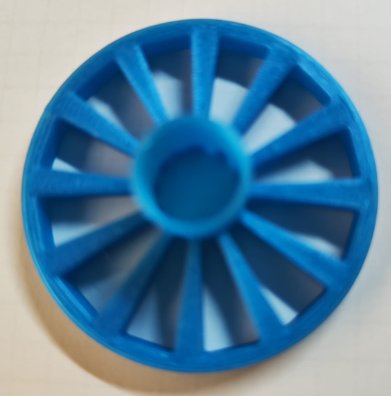  
*Encoder*  

* [Enlace al archivo stl del encoder](./Estructura/RuedaYencoder/encoder.stl).

En la imagen vemos el encoder colocado en la rueda:

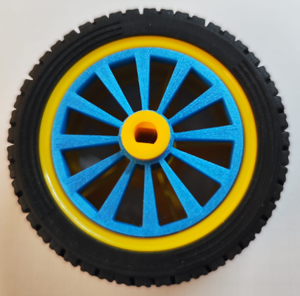  
*Encoder colocado*  

A continuación se enlaza el archivo fuente.

* [Archivo de diseño en FreeCAD de la rueda y el encoder](./Estructura/RuedaYencoder/encoder_rueda.FCStd) por si necesitas modificar algo.
