# Guía de montaje versión corte en madera
La presente guía de montaje está basada en **IMAGINA 3DBot + ESP32 STEAMakers (PUB)** de Toni Hortal (para Robolot). 

La obra está publicada bajo licencia de [Reconeixement-NoComercial-CompartirIgual 4.0 Internacional de Creative Commons](https://creativecommons.org/licenses/by-nc-sa/4.0/deed.ca).

*Las imágenes* són originales de Kike Montañés

El kit Imagina 3dBot se presenta así:

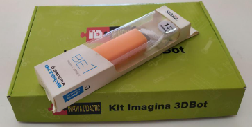  
*Presentación del kit*  

## **Material**
Al abrir la caja encontrarás todo el material necesario:

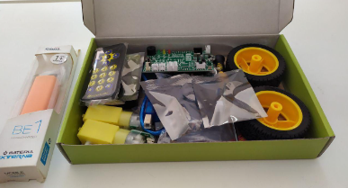  
*Material*  

El kit incluye:

* 1 lámina de madera con el chasis troquelado. Es sustituible por piezas impresas en 3D
* 1 Placa de control ESP32 STEAMakers con cable USB
* 1 Shield Imagina 3DBot V4 Innova Didactic
* 2 Motores con placa + cables con dos ruedas
* 3 Sensores de infrarrojos siguelíneas
* 3 Cables M-M de 20 cms. para conectar los sensores de línea
* 1 Power-Bank con cable de carga
* 1 Sensor de ultrasonidos HC-SR04 de 4 pins
* 1 bola de acero de 16mm de diámetro
* 1 Mando de infrarrojos para control remoto
* 1 Juego de tornillería compuesto por:
    * 4 tornillos M3x10mm
    * 4 tornillos M3x15mm
    * 8 tuercas M3
* Herramientas para el montaje:
    * 1 mini llave de tubo M3
    * 1 destornillador de estrella

En la imagen vemos las herramientas.

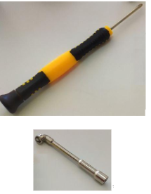  
*Herramientas que acompañan al kit*  

## **Montaje**
Saca las piezas de la caja, quitales los envoltorios y desencaja las piezas que componen el conjunto del chasis.

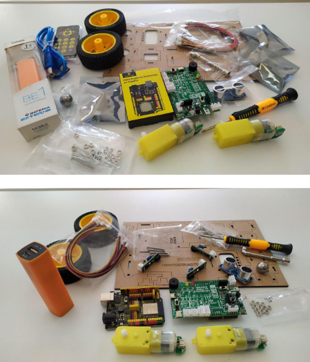  
*Unboxing 3DBot*  

<b>Recuerda que las piezas son de un material similar a la madera (DM), que ajustan perfectamente, pero ten en cuenta su fragilidad si en fuerzas el encaje.</b>

Empieza con las piezas que forman la zona de la bola de acero.

Este encaje es delicado y, por tanto, **<u>debes prestar atención a su manipulación</u>**.

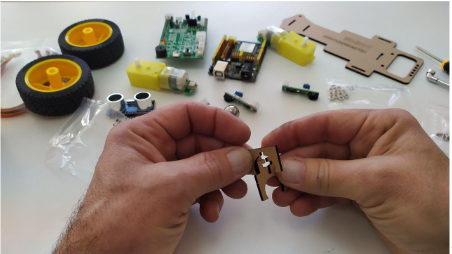  
*Rueda loca*  

Encaja ambas piezas colocandolas sobre la mesa y haciendo presión de forma uniforme con ambos dedos y conseguirás un conjunto robusto, como muestran las imágenes:

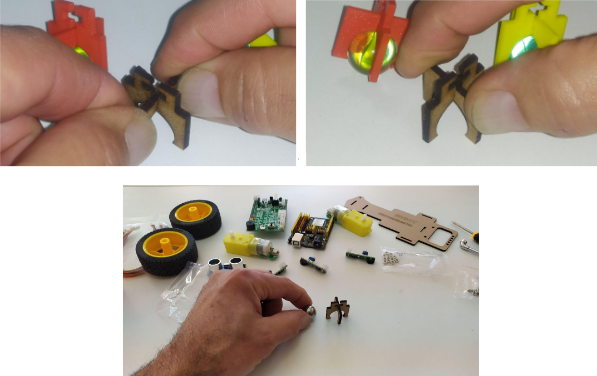  
*Rueda loca*  

Una vez creado el conjunto inserta la bola:

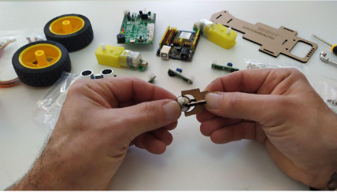  
*Rueda loca*  

Entrará de forma suave, quedando un grupo final que dará movilidad al robot por su parte trasera.

Seguidamente monta los soportes de ambos motores:

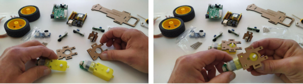  
*Soporte de motores*  

Introduce los tornillos M3 de 25 mm por la parte posterior del motor y termina la fijación con las tuercas M3 por su parte exterior, haciendo uso de las herramientas (destornillador y llave de tubo):

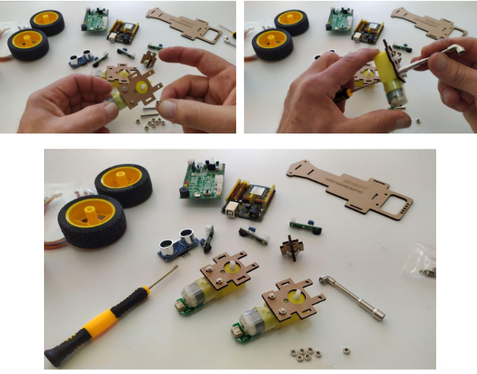  
*Soporte de motores*  

Con los dos soportes de motores fijados, monta el chasis por su parte inferior.

Encaja cada uno de los motores en la lámina que forma la parte de debajo del chasis.

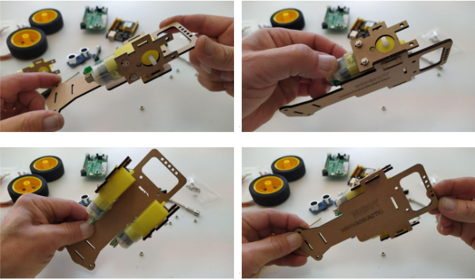  
*Soporte de motores*  

Una vez encajados, inserta las piezas en forma de T para fijar el conjunto y darle robustez. Estas pequeñas piezas tienen cierta dificultad a la hora de ser insertadas, pero es posible. Y dan así mucha solidez a todo el grupo de piezas que forman el robot.

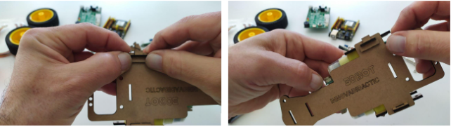  
*Soporte de motores*  

Ahora encaja la parte que hará de tope en la powerbank por la parte delantera:

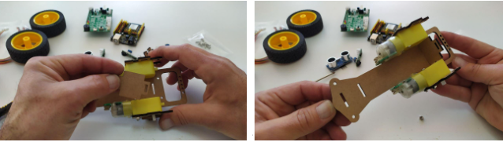  
*Tope powerbank*  

A continuación la pieza de la parte trasera:

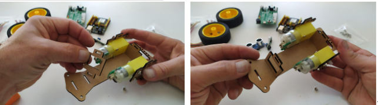  
*Tope powerbank*  

Coloca la powerbank en su "interior". Ten en cuenta que la zona de carga de la powerbank va hacia la parte trasera del robot. Y que las conexiones (puertos USB) deben estar centrados en la “ventana” de esta pieza. <b>¡Comprueba que puedes conectar los dos extremos del cable USB a los dos puertos!</b>

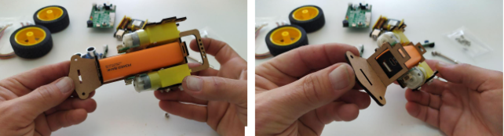  
*Tope powerbank*  

Dejamos a un lado el montaje actual y ahora sujetamos la placa ESP32 STEAMakers a la pieza superior del chasis:

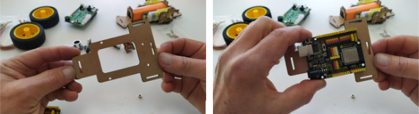  
*Sujetar la placa ESP32 STEAMakers*  

Sólo será necesario anclar la placa por 3 puntos con los tornillos cortos M3 y haciendo uso de las herramientas:

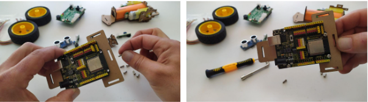  
*Sujetar la placa ESP32 STEAMakers*  

Debería quedar así:

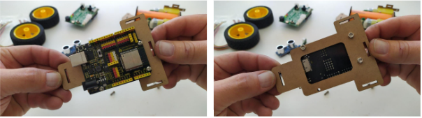  
*Sujetar la placa ESP32 STEAMakers*  

Continúa ahora encajando la parte superior del chasis sobre el montaje inferior. El robot comienza a tomar forma.

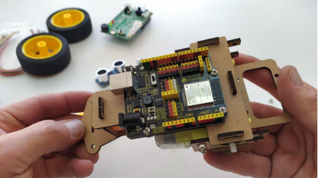  
*Partes superior e inferior colocadas*  

Ahora colocamos todas las piezas en T para dar rigidez a todo el conjunto:

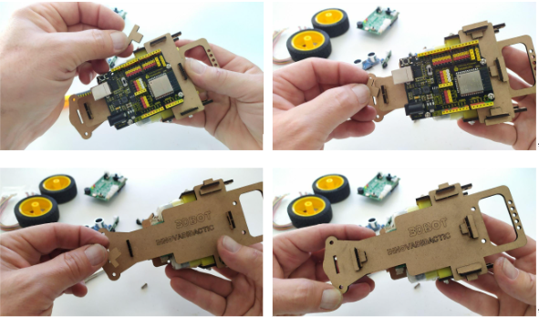  
*Partes superior e inferior colocadas*  

Encaja ahora la pieza de la bola loca y su pasador en T:

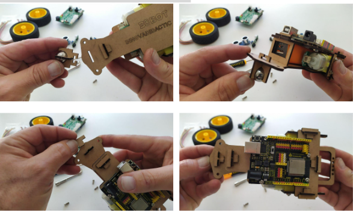  
*Colocación de la bola loca*  

El aspecto actual del robot es:

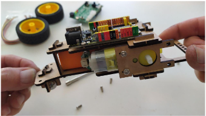  
*Robot con la bola loca colocada*  

Ahora colocamos la placa Imagina 3DBot sobre la ESP32 STEAMakers:

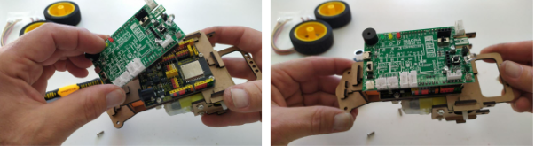  
*Colocación de la placa Imagina 3DBot*  

Ahora montamos los sensores seguidores de línea TCRT5000:

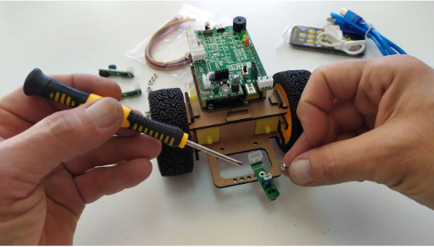  
*Colocación de sensor TCRT5000*  

Fija los dos sensores frontales con los tornillos M3x8mm haciendo uso de las herramientas:

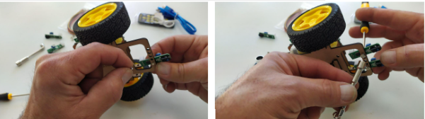  
*Fijación de sensores TCRT5000*  

Fija el tercer sensor TCRT5000 en el lateral derecho del robot y coloca las ruedas en su lugar:

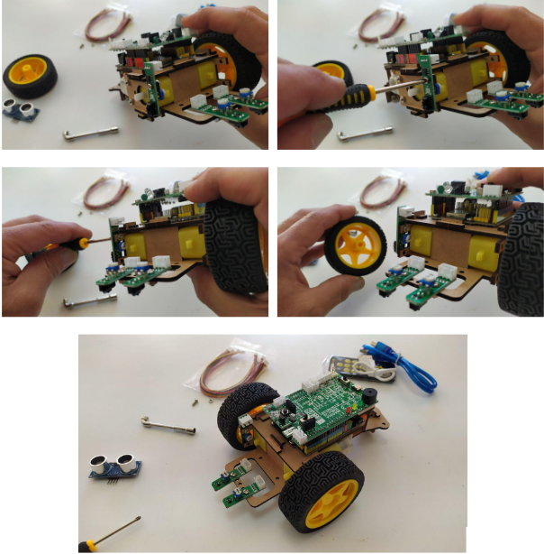  
*Fijación tercer sensor TCRT5000 y ruedas*  

Ya tiene mejor aspecto.

El sensor de ultrasonidos se conecta directamente a la placa Imagina 3DBot, sin cables, al conector de 4 pines que hay detrás del pulsador D2.

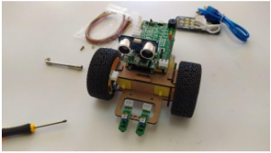  
*Colocación del sensor de ultrasonidos HC-SR04*  

## **Conexionado del robot 3DBot**
En este punto ya puedes iniciar el cableado de los componentes electrónicos.

El motor izquierdo se conecta al drive A y el motor derecho al drive B. El sensor izquierdo a SL, el derecho a SR y el sensor lateral a A1.

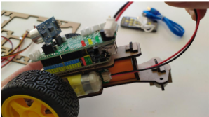  
*Conexionado del robot 3DBot*  

Para evitar que los cables de los 3 sensores seguidores de línea queden por delante del sensor de ultrasonidos y del sensor de infrarrojo, pasalos por entre las dos placas hasta los conectores correspondientes:

El aspecto final del robot es el siguiente:

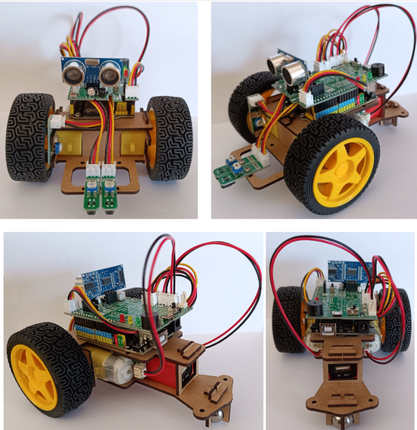  
*Robot 3DBot finalizado*  

**Nota**: observa que te sobrará una pieza de encaje en T (es para una posible pérdida de alguna de ellas).

**MISIÓN CUMPLIDA!!!!**

Ya estamos listos para continuar con las actividades con el robot 3DBot.
