# Guía de montaje versión pieza impresa 3D
La presente guía de montaje es la que aparece en el manual que acompaña al kit y que está disponible en la [Tienda - Innovad Ddactic](https://shop.innovadidactic.com/es/imagina-steam-y-makers/1598-kit-imagina-arduino-3dbot-esp32-steamakers-para-arduinoblocks.html)

En esta sección vamos a explicar el montaje a partir de la nueva versión del chasis 3DBot formado por una sola pieza.

## **Material**
El kit Imagina 3dBot incluye:

* 1 Chasis impreso en 3D compacto: 2 ruedas + 2 juntas tóricas y 1 bola de plástico
* 1 Placa de control ESP32 STEAMakers con cable USB
* 1 Shield Imagina 3DBot V4 Innova Didactic
* 2 Motores con placa + cables (Ref. ID_MOTOR_PLACA)
* 3 Sensores infrarrojo siguelíneas (Ref. RBL030120)
* 3 Cables M-M de 20 cms. para conectar los sensores de línea (Ref. RBLSENSOR-PP)
* 1 Power-Bank 5V/2200 mAh (Ref. VL2200PB001GR)
* 1 Sensor de ultrasonidos de 4 pins (Ref. HC-SR04)
* 1 Mando para control remoto (Ref. KS9002)
* 1 Juego de tornillería compuesto por:
    * 4 DIN7981 2,9*25mm
    * 7 DIN7981 2,9*6,5mm
    * 2 DIN7985 M3*12mm
    * 2 DIN934 M3

En la imagen vemos el contenido del kit.

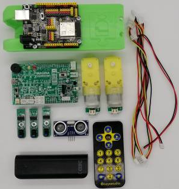  
*Material*  

Las piezas impresas en 3D son las siguientes:

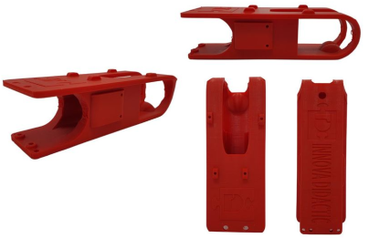  
*Chasis 3DBot*  
Disponible en: [Tienda - Innovad Ddactic](https://shop.innovadidactic.com/es/3dbot-robotica-con-arduino-o-scratch/1633-chasis-3dbot-nueva-version-cuerpo-de-una-sola-pieza.html)

Serán necesarias las ruedas también impresas en 3D:

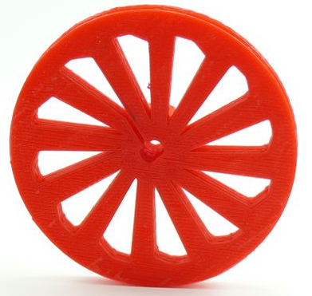  
*Rueda 3DBot*  
Disponible en: [Tienda - Innovad Ddactic](https://shop.innovadidactic.com/es/3dbot-robotica-con-arduino-o-scratch/312-rueda-3dbot.html)

Las ruedas necesitan de neumáticos, que se consiguen a partir de una junta tórica:

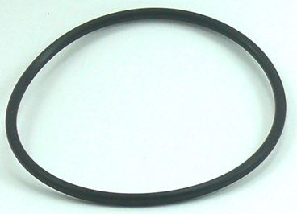  
*Tórica neumático*  
Disponible en: [Tienda - Innovad Ddactic](https://shop.innovadidactic.com/es/3dbot-robotica-con-arduino-o-scratch/315-torica-neumatico.html)

Para funcionar con dos ruedas apoyamos el chasis en una rueda loca:

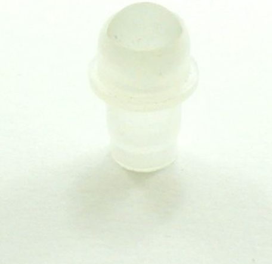  
*Bola soporte chasis*  
Disponible en: [Tienda - Innovad Ddactic](https://shop.innovadidactic.com/es/3dbot-robotica-con-arduino-o-scratch/316-bola-soporte-chasis.html)

## **Montaje ESP32 STEAMakers e Imagina 3DBot**
Montaremos la placa ESP32 STEAMakers en la caja de soporte de la placa con 3 tornillos de estrella de 2,9×6,5mm. Encima de esta, instalaremos el Shield Imagina 3DBot y ya podemos conectar la placa ESP32 STEAMakers al ordenador con el cable USB.

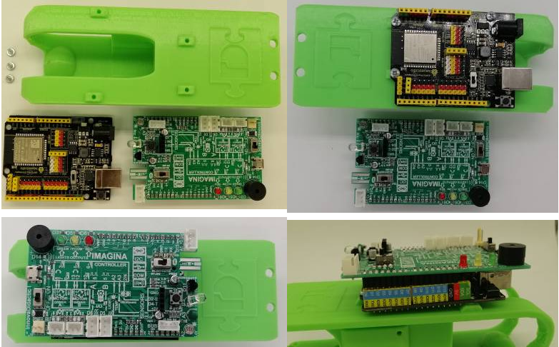  
*Montaje ESP32 STEAMakers e Imagina 3DBot*  

## **Montaje y conexionado del robot 3DBot**
Colocamos o verificamos que el chasis ya lleve puesta la rueda “loca” trasera.

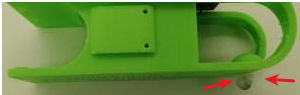  
*Rueda loca*  

Preparamos el motor izquierdo (motor A), que es el motor que lleva incorporado el sensor de línea fotoeléctrico que hace de “encoder”.

Hemos de poner el soporte para el sensor de línea tal y como se ve en la fotografía con un tornillo de 2,9×6,5mm.

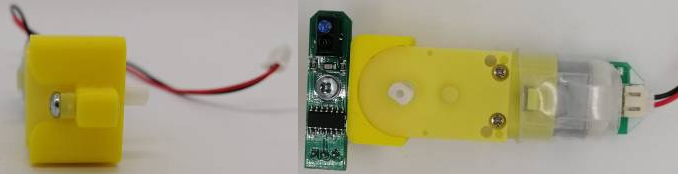  
*Motor izquierdo*  

Sujetamos al chasis los motores del robot apretándolos con dos tornillos de 2,9x25mm. 

<b></b>¡Importante!</b> No hay que apretar en exceso los tornillos para no aplastar la caja reductora y los engranajes de los motores.

Hemos de tener en cuenta que el motor A, que lleva el encoder, es el que se coloca a la izquierda.

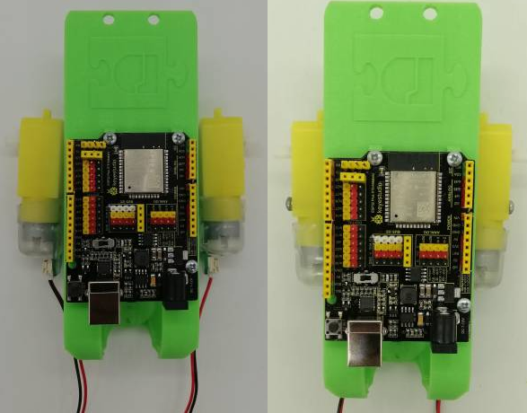  
*Motores*  

Insertamos la batería Power Bank, en la parte inferior del chasis con el connector USB hacia la parte trasera.

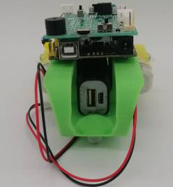  
*Power Bank*  

Conectamos el motor izquierdo a motor A y el motor derecho a motor B en la placa.

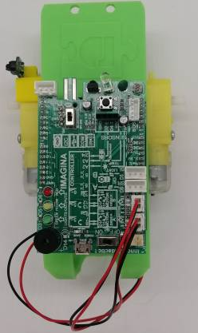  
*Conexionado de motores*  

Colocamos los sensores de línea fotoeléctricos, sujetándolos con tornillos de M3x12mm y tuercas de M3.

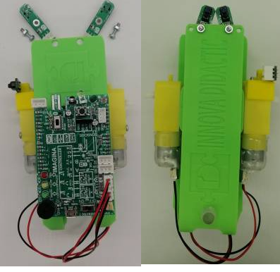  
*Sensores de línea*  

Una vez los tenemos montados, conectamos el sensor fotoeléctrico izquierdo a la entrada D5 o SL, y el sensor fotoeléctrico derecho a la entrada D6 o SR, con sus respectivos cables.

También conectamos a la entrada D15 el sensor de línea fotoeléctrico de la rueda izquierda (encoder).

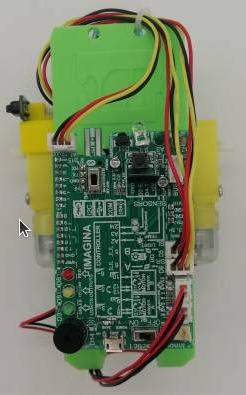  
*Conexionado sensores de línea y encoder*  

Colocamos las juntas tóricas en las ruedas y a su vez colocamos estas en los ejes de los motores.

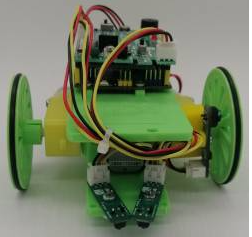  
*Ruedas*  

Conectamos el sensor de ultrasonidos a la placa Imagina 3DBot en su correspondiente zócalo, en la parte delantera de la placa.

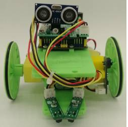  
*Ultrasonidos*  

El aspecto final del robot es:

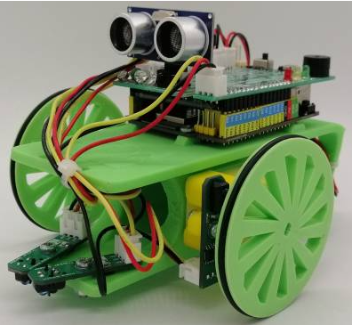  
*Robot 3DBot*  

Ya estamos listos para continuar con las actividades con el robot 3DBot.
