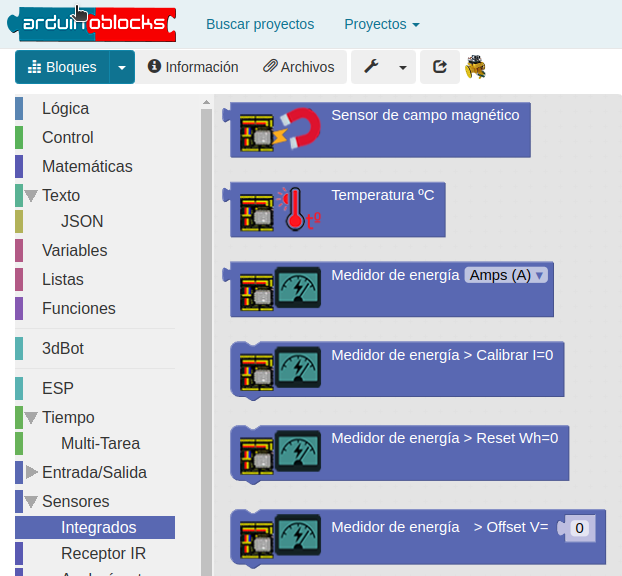
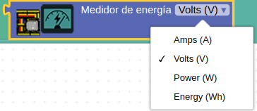
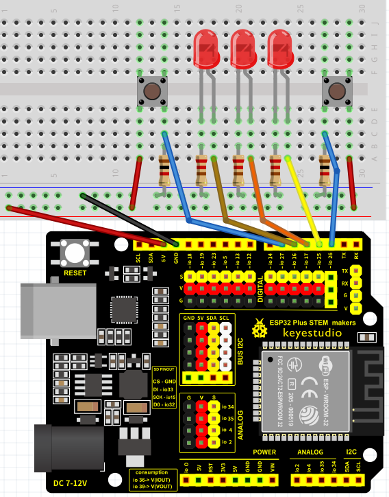
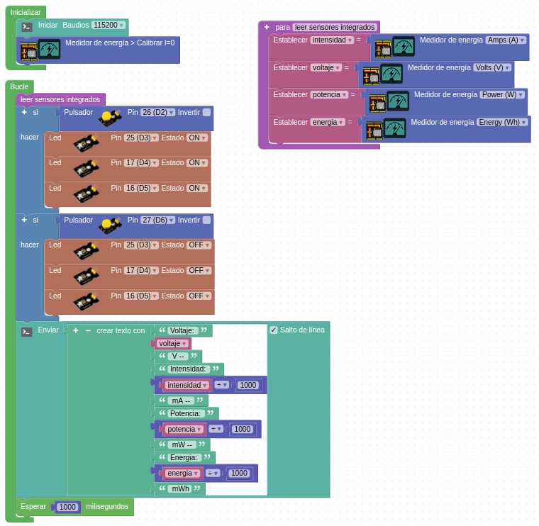

# Consumo de energia
La placa ESP32 STEAMakers dispone de un sistema para medir el consumo de energía.

En Arduinoblocks, el medidor de consumo de energía se encuentra en la categoría Sensores → Integrados:

  
*Sensores integrados en ESP32 STEAMakers*  

Permite medir tanto la intensidad (Amps) en amperios, como la tensión (Volts) en voltios, la potencia (Power) en vatios y la energía (Energy) en vatios por hora:

  
*Variables que se pueden medir*  

## **Monitorización del consumo de energia**
Para hacerlo vamos a montar el circuito de la figura siguiente utilizando una ESP32 STEAMakers, una placa protoboard. Conectamos dos pulsadores a los pines IO26 (D2) e IO27 (D6) y tres diodos LED a los pines IO25 (D3), IO17 (D4) e IO16 (D5).

  
*Montaje para el ejemplo 3DB_Ej4*  

El primer pulsador enciende los LEDs y el segundo los apaga.

Si no tenemos conectado nada el valor de la intensidad debería ser cero. Cuando se enciende los LEDs se producirá una pequeña variación en la intensidad y para verla mejor se ha expresado en miliamperios.

El programa para saber el valor de las cuatro magnitudes es el siguiente:

  
*[Enlace a ejemplo 3DB_Ej4](http://www.arduinoblocks.com/web/project/1661363)*

Conecta la placa a un puerto USB del ordenador, pon en marcha Arduinoblocks Connector, espera a que identifique la placa y el puerto y pulsa en el botón Subir.

Abre la Consola, selecciona la velocidad de comunicación según la establecida en el programa y pulsa Conectar.

En la Consola serie podemos ver los valores de las 4 magnitudes, algunas de las cuales variarán en función de si están encendidos o no los LEDs.

En el video [ENERGIA ESP32 PARTE I](https://www.youtube.com/watch?v=eEk3aFT4RIU) de [Ardutaller](https://www.ardutaller.com.es/) tenemos una completa información del tema.
