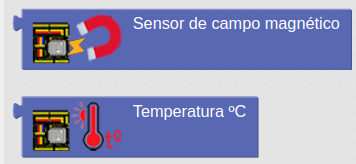

# Sensores internos
La placa ESP32 STEAMakers, al estar basada en el ESP32-WROOM-32, dispone de 2 sensores integrados. Se trata de un sensor de efecto Hall y un sensor de temperatura.

Los bloques para utilizarlos se encuentran en la categoría Sensores → Integrados:

  
*Bloques sensores integrados*

Con el sensor de efecto Hall podremos detectar variaciones de campo magnético en las proximidades de la placa.

Con el sensor de temperatura podremos controlar la temperatura a la que se encuentra el procesador de la placa.

A continuación podemos ver un ejemplo de lectura de dichos sensores:

  
*[Enlace a ejemplo 3DB_Ej6](http://www.arduinoblocks.com/web/project/1663213)*

Conecta la placa a un puerto USB del ordinador, lanza Arduinoblocks Connector, espera a que se identifique la placa y reconozca el puerto y haz clic en el botón 'Subir'.

Abre la consola serie y haz clic en conectar seleccionando previamente la velocidad de comunicación según el valor establecido en el programa.

En la consola serie podemos ver los valors de temperatura y si tenemos cerca un objeto metálico. Si el objeto metálico esta sobre la placa debe aumentar el valor de la variable de proximidad y si lo alejamos disminuye.
