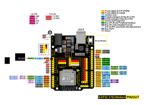

# <FONT COLOR=#8B008B>Sensores táctiles capacitivos</font>
En este aparatado se muestra cómo utilizar los pines de sensores táctiles capacitivos del ESP32. Estos pinos pueden captar variaciones en cualquier cosa que tenga una carga eléctrica. A menudo se utilizan para despertar el ESP32 del [modo deep sleep](https://randomnerdtutorials.com/esp32-touch-wake-up-deep-sleep/) (sueño profundo).

## <FONT COLOR=#007575>**Sensores táctiles de la ESP32**</font>
El ESP32 puede llegar a tener 10 pines con sensores táctiles capacitivos, dependiendo del modelo con el que trabajemos. Estos GPIO pueden captar variaciones en cualquier cosa que tenga una carga eléctrica, como la piel humana. Así, pueden detectarse variaciones inducidas cuando tocamos los GPIO con un dedo.

Estos pinos pueden ser fácilmente integrados en almohadillas (pads) capacitivos, y sustituir botones mecánicos por botones táctiles. Adicionalmente, estos pinos pueden ser utilizados también como fuente para despertar al ESP32 del [modo deep sleep](https://randomnerdtutorials.com/esp32-touch-wake-up-deep-sleep/).

Veamos en primer lugar el pinout de una ESP32 con 30 GPIOs donde podemos localizar los sensores tipo 'touch' en color rosa.

<center>

  
*[Sensores táctiles en ESP32 DEVKIT V1 - DOIT](https://randomnerdtutorials.com/esp32-doit-devkit-v1-board-pinout-30-gpios-copy/)*

</center>

Puedes comprobar que el sensor 0 corresponde al GPIO 4, el sensor 2 al GPIO 2, y así sucesivamente.

**Nota**: el sensor 1 es el GPIO 0. Sin embargo, no está disponible como pin en esta placa de desarrollo particular de ESP32 (versión con 30 GPIO). El GPIO 0 está disponible en la versión de 36 pines de esa placa.

Veamos ahora los pines touch en la ESP32 STEAMakers:

<center>

  
*Sensores táctiles en la placa ESP32 STEAMakers*  

</center>

Los pines se localizan en color verde claro y observa como en este caso disponemos de seis: TOUCH0, TOUCH1, TOUCH2, TOUCH4, TOUCH5, TOUCH6 y TOUCH7.

## <FONT COLOR=#007575>**Lectura del sensor táctil**</font>
La lectura del sensor táctil es directa en el IDE de Arduino mediante el uso de la función ```touchRead()```, que acepta como argumento el GPIO que quieres leer:

~~~C++
touchRead(GPIO);
~~~

Vamos a programar la placa utilizando el IDE de Arduino, por lo que hay que asegurarse de tener instaladas las placas ESP32 antes de proceder.

<center>

  
*Placas ESP32 en el IDE*

</center>

Una vez conectada la ESP32 a un puerto USB y seleccionada la placa podemos ver cómo trabaja esta función utilizando un ejemplo de la librería. Para ellos debes ir a Archivo → Ejemplos → ESP32 → Touch y abre el programa TouchRead.

<center>

  
*Archivo → Ejemplos → ESP32 → Touch*

</center>

Se abre una ventana con el siguiente programa:

<center>

  
*Archivo → Ejemplos → ESP32 → Touch → TouchRead*

</center>

A continuación vemos el programa con algunas pequeñas modificaciones:

~~~C++
// Prueba de pin tactil en ESP32
// Touch7 es T7 que esta en GPIO 14.

void setup()
{
  Serial.begin(115200);
  delay(1000); // dame tiempo para subir monitor de serie
  Serial.println("Prueba de sensor tactil en ESP32");
}

void loop()
{
  Serial.println(touchRead(T7));  // obtener valor usando T7
  delay(1000);
}
~~~

También podemos realizar el programa en Arduinoblocks haciendo el programa siguiente:

<center>

  
*[Enlace a ejemplo 3DB_Ej5](http://www.arduinoblocks.com/web/project/1663141)*

</center>

En la imagen siguiente vemos una captura del Serial Plotter mostrando los cambios al tocar el pin con el dedo.

<center>

  
*Ejemplo 3DB_Ej5. Ventana Serial plotter*

</center>

## <FONT COLOR=#007575>**Mas información**</font>
En los siguientes enlaces podemos ampliar la información sobre los sensores táctiles en las placas ESP32.

* [ESP32 Sensores táctiles](https://www.youtube.com/watch?v=07b8nKLS_PM) del canal Youtube [LaBuhardillaDelLoco](https://www.youtube.com/@LaBuhardillaDelLoco)

* Tutorial [ESP32 Capacitive Touch Sensor Pins with Arduino IDE](https://randomnerdtutorials.com/esp32-touch-pins-arduino-ide/) de [RANDOM NERD TUTORIALS](https://randomnerdtutorials.com/)

* [ESP32 Capacitive Touch Sensor Pins with Arduino IDE](https://www.youtube.com/watch?v=40tyJfvpcxw) del canal Youtube [Rui Santos](https://www.youtube.com/@RuiSantosdotme)
