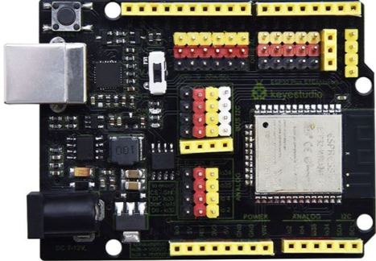
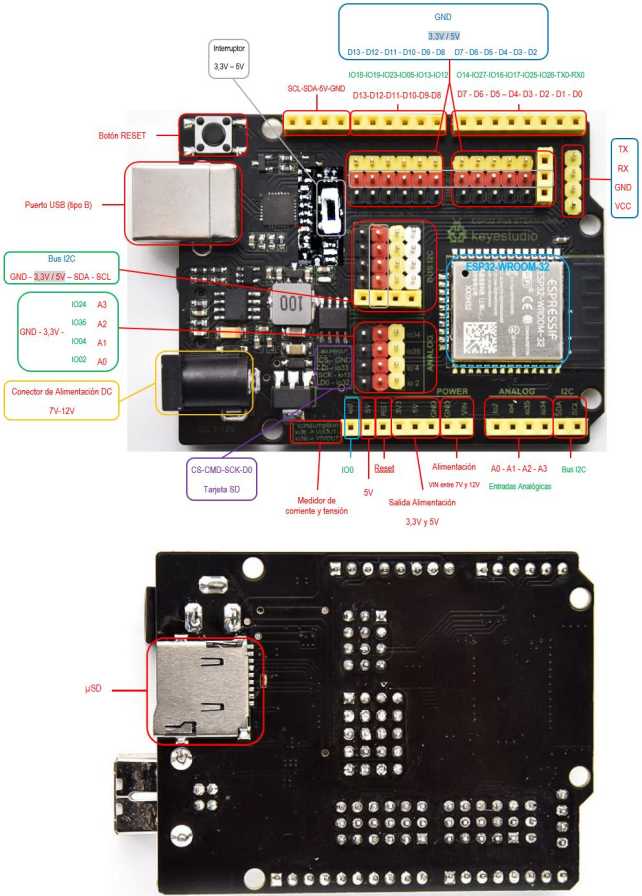
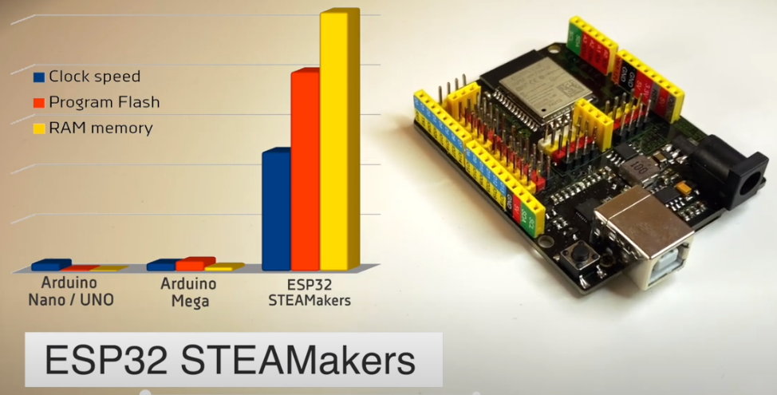
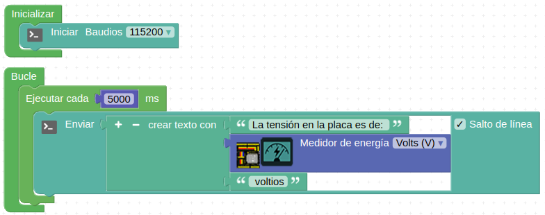

# Introducción a la ESP32 STEAMakers
Esta placa está basada en el **ESP32-WROOM-32**, un microcontrolador de 32 bits, y nos ofrece una gran cantidad de prestaciones como:

- conectividad WiFi y Bluetooth integradas en la propia placa
- un zócalo para tarjetas microSD para el almacenamiento de datos
- conexiones para todas las entradas y salidas disponibles
- puertos de expansión I2C para poder conectar diferentes dispositivos I2C directamente a la placa

  
*Aspecto de la placa ESP32 STEAMakers*  

En la figura siguiente vemos los elementos que componen la placa ESP32 STEAMakers:

  
*Elementos en la placa ESP32 STEAMakers*  

## **Especificaciones técnicas**
Sus principales especificaciones técnicas son:

* Microcontrolador Tensilica Xtensa 32-bit LX6 a 160MHz.
* Conectividad WiFi 802.11 b/g/n/e/i.
* Conectividad Bluetooth 4.2 y modo BLE.
* Zócalo para tarjetas µSD.
* 14 entradas y salidas digitales con alimentación.
* Conector serie hembra con alimentación.
* Conector I2C para conectar hasta 5 dispositivos a la vez sobre la misma placa.
* Conector hembra I2C para conexión de una pantalla OLED.
* Botón de Reset.
* Conector de 5V
* Conector de 3.3V
* Interruptor 3.3-5V para cambiar entre estas dos tensiones en algunos pines de alimentación.
* Entradas y salidas analógicas.
* Sensor Hall y de temperatura integrado.
* 2 convertidores Digital-Analógico (DAC) de 8 bits.
* 16 convertidores Analógico-Digital (ADC) de 12 bits.
* 16 canales PWM.
* 2 UART.
* 2 canales I2C.
* 4 canales SPI.
* 448Kb ROM.
* 520 KB SRAM.
* 8KB+8KB SRAM en RTC.
* 1kbit eFUSE.
* 512 bytes Memoria Flash (EEPROM).10 sensores táctiles.
* 4 temporizadores internos de 64 bits.

No están disponibles todas las características del controlador ESP-WROOM-32, ya que algunos pines tienen funciones dobles y se utilizan en la placa de forma específica (como, por ejemplo, para controlar la tarjeta microSD). Pero la mayoría de funciones se pueden utilizar, además de disponer la placa ESP32 STEAMakers de una mejor conexión de elementos debido a los pines para conectores tipo Dupont de entrada y salida, de I2C y de alimentación. Además, algunos pines de alimentación pueden cambiar su valor (3,3V o 5V) mediante un interruptor en función de nuestras necesidades.

En la figura siguiente vemos un momento del [video descriptivo de la placa ESP32 STEAMakers](https://www.youtube.com/watch?v=MQjIEI7I4ik&list=PL1pKD-Bz2QBAgfy580m8OaQ2Z60v6DOhC) que se aloja en el canal [Youtube de Arduinoblocks](https://www.youtube.com/c/ArduinoBlocks). En la imagen se compara el potencial de la placa ESP32 STEAMakers con otras placas tradicionales.

  
*Comparativa de la placa ESP32 STEAMakers*  

En la tabla siguiente se realiza una comparativa entre ESP32 y otras placas muy utilizadas.

|Especificaciones|ESP32|STM32F103C8T6|ESP8266|Nano|
|---|:-:|:-:|:-:|:-:|
|CPU|Xtensa LX6|ARM Cortex M3|Xtensa L106|ATmega328P|
|Núcleos|2|1|1|1|
|Arquitectura (bits)|32|32|32|8|
|Frecuencia CPU (MHz)|160|72|80|16|
|Comunicaciones|WiFi, Bluetooth|No|WiFi|No|
|RAM (KB)|512|20|160|2|
|Flash|4 MB|64/128 KB|4 MB|32 KB|
|Pines E/S|36|37|17|14|
|SPI/I2C/I2S/UART|4/2/2/3|2/2/0/3|2/1/2/2|1/1/0/1|
|ADC|6 de 12 bits|10 de 12 bits|1 de 10 bit|6 de 10 bit|
|DAC|2|0|0|0|

## **Consideraciones sobre ESP32**
En este apartado vamos a realizar algunas consideraciones sobre los siguientes aspectos de las placas ESP32:

* Pines
* Entradas analógicas
* Entradas y salidas digitales
* Salidas PWM en ESP32

### Pines en ESP32
En general los pines en ESP32 son de tipo GPIO (General Purpose Input/Output, Entrada/Salida de Propósito General). Algunos pines GPIO pueden tener un comportamiento no esperado durante el arranque del sistema o en el reinicio del mismo. Esto se debe a que durante el arranque de la placa ESP32 se deben realizar procesos internos que ponen en alto ciertos pines o incluso hacen que emitan señales, y esto puede provocar esos efectos no deseados.

El pin GPIO1 del microcontrolador es el pin Tx del puerto UART de depuración y cuando la placa arranca, se reinicia o cuando nosotros hacemos uso del puerto serie, este pin emite datos. Por este motivo es un pin que no conviene usar como entrada o salida.

El GPIO3 tiene un problema similar al GPIO1 ya que se trata del pin Rx del micocontrolador.

Los pines GPIO34, GPIO35, GPIO36 y GPIO39 solamente pueden utilizarse como entradas porque no disponen de resistencia pull-up.

### Entradas analógicas
Las señales analógicas son las que pueden tomar diferentes valores de tensión en un determinado periodo de tiempo, siendo su forma mas característica la senoidal. Cuando hablamos de entradas analógicas estamos hablando de pines del microcontrolador que pueden leer esas señales. En el caso de ESP32 todo son pines GPIO y por lo tanto se requiere de un conversor analógico a digital que sea capaz de transformar esas señales analógicas en digitales. El chip ESP32 que monta la placa ESP32 STEAMakers dispone de 2 convertidores Digital-Analógico (DAC) de 8 bits y 16 convertidores Analógico-Digital (ADC) de 12 bits. Estos conversores se asocian a los pines IO1 hasta IO20.

La resolución de los conversores ADC es de 12 bits (2^12 = 4096) por lo que la transformación de los valores digitales va a ser de mucha precisión. Pero cuidado con el uso de estas entradas, porque en realidad su comportamiento es que están leyendo valores digitales y no valores analógicos por lo que cambios de valores analógicos muy pequeños pueden no ser detectados.

Los canales ADC se dividen en dos puertos denominados ADC1 y ADC2. Las entradas analógicas del puerto ADC2 solamente las podemos usar como tales si el controlador WiFi no ha sido iniciado, ya que este puerto es el que utiliza el controlador del WiFi que integra la placa.

### Entradas y salidas digitales
Una señal digital solamente puede tomar dos valores o estados lógicos, alto y bajo, High y Low, 0 y 1 siendo su representación característica una onda cuadrada. El estado bajo se asocia a cero voltios y el estado alto a 3.3V (5V en el caso de placa tipo UNO).

Las entradas permiten recibir señales con los valores digitales descritos, como por ejemplo leer el estado de un pulsador.

Debemos saber que ESP32 lleva unas resistencias de pull-up (1) o pull-down (0) que nos permiten establecer el estado que tiene la entrada cuando está en reposo. Estas resistencias están disponibles en todos los pines excepto el 34 y 39. Estas resistencias internas se pueden activar por código.

Las salidas digitales nos van a servir para realizar acciones sobre los elementos conectadas en ellas, como por ejemplo encender un LED o activar un relé.

En principio todos los pines que se pueden utilizar como salida en ESP32 pueden usarse con PWM excepto los pines que no disponen de resistencia de pull-up interna.

## **Compatibilidad y descripción de pines ESP32 STEAMakers**
**Importante**: Todos los pines IOxx son entradas y salidas digitales, algunas con más funciones. Utilizando la comunicación WiFi no funciona el ADC2.

En la tabla siguiente tenemos relacionados todos los pines entre los tipos de placas UNO y ESP32 STEAMakers.

| UNO | ESP32 |||
|:|---|---|---|
| Pin | Pin | Función | Ampliación |
| D0 | IO03 | Rx | UART 0 RX |
| D1 | IO01 | Tx | UART 0 TX |
| D2 | IO26 | ADC2 CH9 | DAC2 |
| D3 | IO25 | ADC2 CH8 | DAC1 |
| D4 | IO17 | | UART 2 TX |
| D5 | IO16 | | UART 2 RX |
| D6 | IO27 | ADC2 CH7 | TOUCH7 / HSPI CS |
| D7 | IO14 | ADC2 CH6 | TOUCH6 / HSPI SCK |
| D8 | IO12 | ADC2 CH5 | TOUCH5 / HSPI MISO |
| D9 | IO13 | ADC2 CH4 | TOUCH4 /  HSPI MOSI |
| D10 | IO05 | | VSPI CSO |
| D11 | IO23 | |  VSPI MOSI |
| D12 | IO19 | |  VSPI MISO |
| D13 | IO18 | |  VSPI CLK |
| GND | GND |  | |
| 5V | +5V | |
| SDA | IO21 | I2C |SDA / VSPI HD|
| SCL | IO22 | I2C|SCL / VSPI WP|
| A0 | IO02 | ADC2 CH2 |TOUCH 2 / HSPI WP / E/S de RTC 12 procesador ultra baja potencia |
| A1 | IO04 | ADC2 CH0 |TOUCH 0 / HSPI CD / E/S de RTC 10 procesador ultra baja potencia |
| A2 | IO35 | ADC1 CH7 | E/S de RTC 5 procesador ultra baja potencia |
| A3 | IO34 | ADC1 CH6 | E/S de RTC 4 procesador ultra baja potencia |
| A4 | IO21 | SDA | |
| A5 | IO22 | SCL | |
| VIN | VIN | |
| GND | GND |  | |
| GND | GND |  | |
| 5V | +5V |  | |
| 3.3V | +3.3V | | |
| RST | | Reset | | |
| 5V |  | 5V |  | |
| | IO00 | ADC2 CH1 |TOUCH 1 / E/S de RTC 11 procesador ultra baja potencia |
| - | IO32 | D0 - uSD | |
| - | IO15 | CLK - uSD | |
| - | IO33 | CMD - uSD | |
| - | IO35 | IOUT | Medidor de corriente |
| - | IO37 | VOUT |  Medidor de tensión |

En la figura siguiente podemos ver y descargar un gráfico con el pinout de la ESP32 STEAMakers en formato original svg.

  
*Comparativa de la placa ESP32 STEAMakers*  

## **Verificación de la alimentación de la STEAMakers**
La ESP32 STEAMakers, como cualquier otra placa basada en ESP32, debe tener unos valores de alimentación mínimos. Gracias a que la STEAMakers lleva incorporado un medidor de tensión e intensidad, podemos saber la tensión de alimentación en todo momento.

Si la tensión de alimentación cae por debajo de 4,8 V (aproximadamente), la placa no funcionará correctamente, sobre todo en la comunicación WiFi.

Es recomendable realizar una verificación de la tensión que está entregando el puerto USB del ordenador. Si la tensión no está cerca de 5 V deberemos cambiar el cable USB, alimentar el puerto USB de forma externa o alimentar la placa con una fuente de alimentación.

Podemos realizar un pequeño programa para verificar la alimentación de la placa como el que vemos en la imagen siguiente:

  
*[Enlace a ejemplo 3DB_Ej3](http://www.arduinoblocks.com/web/project/1661261)*

Debería ser un buen hábito colocar estos bloques al inicio de cualquier programa para asegurarnos de una buena alimentación, sobre todo si trabajamos directamente con la placa conectada al puerto USB del ordenador y empezamos a conectar elementos externos en la placa (pantallas, LED, servos, etc.).

También hay que tener en cuenta que, cuando utilicemos la comunicación mediante WiFi, deja de funcionar el ADC2, por lo que no podremos leer los valores de sensores conectados a los pines A0 y A1. En este caso, la alternativa es conectarlos a los pinos A2 y/o A3.
