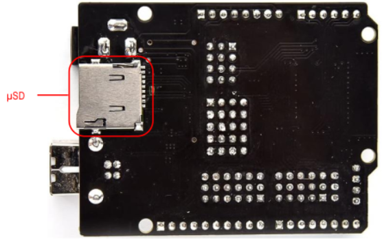
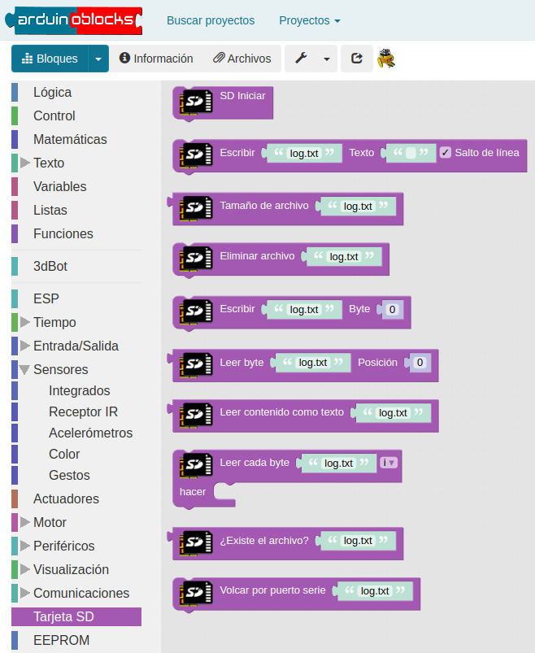
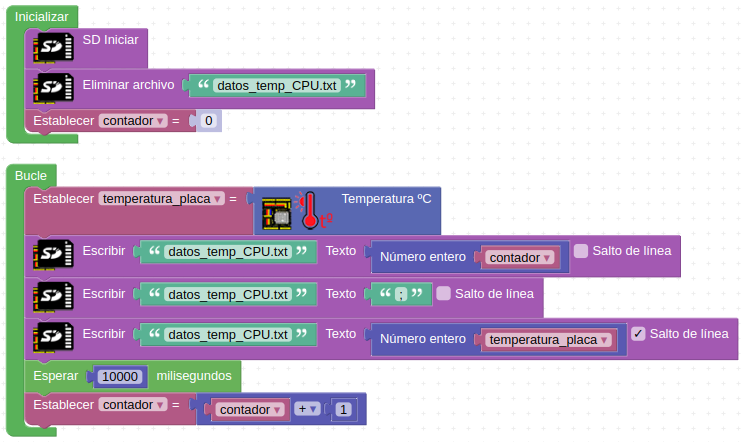
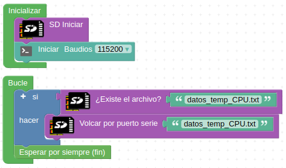
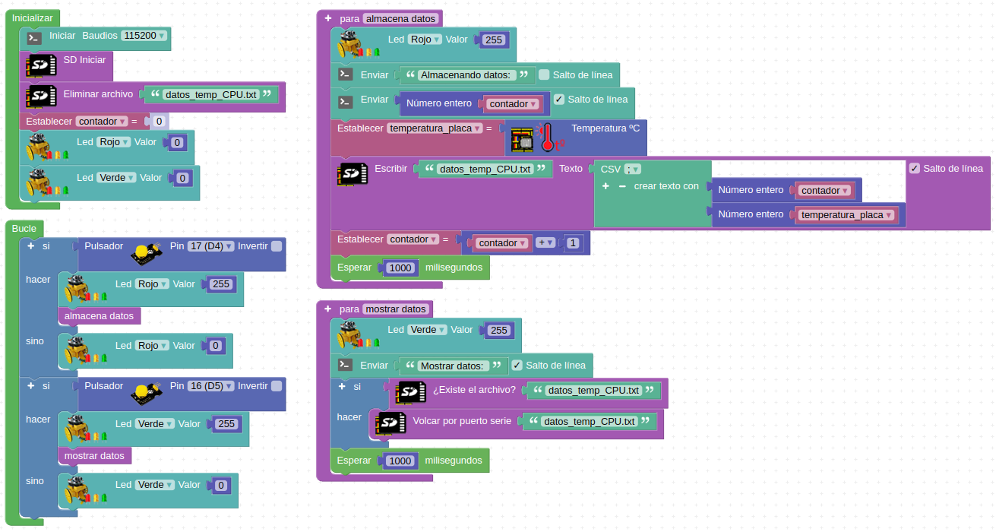

# Tarjeta microSD
La placa ESP32 STEAMakers dispone de un zócalo para poder insertar tarjetas microSD.

Para que funcione correctamente, la tarjeta debe estar formateada en formato FAT32, permitiendose tamaños de hasta 2 TB y archivos de un tamaño máximo de 2 GB.

La tarjeta da gran flexibilidad a la placa, ya que permite poder escribir y leer datos. Una de las funcionalidades más útiles es poder almacenar los datos de los sensores a modo de Datalogger. También nos permitirá leer datos de la tarjeta (por ejemplo, configuraciones de conexiones WiFi) para poder utilizarlos directamente en un programa.

El zócalo para introducir la tarjeta microSD se encuentra en la parte posterior de la placa, como podemos ver en la siguiente imagen:

  
*Lector de microSD*

**Nota importante**: en la práctica el tipo de tarjeta de memoria SD que podemos conectar es de un máximo de 32 GB y formateada en FAT32. Si son de mayor capacidad pueden no funcionar.

Existen una serie de bloques específicos en Arduinoblocks para controlar la funcionalidad de la tarjeta microSD:

  
*Bloques para microSD*

## **Almacenar datos: Datalogger**
Vamos a realizar un programa que nos permita almacenar los valores de temperatura de la CPU en un archivo.

Primero inicializaremos la tarjeta microSD y borramos el archivo que pueda haber anteriormente.

A continuación leeremos la temperatura la almacenaremos en el archivo de texto datos_temp_CPU.txt.

Para separar los datos añadiremos el símbolo “;” para poder extraer después los datos de forma más sencilla.

Tomaremos las muestras en intervalos de 10 segundos.

El programa que realizaremos es el siguiente:

  
*[Enlace a ejemplo 3DB_Ej7](http://www.arduinoblocks.com/web/project/1663228)*

Una vez colocamos la tarjeta en nuestro ordenador y la abrimos observaremos que se ha creado el archivo con el nombre que le hemos asignado.

Y si abrimos el archivo veremos la secuencia de muestras que hemos tomado y el formato de números obtenido.

## **Leer datos almacenados**
Ahora vamos a leer los datos que hemos almacenado en el ejemplo anterior. Vamos a realizar un programa que nos permita volcar todos los datos por el puerto serie.

El programa resultante es el siguiente:

  
*[Enlace a ejemplo 3DB_Ej8](http://www.arduinoblocks.com/web/project/1663237)*

## **Escribir y leer datos**
A continuación vamos a realizar un programa que reúna las dos funcionalidades vistas anteriormente. Utilizaremos un pulsador para iniciar la grabación de los datos y otro pulsador para detener la grabación. En el momento en que se detenga la grabación de datos, los mostrará por la Consola serie. Mientras esté almacenando datos se encenderá el LED rojo y cuando los muestre por la Consola serie encenderá el LED verde.

Cada vez que apretemos el pulsador de almacenar datos se irán añadiendo a las muestras que ya tenemos registradas.

  
*[Enlace a ejemplo 3DB_Ej9](http://www.arduinoblocks.com/web/project/1663246)*

La información que veremos por la Consola serie (cada vez que la abrimos, se reinicia el programa y empieza a tomar muestras desde cero): cada vez que almacena una muestra cuando pulsamos el pulsador de almacenar se añade una nueva muestra al archivo de datos (almacena datos).

Al pulsar el botón de mostrar aparecen las muestras grabadas (mostra datos).
