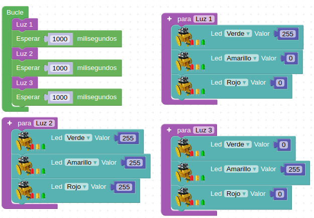

# <FONT COLOR=#8B008B>Actividades básicas con la placa Imagina 3DBot</font>
Utilizaremos la placa Imagina 3DBot como shield de la ESP32 STEAMakers.

En todas las actividades es muy importane tener presente el siguiente aviso:

<center>

  
*Aviso*

</center>

## <FONT COLOR=#007575>**A01. Encender un LED**</font>
Trabajaremos con los LEDs que vemos en la imagen siguiente:

<center>

  
*Diodos LED*

</center>

### <FONT COLOR=#AA0000>A01_1. Activar un LED como indicativo de que todo va bien</font>
En el apartado "3dBot" de Arduinoblocks encontraremos el bloque "Led", que nos permite encender y apagar los LED verde, amarillo y rojo de la Imagina 3DBot.

<center>

  
*A01_1. Activar un LED*

</center>

El LED se enciende totalmente introduciendo un 255 en la parte derecha del bloque. Para apagarlo basta con poner un 0. También se puede variar la intensidad de brillo. Para ello, cualquier valor entre 0 y 255 hará que el brillo del LED aumente proporcionalmente hasta alcanzar su máximo en 255.

<center>

  
*A01_1. Activar un LED*  
[Acceder al programa](http://www.arduinoblocks.com/web/project/1669057)

</center>

Después de cargar este programa, el LED rojo tendrá que permanecer encendido indefinidamente a la mitad de su brillo. Si es así, tienes bien conectada la placa y has conseguido cargar tu primer programa. ¡Seguimos!

### <FONT COLOR=#AA0000>A01_2. Juego de luces con bloque “Espera”</font>
El bloque “Esperar” lo podemos encontrar en el apartado “Tiempo”. Se corresponde con el famoso delay. Lo que hacemos al insertar un bloque “Esperar” es dejar la placa en el estado en el que se encontraba justo antes de la espera durante el tiempo que ésta dure, es decir, se detiene el procesador durante ese tiempo.

<center>

  
*A01_2. Bloque esperar*

</center>

Cuidado, porque el tiempo utilizado en este bloque está en milisegundos, por lo que para esperar, por ejemplo medio segundo, deberemos introducir un 500.

Programa ejemplo:

<center>

  
*A01_2. Juego de luces*

[Acceder al programa](http://www.arduinoblocks.com/web/project/1669156)

</center>

Con este programa conseguimos que el LED verde parpadee con una frecuencia de 1 segundo de encendido y apagado. Puedes intentar cambiar tiempo e introducir más LED, así como variar su intensidad de brillo.

El problema de la función Esperar es que deja la placa bloqueada en el estado anterior durante este tiempo de espera, es decir, no recibe ni envía nuevas órdenes durante este tiempo. Por eso, en ciertos casos, es más conveniente utilizar el bloque “Ejecutar cada” que veremos en futuros apartados.

## <FONT COLOR=#007575>**A02. Encender un LED con el pulsador**</font>
Los componentes implicados los vemos en la imagen siguiente:

<center>

  
*A02. Componentes utilizados*

</center>

En esta actividad queremos encender el LED verde al presionar el pulsador de la placa. Para ello debemos empezar a utilizar funciones del menú "Lógica" con las funciones de condición.

<FONT COLOR=#BB00FF><font size="5"><b>Condiciones “Si … hacer …”</font color></font size></b>

Se trata del famoso bucle ```if```, que es uno de los pilares de la programación, puesto que permite evaluar estados y tomar decisiones en consecuencia.

Funciona como una oración condicional: si se cumple la condición incluida en su primer apartado, entonces se realiza la acción incluida en su segundo apartado. De lo contrario, no se hace nada.

<center>

  
*A02. Condicional ```Si ... hacer```*

</center>

Para el programa ejemplo vamos a utilizar un nuevo bloque que controla el pulsador que incorpora la placa Imagina 3dBot. Lo podemos encontrar en el apartado "3dBot".

<center>

  
*A02. Bloque 'Botón se ha pulsado'*

</center>

Con este bloque crearemos la condición. Como acción a ejecutar si se cumple la condición, vamos a encender un LED. Para ello volveremos a utilizar wl bloque 'Led' que localizamos en la misma sección que el pulsador.

### <FONT COLOR=#AA0000>A02_1. Al pulsar el botón se enciende un LED</font>

<center>

  
*A02_1. Al pulsar el botón se enciende un LED*

[Acceder al programa](http://www.arduinoblocks.com/web/project/1672190)

</center>

<FONT COLOR=#BB00FF><font size="5"><b>Ampliando el condicional</font color></font size></b>

Otros bloques condicionales: ```si... hacer... si no...``` o ```si... hacer... si no si... hacer....```

El bloque ```si … hacer … si no …``` está en “Lógica”:

<center>

  
*A02. Bloque ```si... hacer... si no...```*

</center>

La ampliación de los bloques, como el bloque ```si... hacer... si no si... hacer....``` se consigue haciendo clic sobre el signo mas de la esquina superior izquierda. Vemos el proceso en la animación siguiente:

<center>

  
*A02. Ampliar los bloques lógicos*

</center>

Veremos ejemplos del uso de estas variantes a lo largo de distintos programas.

Pero siguiendo con el ejemplo del LED, realizaremos un programa que al pulsar el botón se encienda el LED durante un segundo; si no se acciona el pulsador, se apagará el LED.

### <FONT COLOR=#AA0000>A02_2. Ampliando el condicional</font>

<center>

  
*A02_2. Ampliando el condicional*

[Acceder al programa](http://www.arduinoblocks.com/web/project/1672908)

</center>

## <FONT COLOR=#007575>**A03. Medir la luminosidad con la LDR**</font>
Anteriormente hemos comentado que existe la función "Ejecutar cada". Aprovecharemos esta función junto con la función “Enviar” para ver los datos del sensor de luminosidad en la pantalla del ordenador. Pero antes de realizar el ejercicio vamos a ver las diferentes funciones poco a poco.

* **Gestión de tiempo con el bloque “Ejecutar cada”**  
Encontraremos el bloque en la sección “Tiempo”. Este bloque ejecuta una vez cada X tiempo los comandos que se encuentren dentro de él. Cuidado, porque **NO** detiene el programa en el estado anterior a él, como sí lo hace el bloque “Esperar”.

<center>

  
*A03. Bloque ```Ejecutar cada```*

</center>

Junto a "Enviar", es una función muy útil para mostrar datos en el ordenador. Vamos a verlo con un ejemplo en el siguiente apartado, en el que aprenderemos a enviar datos desde Imagina 3dBot con la placa ESP32 STEAMakers al ordenador.

* **Imprimir en el puerto serie (enviar datos al ordenador)**  
En la sección “Comunicaciones → Puerto serie” tenemos el bloque “Enviar”, mediante el cual enviamos valores a la pantalla del ordenador.

<center>

  
*A03. Bloque ```Enviar```*

</center>

Podemos enviar cualquier orden o dato que queramos sólo introduciéndolo en el espacio en blanco entre comillas del bloque.

* **Programa ejemplo**  

<center>

  
*[Enlace a ejemplo 3DB_Ej10](http://www.arduinoblocks.com/web/project/1676543)*

</center>

Con este programa lo que hacemos es enviar a la pantalla del ordenador las palabras "Imagina 3dBot" una vez por segundo (1000 ms).

Después de cargar el programa, pulsando el botón “Consola” y a continuación “Conectar” veremos en la pantalla del ordenador los valores enviados:

<center>

  
*Ejemplo 3DB_Ej10: Consola*

</center>

Cabe destacar que, si no utilizamos el bloque “Ejecutar cada”, enviamos al ordenador un dato cientos de veces por segundo, lo que satura la comunicación y bloquea el sistema. De ahí la importancia de este bloque.

También podríamos utilizar el bloque “Esperar” para enviar datos cada segundo, pero entonces, en tiempos de espera, la placa no podría escuchar otros comandos ni realizar otras acciones. Tranquilos, veremos esto más adelante con calma… ¡y con más ejemplos!

Ahora vamos a aplicar estos dos conceptos para leer los valores del sensor LDR incorporado en la placa.

En esta actividad se pretende que, cuando oscurezca, se encienda el LED amarillo, como si de una sonda crepuscular se tratara.

Los componentes implicados los vemos en la imagen siguiente:

<center>

  
*A03. Componentes utilizados*

</center>

Para ello vamos a utilizar el bloque de la LDR (Resistencia Dependiente de la Luz) como dato para enviar a la pantalla del ordenador.

<center>

  
*A03. Bloque "Sensor de luz"*

</center>

Introducimos el siguiente programa y abrimos la consola:

<center>

  
*A03_1. Medir la luminosidad con la LDR*

[Acceder al programa](http://www.arduinoblocks.com/web/project/1676752)

</center>

<center>

  
*A03_1. Medir la luminosidad con la LDR: Consola*

</center>

Comprueba su funcionamiento observando como cómo cambia de valor si tapamos el sensor con el dedo y nos permite saber el valor con luz ambiental o a oscuras.

<FONT COLOR=#0000FF>**¿Cómo podríamos hacer para que se active el LED amarillo a partir de cierto nivel de luz?**</font>

<center>

  
*A03_2. Interruptor crepuscular*

[Acceder al programa](http://www.arduinoblocks.com/web/project/1676775)

</center>

## <FONT COLOR=#007575>**A04. Medida de la temperatura con la NTC**</font>
En esta práctica realizaremos un detector de incendios, de forma que deberá encenderse el LED rojo cuando se supere un determinado valor del sensor de temperatura.

El sensor de temperatura que utilizamos es de tipo analógico, y se llama NTC (Coeficiente de Temperatura Negativo).

Los componentes implicados los vemos en la imagen siguiente:

<center>

  
*A04. Componentes utilizados*

</center>

Aprovecharemos para introducir el concepto de variable.

Las variables son elementos comunes en programación. Básicamente, crear una variable es dar un nombre a un dato o lectura. Por ejemplo, las medidas de valores de temperatura se pueden guardar en una variable llamada “Temperatura”. No es obligatorio su uso, pero nos permite trabajar más cómodamente. Además, puesto que podemos personalizar su nombre, ayudan a clarificar el código y utilizar un lenguaje más natural.

Hay 3 tipos de variables distintas que son:

* **Número**: son variables para números (como indica el nombre de la variable)
**Texto**: son variables para texto (como indica el nombre de la variable)
* **Booleana**: son variables para datos digitales que sólo pueden ser 0 y 1

Para crear una variable escogemos el tipo y le ponemos un nombre, lo que hacemos de la forma siguiente:

<center>

  
*A04. Crear, renombrar y eliminar variables*

</center>

Así tenemos la variable creada, lo que nos ofrece dos nuevos bloques:

* El bloque donde damos valor a la variable

<center>

  
*A04. Bloque para asignar valor a variable*

</center>

* Y el bloque de la propia variable creada, para poder insertarla y combinarla con otros bloques.

<center>

  
*A04. Bloque con el valor de la variable*

</center>

### <FONT COLOR=#AA0000>A04_1. Medir el valor de temperatura ambiente</font>
De forma totalmente similar a como hemos realizado la actividad de la luminosidad vamos a descubir el valor de la temperatura.

<center>

  
*A04_1. Medir la temperatura ambiente*

[Acceder al programa](http://www.arduinoblocks.com/web/project/1685616)

</center>

Podemos observar en la consola como el sensor devuelve el valor de la temperatura ambiente con dos cifras decimales.

### <FONT COLOR=#AA0000>A04_2. Detector de temperatura elevada</font>
Vamos a hacer que cuando se superen los 30 ºC se encienda el LED rojo y que suene una sirena en el zumbador.

<center>

  
*A04_2. Detector de temperatura elevada*

[Acceder al programa](http://www.arduinoblocks.com/web/project/1685618)

</center>

## <FONT COLOR=#007575>**A05. Medir distancias con el sensor HC-SR04**</font>
Si disponemos de un sensor de ultrasonidos HC-SR04 podremos realizar medidas de distancia directamente con Arduinoblocks.

El funcionamiento de los sensores de ultrasonidos consiste en emitir un ultrasonido y medir el tiempo que tarda en rebotar con el objeto que tiene delante y volver. Así se puede calcular la distancia a la que se encuentra el objeto que está delante y sobre el que ha rebotado el sonido.

Para realizar esta práctica lo conectaremos directamente al zócalo delantero como se ve en la imagen.

<center>

  
*A05. Colocación del sensor HC-SR05*

</center>

El bloque 'Distancia' del menú 3DBot nos va a permitir trabajar de forma sencilla con el sensor.

<center>

  
*A05. Bloque 'Distancia'*

</center>

### <FONT COLOR=#AA0000>A05_1. Medir distancia</font>
El programa que nos mostrará las distancia por consola sería el siguiente:

<center>

  
*A05_1. Medir distancia*

[Acceder al programa](http://www.arduinoblocks.com/web/project/1685745)

</center>

En la consola vemos diferentes distancias medidas.

<center>

  
*A05_1. Medir distancia*

</center>

### <FONT COLOR=#AA0000>A05_2. Sensor de aparcamiento de un coche</font>
La placa emitirá un aviso sonoro intermitente cuya frecuencia dependerá de la distancia a la que esté un objeto que se coloque por delante. Cuanto más cerca esté, más veces por segundo sonará.

Hay que tener en cuenta que el tiempo que pasa entre aviso y aviso (que depende de la distancia) se indica en milisegundos. Por eso multiplicamos por un factor (en el ejemplo, 15) que hace que la frecuencia de aviso se adapte a nuestras necesidades. Puedes probar el sistema, variarlo, escalarlo y adaptarlo a tu antojo.

<center>

  
*A05_2. Sensor de aparcamiento de un coche*

[Acceder al programa](http://www.arduinoblocks.com/web/project/1685758)

</center>

Vemos en el programa que la frecuencia con que se hace cada ciclo, equivale a la frecuencia con la que damos cada aviso, que depende directamente de la distancia del sensor al objeto.

### <FONT COLOR=#AA0000>A05_3. Sensor de distancia</font>
En el programa anterior existe un inconveniente, y es que la placa siempre dará avisos, aunque el objeto que esté delante se encuentre a mucha distancia. Ahora vamos a poner una nueva condición para que ese aviso sólo comience cuando el objeto se encuentre a una determinada distancia mínima. Para el ejemplo que se propone se ha probado con 20 cm, pero al igual que antes puede ajustarlo como quieras.

<center>

  
*A05_3. Sensor de distancia*

[Acceder al programa](http://www.arduinoblocks.com/web/project/1685773)

</center>

## <FONT COLOR=#007575>**A06. Generador de notas musicales con el zumbador**</font>
El zumbador es el pequeño “altavoz” situado en una de las esquinas de la placa, junto a los LED, y con él podemos generar melodías musicales.

<center>

  
*A06. Generador de notas musicales con el zumbador*

</center>

Uno de los parámetros que caracterizan a un sonido es su frecuencia de emisión, siendo la frecuencia el número de veces que se repite por unidad de tiempo (segundo). La transmisión del sonido se realiza por ondas a través en cualquier medio (sólido, líquido o gaseoso) excepto en el vacío. La frecuencia de un sonido nos indica cuantos ciclos por segundo tiene una onda.

En la imagen y la tabla siguientes vemos un dibujo con un fragmento de las teclas de un piano estando todo referido a una nota estándar, la nota "La" central que tiene una frecuencia de 440 Hz. Podemos ver la nota musical que reproduce, en las dos notaciones más comunes de los sonidos (Inglés: C D E F G A B, Alemán: C D E F G A H, Español, italiano y francés: Do Re Mi Fa Sol La Si) y además se encuentra la frecuencia que produce esa nota musical.

<center>

  
*A06. Sección de piano y notas*

</center>

Los bloques que tenemos disponibles para programar sonidos son:

<center>

  
*A06. Bloques sonido*

</center>

### <FONT COLOR=#AA0000>A06_1. Notas musicales</font>
En el programa siguiente se reproducen todas las notas musicales bien especificando la frecuencia o bien especificando la nota.

<center>

  
*A06_1. Notas musicales*

[Acceder al programa](http://www.arduinoblocks.com/web/project/1686587)

</center>

### <FONT COLOR=#AA0000>A06_2. Melodias</font>
Si no se pulsa el botón suena una melodia y mientras se mantiene pulsado suena otra.

<center>

  
*A06_2. Melodias*

[Acceder al programa](http://www.arduinoblocks.com/web/project/1686636)

</center>

## <FONT COLOR=#007575>**A07. Funciones**</font>
Una función es simplemente un conjunto de instrucciones a las que damos un nombre, para no tener que repetirlas en distintas partes del programa y para clarificar y ordenar el código. Al crear una función se genera automáticamente un bloque, que ya puede ser insertado en cualquier parte del programa.

Para ello, debemos utilizar el bloque “hacer algo” que encontramos en el apartado “Funciones” de Arduinoblocks.

<center>

  
*A07. Bloques “hacer algo”*

</center>

Primero debemos dar un nombre a la función e incluir el conjunto de instrucciones que queremos que haga la placa cada vez que la utilicemos.

Por ejemplo, podemos definir una función con el nombre “Luz 1” cuya finalidad sea encender el LED verde y apagar el amarillo y el rojo.

<center>

  
*A07. Función Luz 1*

</center>

Si ahora vamos a la sección “Funciones” del panel izquierdo de Arduinoblocks, encontraremos ya la nueva función creada, disponible para ser seleccionada e insertada en cualquier parte del código:

<center>

  
*A07. Función Luz 1*

</center>

Es importante destacar que las funciones no se definen dentro de “Bucle”. Se crean fuera y después se insertan en los momentos en los que queramos que se ejecuten.

Cuando creamos un programa pequeño (de pocos bloques), no suele valer la pena definir funciones. Pero cuando hacemos programas más extensos o con partes iguales que se repiten, es una buena práctica su uso, tanto por comodidad como por claridad del programa realizado.

### <FONT COLOR=#AA0000>A07_1. Juegos de luces</font>
En el siguiente programa se definen 3 funciones, creando juegos de luces con los 3 LED de la placa, y a continuación se realiza una secuenciación y repetición de éstas.

Las funciones “Luz 1”, “Luz 2” y “Luz 3” son:

<center>

  
*A07. Funciones Luz 1, Luz 2 y Luz 3*

</center>

Después de crear las funciones ya las podemos encontrar en el apartado “Funciones”, como bloques, para insertarlas en el “Bucle”.

El programa completo queda así:

<center>

  
*A07_1. Juegos de luces*

[Acceder al programa](http://www.arduinoblocks.com/web/project/1686692)

</center>

### <FONT COLOR=#AA0000>A07_2. Juegos de luces con sonido</font>
Siguiendo el programa anterior, vamos a añadir unos sonidos a las funciones con el bloque Zumbador. Para que siga a la misma velocidad, ahora eliminamos los tiempos de espera del bucle, ya que el zumbador ya incluye ese tiempo de espera.

<center>

  
*A07_2. Juegos de luces con sonido*

[Acceder al programa](http://www.arduinoblocks.com/web/project/1686820)

</center>

## <FONT COLOR=#007575>**A08. Infrarrojos**</font>
Los infrarrojos son una clase de radiación electromagnética con una longitud de onda que resulta superior a la longitud de onda de la luz visible, siendo su frecuencia superior a las microondas. Dentro del espectro electromagnético, la radiación infrarroja se encuentra comprendida entre el espectro de luz visible y las microondas. Tiene longitudes de onda mayores o más largas que el rojo. En la imagen siguiente, obtenida del blog de Mercedes González Mas vemos caracterizados los infrarrojos dentro del espectro.

<center>

  
*A08. Espectro electromagnetico*

</center>

Como podemos observar en la imagen, los rayos infrarrojos son clasificados, de acuerdo a su longitud de onda, del siguiente modo:

* **infrarrojo cercano**, con longitud de onda entre 0.7 µm y 1.1 µm, es la parte del espectro infrarrojo que ese encuentra más próximo a la luz visible.
* **infrarrojo medio**, con longitud de onda entre 1,1 µm y 15 µm.
* **infrarrojo lejano** o región más cercana a las **microondas**, con longitud de onda entre 15 µm y 100 µm

En la imagen siguiente, obtenida de [wikipedia](https://es.wikipedia.org/wiki/Espectro_electromagn%C3%A9tico), sobre espectro electromagnético podemos ver más información del tema.

<center>

  
*A08. Espectro electromagnetico*

</center>

Todos los cuerpos emiten una cierta cantidad de radiación, y aunque esta resulta invisible para el ojo humano, existen dispositivos electrónicos capaces de "verla" por estar diseñados para ello.

<FONT COLOR=#BB00FF><font size="5"><b>Receptor de infrarrojos</font color></font size></b>

Un diodo receptor de infrarrojos típico de 38 KHz tiene el siguiente aspecto:

<center>

  
*A08. Diodo receptor de infrarrojos*

</center>

En la placa Imagina 3DBot se localiza en la posición que observamos en la imagen siguiente:

<center>

  
*A08. Diodo receptor de infrarrojos en la Imagina 3DBot*

</center>

El dispositivo sirve para controles remotos universales y utiliza la codificación NEC. El receptor de infrarrojos permite codificar los protocolos de señales de pulsos infrarrojos utilizados por los mandos a distancia. Los protocolos detectados son los siguientes: RC5, RC6, NEC, SONY, PANASONIC, JVC, SAMSUNG, WHYNTER, AIWA, LG, SANYO, MITSUBISHI y DENON. Es decir, detectaría cualquier señal emitida por cualquiera de esos mandos.

<FONT COLOR=#BB00FF><font size="5"><b>Emisor de infrarrojos</font color></font size></b>

En nuestro caso como emisor de infrarrojos vamos a utilizar el control remoto de Keyestudio que vemos en la imagen siguiente:

<center>

  
*A08. Control remoto de Keyestudio*

</center>

El mini control remoto tiene 17 teclas de función y tiene las siguientes especificaciones:

* Batería: pilas de botón CR2025
* Distancia de transmisión: hasta 8 m
* Ángulo efectivo: 60°

El control remoto, o mando a distancia, por IR funciona emitiendo trenes de pulsos de luz infrarroja. Diferentes señales corresponden a botones diferentes La señal infrarroja transmite el código correspondiente al botón del mando a distancia pulsado al dispositivo en forma de una serie de impulsos de luz infrarroja. El receptor recibe la serie de impulsos de infrarrojos y los pasa a un procesador que decodifica y activarán una determinada función del dispositivo. En el reto y las actividades del mismo obtendremos estos códigos. En ArduinoBlocks se han asignado los siguientes nombres a las teclas:

<center>

  
*A08. Nombre teclas control remoto en Arduinoblocks*

</center>

<FONT COLOR=#BB00FF><font size="5"><b>Bloques en Arduinoblocks</font color></font size></b>

El sensor receptor de infrarrojos permite obtener la cadena de texto con el código en formato hexadecimal correspondiente al tren de pulsos de IR generado al pulsar una determinada tecla. Si utilizamos mandos genéricos RC5 como el modelo de Keyestudio, podemos usar los bloques de la imagen siguiente para comparar los códigos recibidos y así identificar fácilmente cada tecla.

<center>

| Sensores | En 3DBot |
|:-:|:-:|
|||

</center>

El valor devuelto por el bloque de recepción será una cadena de texto con valor vacío en caso de no detectar ningún código. Al devolver el bloque una cadena de texto debemos recordar que lo tenemos que almacenar en una variable de tipo texto.

### <FONT COLOR=#AA0000>A08_1. Tecla OK pulsada</font>
Vamos a realizar un programa en el que si pulsamos la tecla Ok del control remoto se nos encienda el diodo LED rojo. El programa lo vemos en la imagen siguiente:

<center>

  
*A08_1. Tecla OK pulsada*

[Acceder al programa](http://www.arduinoblocks.com/web/project/1687695)

</center>

### <FONT COLOR=#AA0000>A08_2. Código de la tecla pulsada</font>
Vamos a realizar un programa que nos muestre por consola el código hexadecimal correspondiente a cada una de las teclas pulsadas junto a un texto descriptivo indicador de la tecla pulsada en cada caso, es decir, que mantenga una estructura del tipo: El CODIGO se corresponde con la tecla TECLA pulsada.

<center>

  
*A08_2. Código de la tecla pulsada*

[Acceder al programa](http://www.arduinoblocks.com/web/project/1690132)

</center>

Para facilitar la visualización se han dividido las teclas en grupos por funciones y dos de ellas se muestran con los bloques contraidos.

En la imagen siguiente vemos el resultado:

<center>

  
*A08_2. Código de la tecla pulsada*

</center>