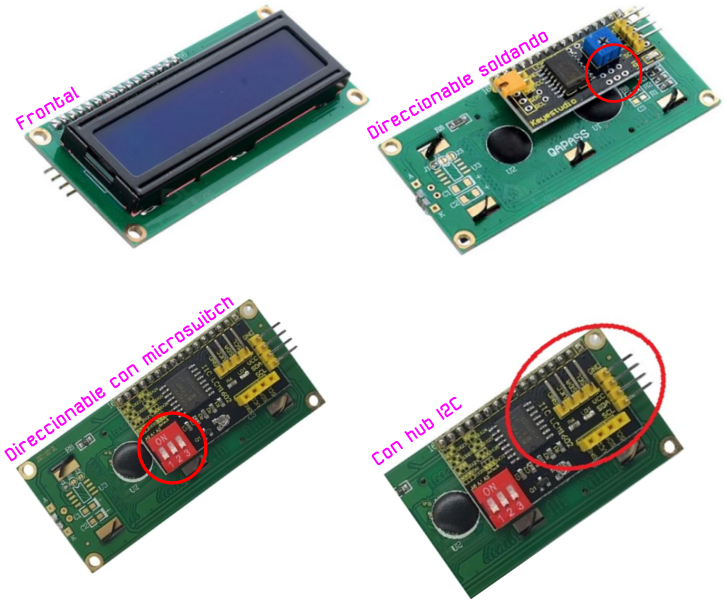
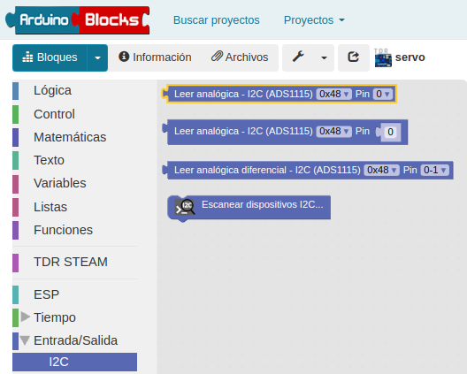
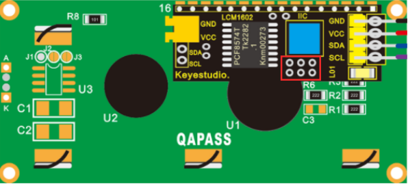
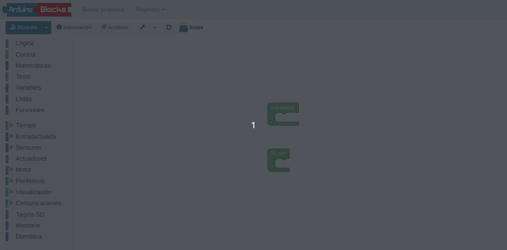

# Actividades de ampliación
Se realizan una serie de actividades con material opcional que NO está incluido en el kit básico.

Contamos con muchos accesorios opcionales para poder conectar al robot. Existen un par de opciones muy interesantes que son: una pantalla de texto y una matriz de LED de tipo I2C.

  
*Conector I2C en la placa Imagina 3DBot*

## **El bus I2C**
Las siglas I2C corresponden en realidad a I²C que tiene su origen en las iniciales del inglés Inter-Integrated Circuit (IIC = I²C) y que siginifican Circuito Inter-Integrado y vamos a explicar un poco en que consiste este sistema de conexionado.

El bus conocido por las siglas I2C, IIC o I²C, es un bus serie de datos desarrollado en 1982 por Philips Semiconductors (hoy NXP Semiconductors, parte de Qualcomm). Se utiliza principalmente internamente para la comunicación entre diferentes partes de un circuito, por ejemplo, entre un controlador y circuitos periféricos integrados. Posteriormente fue adoptado progresivamente por otros fabricantes hasta convertirse en un estándar del mercado con miles de circuitos integrados de diferentes fabricantes.

I2C también se denomina TWI (Two Wired Interface) únicamente por motivos de licencia, denominación introducida por Atmel. No obstante, la patente caducó en 2006, por lo que actualmente no hay restricción sobre el uso del término I2C.

El bus I2C requiere únicamente dos cables o lineas de señal para su funcionamiento, uno para la señal de reloj (SCL, Serial Clock) y otro para el envío de datos (SDA, Serial Data). Ambas líneas precisan resistencias de pull-up hacia Vcc. Cualquier dispositivo conectado a estas líneas es de drenador o colector abierto (Open Collector), lo cual en combinación con las resistencias pull-up, crea un circuito Wired-AND. En la imagen siguiente vemos el diagrama básico de conexionado del bus con algunos ejemplos de dispositivos. La señal de reloj siempre es generada por el circuito que actúa como Master.

  
*Diagrama de conexión del bus I2C*

Para ser reconocido en el bus, cada dispositivo dispone de una dirección física, que se emplea para acceder a cada uno de ellos de forma individual. Esta dirección puede ser fijada por hardware, en cuyo caso se pueden modificar los últimos 3 bits mediante “jumpers” o microinterruptores, o por software.

En general, cada dispositivo conectado al bus debe tener una dirección única. Si tenemos varios dispositivos similares tendremos que cambiar la dirección o, en caso de no ser posible, implementar un bus secundario.

El bus I2C tiene una arquitectura de tipo master-slave, lo que indica que el master es el encargado de controlar al resto de dispositivos tipo slave con los que se comunica y que se comunican con el, teniendo siempre el master prioridad absoluta. El dispositivo master es el que inicia la comunicación con los slaves. Los slaves no pueden iniciar la comunicación (el master tiene que preguntarles), ni hablar entre si directamente.

El bus I2C debe ser por lo tanto síncrono, es decir debe existir una señal de reloj que controle las comunicaciones. Es el master el que proporciona la señal de reloj, que mantiene sincronizados a todos los dispositivos del bus. De esta forma, se elimina la necesidad de que cada dispositivo tenga su propio reloj, de tener que acordar una velocidad de transmisión y mecanismos para mantener la transmisión sincronizada como en UART o SPI. En la imagen vemos un cronograma ejemplo del funcionamiento del sistema.

  
*Cronograma de trabajo del bus I2C*

El protocolo de comunicación I2C sigue la siguiente secuencia:

>
* Primero, el master genera la señal de reloj del bus (SCL).
* Se inicia la comunicación por orden del master al establecer la condición de START, que se produce cuando SDA pasa de uno a cero y se mantiene en cero durante un tiempo.
* El master direcciona a los slaves.
* El master indica si se va a leer o escribir.
* El slave direccionado responde con una señal de conformidad ACK (acknowledge).
* Se transmite los datos byte a byte desde SDA al receptor. Por cada pulso desde SCL se transmite un bit de información.
* El destinatario de la información responde con una señal de conformidad ACK.
* Se acaba la comunicación cuando el master establece la condición de STOP, que se produce cuando SDA, por orden del master pasa de cero a uno y se mantiene en uno durante un tiempo.

Son muchos los dispositivos I2C que se pueden direccionar por este bus I2C, siendo lo más común en los dispositivos para I2C que utilicen direcciones de 7 bits, aunque existen dispositivos de 10 bits, pero es un caso raro. Una dirección de 7 bits implica que se pueden poner hasta 128 (27) dispositivos sobre un bus I2C. Hemos visto que las direcciones son de 8 bits y esto es porque el bit extra de los 7 de la dirección lo emplea el master para informar al slave si va a leer o escribir. Si el bit de lectura/escritura es cero, el dispositivo master está escribiendo en el slave. Si el bit es 1 el master está leyendo desde el slave. La dirección de 7 bit se coloca en los 7 bits más significativos del byte y el bit de lectura/escritura es el bit menos significativo.

Existen, además, concentradores o hubs que permiten conectar mas de un dispositivo a la vez.

  
*Hub bus I2C*

## **AAm_1. Pantalla LCD1602**
Una pantalla LCD (del ingés, Liquid Cristal Display) de 2 líneas de 16 caracteres tiene el aspecto y la distribución de pines que vemos en la imagen siguiente.

  
*LCD 2x16*

Es evidente que deberíamos utilizar bastantes patillas de nuestra placa tipo UNO (es el formato que tiene la ESP32 STEAMakers) para su control. En la imagen siguiente se muestra el conexionado mínimo necesario en una pantalla de este tipo: 4 bits para datos y dos señales de control En (Enable) y Rs (Register select). La conexión RW la ponemos a GND. Además se debe añadir una resistencia ajustable o un potenciómetro para regular el contraste de la pantalla.

  
*Conexionado mínimo LCD 2x16*

Es preferible utilizar alguna de las que tienen el aspecto que vemos en la imagen siguiente:

  
*LCD 2x16 con módulo I2C*

En realidad el conjunto que vemos en la imagen anterior no es mas que una LCD 2x16 a la que se ha incorporado un módulo adaptador de LCD a I2C. Este modulo está especialmente diseñado para poder soldarlo directamente a la LCD y convertirla así en un dispositivo I2C que además ya lleva incorporado el potenciómetro de ajuste de contraste en alguno de los casos.

Este tipo de pantalla requiere cuatro cables para establecer las conexiones, dos cables SDA (datos) y SCL (reloj) para el bus de comunicaciones I2C y los dos cables de alimentación VCC y GND.

La dirección I2C por defecto de este tipo de módulos puede ser 0x3F o en otros casos 0x27, e incluso hay modelos en los que se puede cambiar. Para un correcto control es muy importante identificar correctamente la dirección I2C de nuestro modulo pues de otra forma nuestro programa no funcionará correctamente.

Una LCD 1602 I2C es muy sencilla de controlar a partir de los bloques que nos proporciona ArduinoBlocks.

En el bloque “Visualización → Pantalla LCD” encontramos la función “LCD iniciar”, que sirve para indicar que vamos a utilizar la pantalla, y que debe colocarse dentro del bloque “Inicializar”, y la función “LCD Imprimir”, que debe ponerse dentro del bloque “Bucle”. En la imagen siguiente vemos los bloques disponibles.

  
*Bloques para trabajar con LCDs*

En la siguiente figura se muestra el sistema de distribución de filas y columnas.

  
*Sistema de coordenadas en una LCD 1602*

### Escanear dispositivos I2C
Si no conocemos la dirección especifica de nuestro módulo podemos utilizar un pequeño programa que llamaremos [Escaner_I2C](http://www.arduinoblocks.com/web/project/1691564) y que se encargará de identificar la dirección I2C y todos los dispositivos I2C conectados a nuestra placa. Debemos crear un proyecto para tener disponible el menú I2C que nos de acceso al bloque "Escanear dispositivos I2C..." tal y como vemos en la imagen siguiente:

  
*Menu I2C*

El programa [Escaner_I2C](http://www.arduinoblocks.com/web/project/1691564) nos permite ver en la Consola la dirección física de los dispositivos I2C conectados a la placa.

  
*Programa Escaner_I2C*

<b>IMPORTANTE</b>

En el caso de la placa ESP32 STEAMakers no ocurre como en otras tipo Arduino, que cuando conectamos la consola se efectúa un reset automático de la placa por lo que es muy posible que el programa de escaneo nos muestre una consola sin resultado alguno o en blanco. Simplemente, con la consola ya conectada, hacemos un reset físico en la placa y el problema quedará solucionado.

En la figura siguiente tenemos el resultado que se muestra con el programa anterior cargado, conectar la consola y hacer reset. En este caso vemos los cinco dispositivos conectados a través de un hub y la placa TdR STEAM.

  
*Consola para el programa Escaner_I2C con 5 dispositivos*

Otra opción para hacer un escáner I2C que no necesita el reset es el programa que vemos en la figura siguiente y que lleva al bucle la orden de escaneo que se va a ejecutar cada 10 segundos, aunque este tiempo puede ser otro cualquiera.

  
*Programa Escaner_I2C_bucle en el bucle con 5 dispositivos*

En la figura siguiente vemos el resultado en la consola y como coincide con el anterior.

  
*Consola para el programa Escaner_I2C_bucle en el bucle con 5 dispositivos*

### Cambiar la dirección física del dispositivo I2C
Esta tarea nos va a resultar especialmente útil si disponemos de LCDs I2C con una dirección fijada de fábrica y queremos conectar varias de ellas en nuestro proyecto.

* **LCD SIN micro interruptores**

La parte posterior de la LCD 1602 de Keyestudio tiene el aspecto de la imagen siguiente. Nos fijaremos especialmente en los tres grupos de agujeros enmarcados en rojo. Aunque en este caso no vienen nombrados los vamos a denominar A0, A1 y A2 de izquierda a derecha.

  
*Pads configuración dirección física en la parte posterior LCD I2C*

La dirección por defecto de fábrica en este caso es la 0x27, pero se puede cambiar alterando la situación de conexionado de estos agujeros entre si según la tabla siguiente:

|A2|A1|A0|Dirección|
|:-:|:-:|:-:|:-:|
|0|0|0|0x27|
|0|0|1|0x26|
|0|1|0|0x25|
|0|1|1|0x24|
|1|0|0|0x23|
|1|0|1|0x22|
|1|1|0|0x21|
|1|1|1|0x20|

Para establecer los unos de la tabla anterior basta con cortocircuitar los dos pads correspondientes. En la imagen siguiente se ha establecido la dirección física como 0x26.

  
*Dirección 0x26*

* **LCD CON micro interruptores**

La parte posterior de la LCD 1602 de Keyestudio con micro interruptores para cambiar su dirección física tiene el aspecto de la imagen siguiente. Nos fijaremos especialmente en el recuadro azul donde están los microinterruptores que permiten cambiar el estado del bit y encima de los mismo está la información de la dirección física que se asigna a cada combinación. La tabla es exactamente la misma que en el caso anterior.

  
*Configuración dirección física en la parte posterior LCD I2C con microinterruptores*

### Definición de símbolos en la LCD
Dentro de los bloques del menú Visualización -> Pantalla LCD está el de "definir símbolo", que permite definir uno de los 8 símbolos personalizables que puede almacenar el micro de la pantalla LCD. El símbolo se define por un mapa de bits (unos y ceros indicando cada píxel del símbolo). Los símbolos tienen una resolución de 5x8 píxeles (blanco o negro).

En ArduinoBlocks disponemos de una herramienta que nos ayuda a definir nuestros propios símbolos y podemos acceder a ella desde herramientas o haciendo clic derecho sobre el bloque, desplegándose en cualquier caso un editor muy sencillo de usar y que vemos con un ejemplo en la imagen en la siguiente:

  
*Ejemplo de símbolo creado con el editor*

### AAm_1_1. Mensajes
Se trata de mostrar una determinada información en la pantalla consistente en varios textos en ambas filas que se irán alternando cada tres segundos.

  
*AAm_1_1. Mensajes*

[Acceder al programa](http://www.arduinoblocks.com/web/project/1691749)

### AAm_1_2. Distancia
Mostrar en una LCD la distancia en centímetros a un objeto detectado por el sensor HC-SR04.

  
*AAm_1_2. Distancia*

[Acceder al programa](http://www.arduinoblocks.com/web/project/1691791)

## **AAm_2. Matriz de LED**
Una distribución de 8x8 LEDs en forma de matriz permite crear una pantalla pequeña que tiene 64 LEDs con el aspecto de la Figura siguiente y se conecta al puerto de comunicación I2C.

  
*Aspecto de la matriz de 8x8*

Este tipo de matrices son 'multiplexadas', por lo que para controlar 64 LED necesitas 16 pines y eso son muchos pines aunque hay chips de controladores como el MAX7219 que pueden controlar una matriz, pero aún así hay mucho cableado que configurar y ocupan muchos pines. Para solucionar esto se utiliza un chip de control que tiene un reloj incorporado para multiplexar la pantalla. Además del módulo utiliza una fuente de corriente constante que permite obtener un color uniforme y brillante de todos los diodos. El conjunto forma una matriz de 8x8 que se controla a través de una interfaz I2C.

Sus principales características son:

* Matriz de LEDs de 8 filas y 8 columnas
* Direccionada por un chip HT16K33
* Conexión tipo I2C
* Tensión de alimentación: 5V
* Frecuencia de trabajo: 400KHz
* Potencia de entrada: 2.5W
* Corriente de entrada: 500mA

También existen matrices que son direccionables, como la que vemos en la imagen siguiente:

  
*Aspecto de la matriz de 8x8 direccionable*

El dispositivo dispone de su propio menú de bloques y de un diseñador de mapas de bits similar al visto para los símbolos de la LCD que podemos apreciar en la figura siguiente:

  
*Bloques para la matriz 8x8 y diseñador*

Como actividad vamos a crear dos mapas de bits de dos corazones de forma que parezca que es un corazón latiendo. Procedemos como vemos en la animación siguiente:

  
*Diseño de un mapa de bits*

La otra imagen puede tener el siguiente aspecto:

  
*Diseño de un mapa de bits*

A continuación vemos el programa:

  
*AAm_2. Latidos*

[Acceder al programa](http://www.arduinoblocks.com/web/project/1692818)

## **AAm_3. Control de un servomotor**

### El servo

Un servomotor o abreviado servo es un motor especial que puede posicionar su eje en un ángulo determinado y lo puede mantener en esta posición. Los servos estándar suelen girar 180º, pero es habitual encontrar servos que giran 90º y otros 360º, que son los conocidos como servos de rotación continua. En el interior del mismo están ubicados tanto la electrónica de control como los engranajes reductores que a su vez pueden llevar o no topes físicos que marquen el ángulo de giro. Para su funcionamiento sólo necesitan ser alimentados (conexiones GND y VCC o 5V) y una señal de control.

Los servomotores son en realidad motores de corriente continua a los que se les ha añadido una reductora, para que giren más despacio y con más fuerza, y un controlador electrónico que permite hacer que gire un determinado ángulo. Además, el servo en todo momento sabe en qué posición está, aunque se apague o reinicie. Esto significa que si a un servo que hemos movido a un determinado punto, lo hemos dejado sin alimentación y al alimentarlo de nuevo le indicamos que gire 90º, no va a girar 90º sino que se va a dirigir a su posición de 90º que tiene memorizada internamente.

En la figura siguiente vemos el interior de un servo esquematizado.

  
*Interior de un servo 9g*

Su aspecto real lo vemos en esta otra figura, donde también se aprecian las palas y tornillería que lo acompañan.

  
*Aspecto real servo 9g*

Veamos su principio básico de funcionamiento: La electrónica de control del servomotor tiene un circuito de referencia incorporado que emite la señal de referencia, que es un ciclo de 20 ms con un ancho de pulso de 1,5 ms. Se compara la tensión de control recibida con la de referencia y se genera una diferencia de tensión. El circuito de control en la placa decidirá la dirección de rotación en consecuencia y accionará el motor. El sistema de engranajes o reductora convierten el giro del motor en un par de fuerza a través del eje. El sensor detecta que se ha alcanzado la posición enviada de acuerdo con la señal de retroalimentación. Cuando la diferencia de tensión existe el motor gira y cuando la diferencia se reduce a cero, el motor se detiene. Normalmente, el ángulo de rotación es de 0 a 180 grados.

El servomotor viene con un conector hembra de tres pines para tres cables de conexión, que se distinguen por los colores marrón, rojo y naranja (diferentes marcas pueden tener diferentes colores).

El ángulo de rotación del servomotor se controla regulando el ciclo de trabajo de la señal PWM cuyo estándar es de 20 ms (50 Hz).

Hay que tener mucho cuidado de posicionar el conector de los servos en los tres pines macho de la shield en el orden correcto (el conector es reversible) o seguramente romperemos algo de manera irremediable.

Existe un tipo especial de servomotor que permite la rotación continua. En algunos casos se trata de servomotores “trucados” de forma que se modifican para permitir la rotación continua quitando los topes mecánicos y se sustituye el potenciómetro por un divisor de tensión con dos resistencia iguales (en algunos casos no se ponen resistencias y se bloquea el potenciómetro para que no gire dejándolo justo en su punto central). Este tipo de modificación la podemos realizar nosotros (en la web existen multitud de tutoriales) o también podemos comprar un servomotor de rotación continua listo para funcionar sin tener que hacer ningún tipo de bricolaje.

En el apartado de bloques de programación, se encuentra en "Motor / Servo" y en la figura siguiente vemos los bloques disponibles.

  
*Bloques para servos*

Para controlar el servomotor, indicamos los grados de rotación (Ángulo de giro) que queremos y el tiempo de retardo, o tiempo que tarda en ir de una posición a otra.

El control de un servomotor de rotación continua se realiza de igual manera, pero su reacción es diferente.

Los bloques Servo-Oscilador nos permiten de una forma sencilla hacer que el servo repita una secuencia de movimientos u oscilaciones de forma indefinida. Un ejemplo típico puede ser el que vemos en la figura siguiente, donde el servo oscila entre 0 y 90º en periodos de dos segundos.

  
*Oscilación con servo*

El bloque Servo-I2C (PCA9685) es simplemente un bloque para manejar la tarjeta controladora para 16 servos PCA9685 utilizando el bus I2C.

### Posicionar el servo
Antes de fijar con el tornillo la pala debemos averiguar cual es su posición de 0º o inicial. Para ello vamos a crear el programa Posicionar_servo que vemos en la figura siguiente o que podemos importar del enlace.

  
*Posicionar_servo*

[Acceder al programa](http://www.arduinoblocks.com/web/project/1693245)

Ejecutamos el programa que hemos cargado en la placa, y lo tenemos que parar en el momento que el servo vuelve a la posición inicial (hace un giro repentino de 180º tras un tiempo de espera mas largo). En ese momento, quitamos el soporte tipo aspa vigilando de que no se modifique la posición del servo. Sin que el servomotor se haya movido, montamos el soporte en su lugar y damos por concluida la tarea.

### Listas
Las listas de datos nos permiten almacenar un listado de valores y acceder a ellos por su posición o índice en la lista. Las listas pueden ser de tipo numéricas o de texto, como vemos en la imagen siguiente:

  
*Tipos de listas en Arduinoblocks*

En la animación siguiente vemos el proceso de creación de una lista numérica y los elementos que se crean con la misma.

  
*Creación de listas en Arduinoblocks*

Los bloques que se crean nos permiten asignarle valores, saber el número de elementos que tiene una lista, obtener el valor de una posición de la lista o cambiar el valor de un elemento de la lista.

De forma muy similar se pueden crear y trabajar con lista de textos.

Vamos a realizar un programa que vamos a dividir en varias partes:

* **Parte 1**: Mover el servo a partir de una lista de posiciones creada previamente.
* **Parte 2**: Mover de forma automática el servo entre 0 y 180 grados con retardos de un segundo.

Crearemos una función para cada apartado y serán llamadas dependiendo de si el pulsador está accionado o no. La solución la tenemos disponible en el programa que vemos en la imagen siguiente:

  
*Listas*

[Acceder al programa](http://www.arduinoblocks.com/web/project/1695723)

