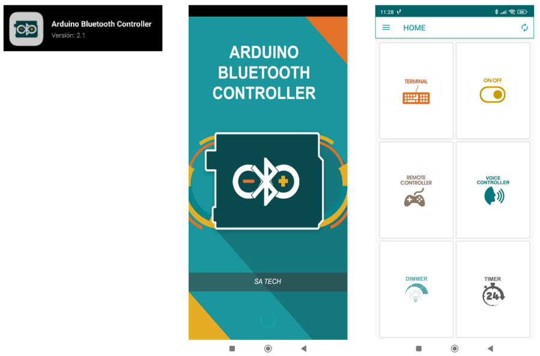
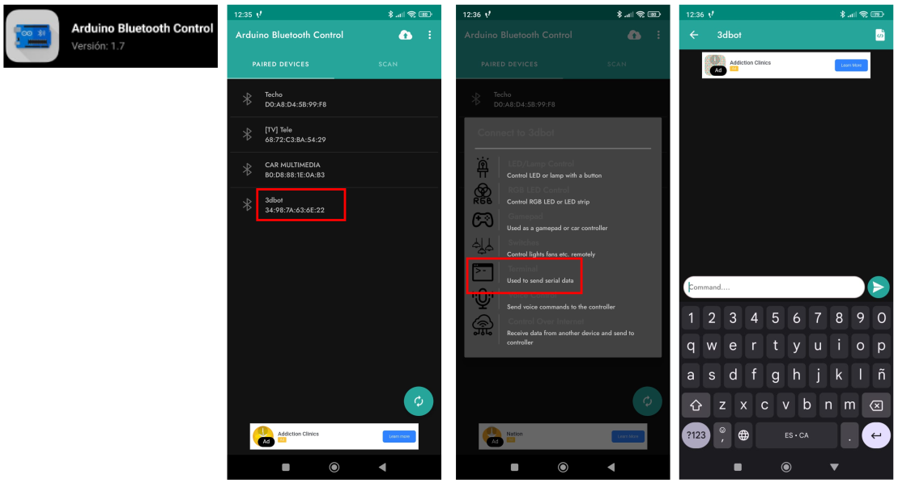

# <FONT COLOR=#8B008B>Actividades avanzadas con la placa Imagina 3DBot</font>
En esta sección realizaremos ejercicios con elementos IoT, interactuar con Telegram, Bluetooth, mando Nunchuk. Todo ello basado en:

* [Manual 3DBot](https://shop.innovadidactic.com/es/imagina-steam-y-makers/1598-kit-imagina-arduino-3dbot-esp32-steamakers-para-arduinoblocks.html) de [Innova Didactic](https://shop.innovadidactic.com/es/)
* Tutorial de Pedro Ruiz [Ejemplos 3DBot + ESP32 STEAMakers](https://pedroruizf.github.io/ejemplos_3dbot/index.html)

## <FONT COLOR=#007575>**Telegram**</font>
Es una aplicación de mensajería instantánea que fue lanzada por los hermanos Nikolái y Pável Dúrov en el año 2013 como una alternativa a WhatsApp y que actualmente cuenta con mas de 800 millones de usuarios.

Telegram sirve principalmente chatear con nuestros contactos a través de mensaje de texto, audio, llamadas, videollamadas… y compartir fotos, videos, archivos, stickers, tu ubicación, etc.

Telegram permite crear bots (usuarios no humanos), mensajes automáticos, chats secretos y organizar por grupos y canales de difusión. Se puede instalar en dispositivos móviles o como una aplicación de escritorio o utilizar o bien utilizarlo en un [navegador web](https://web.telegram.org/).

### <FONT COLOR=#AA0000>Crear un bot en Telegram</font>
Un bot, o chatbot, es una aplicación capaz interactuar en una conversación real con un usuario de manera bastante natural.

Estamos habituados a que se usen los bots automatizando servicios al cliente y son utilizados para responder rapidamente a preguntas, atender consultas 24 horas 7 dias a la semana y pueden recopilar comentarios de los clientes tras su servicio. En nuestro caso vamos a usarlos para intercambiar información entre nuestra placa y un dispositivo móvil, por lo que necesitamos crear un bot que permita realizar estas tareas.

La forma mas rápida y sencilla de crear un bot en Telegram es utilizando el "Padrino de los bots" o BotFather, que es un bot oficial de Telegram que, como indica en su información ***es el bot que los domina a todos***.

<center>

  
*BotFather info*

</center>

Este bot lo puedes usar para crear nuevas cuentas de bot y gestionar tus bots existentes.

Cuando invocamos BotFather este nos devuelve un mensaje como el que vemos a continuación:

<center>

  
*@BotFather*

</center>

El propio bot nos explica que con el mismo podemos crear y manejar bots de Telegram, nos muestra un enlace al [manual de la API del Bot](https://core.telegram.org/bots) y nos lista los comandos de control que tenemos disponibles.

Observamos que todos los comandos comienzan con '/' y cuando tecleamos esta en el chat automáticamente BotFather nos devuelve un listado con todos ellos para que podamos seleccionar el que nos interesa.

Vamos a comenzar por crear un nuevo Bot, para lo que necesitamos chatear con BotFather tecleando el comando de creación de un nuevo bot, ```/newbot``` en nuestro Telegram y a continuación nos indicará que tecleemos el nombre del Bot, en este caso será ```3DBot```. Si damos un nombre válido nos pedirá que le pongamos un nombre de usuario al Bot, en nuestro caso será ```Imagina_3D_bot```. El nombre debe terminar siempre con la palabra **bot** o **_bot**.

<center>

  
*Creación del bot 3DBot con BotFather*

</center>

Ya tenemos creado el nuevo bot con un usuario y entre otras cosas nos da el **Token** que necesitamos para conectar con la API de Telegram.

<center>

  
*Bot creeado*

</center>

Si una vez creado el bot queremos completar su información o modificarlo, la forma mas sencilla es a través del comando ```/mybots``` y escoger el bot a modificar y seguir las opciones que nos muestra el menú de botones.

<center>

  
*Acceso a mis bots y menú de botones*

</center>

Cuando escogemos el bot se nos presenta el siguiente menú:

<center>

  
*Opciones de configuración del bot*

</center>

En la edición del Bot podemos observar como se han editado algunas de las opciones:

<center>

  
*Opciones de configuración del bot editadas*

</center>

### <FONT COLOR=#AA0000>Bloques Arduinoblocks</font>
Para poder trabajar con Telegram arduinoblocks nos ofrece una serie de bloques y tenemos que utilizarlos convenientemente para poder interactuar desde Telegram con nuestras placas.

* **Iniciar Telegram Bot**: permite iniciar el sistema Telegram en la ESP32, debemos indicar el
Token obtenido para la API al crear el bot con @botfather:

<center>

  
*Iniciar Telegram Bot*

</center>

* **Enviar un mensaje**: permite enviar mensajes a cualquier chat de telegram directamente.

    - **Chat-ID**: puede ser el ID de una conversación privada o un usuario en concreto, de un
grupo o de un canal.
    - **Texto del mensaje**: el texto con el mensaje que se quiere enviar
    - **Formato**: Se pueden indicar tres tipos de formato para aplicar estilos al mensaje
(negrita, títulos, etc.). Formato: Markdown, MarkdownV2 o HTML

<center>

  
*Enviar un mensaje*

</center>

* **Evento de cuando se recibe un nuevo mensaje desde Telegram**:
    - Dentro de este bloque procesaremos el mensaje recibido, pudiendo acceder al texto del mensaje, al remitente (nombre) y al Chat-ID de donde procede el mensaje.
    - Aquí responderemos o actuaremos según el mensaje que nos llegue.

<center>

  
*Evento de cuando se recibe un nuevo mensaje desde Telegram*

</center>

* **Mensaje recibido**: Este bloque sólo tiene sentido usarlo dentro del evento de “nuevo mensaje
recibido”, si se usa fuera de él su contenido estará vacío.

    - Texto: texto del mensaje recibido
    - Chat ID: ID del chat de donde procede el mensaje. Muy útil para responder a ese mismo chat (pueden llegar mensajes de distintos chats, grupos, etc. por lo que de esta forma identificamos el origen y nos sirve para responder al chat correcto)
    - Remitente: El nombre del usuario remitente del mensaje.

Nuestros programas van a necesitar un bloque inicializar en el que conectemos la placa a una red WiFi y suminstremos el token facilitado por el Bot.

<center>

  
*Bloque inicializar*

</center>

### <FONT COLOR=#AA0000>ID del chat</font>
Si queremos que nuestro Bot envíe mensajes a un chat vamos a necesitar averiguar el ID o número que identifica al chat en cuestión. Tenemos dos ID que nos interesan:

* **ID de chat privado**. Lo necesitaremos si queremos que el Bot envíe mensajes a nuestro usuario de Telegram. Iniciamos Telegram y localizamos un bot llamado @myidbot, lo iniciamos y en el menú nos indica las dos ordenes que soporta.

<center>

  
*ID de chat privado*

</center>

El mensaje **¿Qué puede hacer este bot?** traducido y original es:

<center>

  
*ID de chat privado*

</center>

La respuesta a la orden ```/getid``` será:

<center>

  
*ID de chat privado*

</center>

Si ejecutamos la orden ```/getgroupid``` nos va a devolver un mensaje indicandonos que para obtener el ID de un grupo o canal debemos seguir uno de los pasos que indica, y que vemos a continuación.

<center>

  
*ID de chat privado*

</center>

* **ID de un grupo**. Debemos añadir al grupo a **@myidbot**, hacerlo administrador y después preguntar por ```/getgroupid```. Seleccionamos nuestro grupo de pruebas y procedemos de la siguiente forma:

<center>

  
*ID de grupo*

</center>

Las ordenes disponibles ahora son:

<center>

  
*Ordenes disponibles en ID de grupo*

</center>

Una vez ejecutadas obtenemos los resultados correspondientes, en el primer caso obtenemos el mismo ID que anteriormente y en el segundo un valor negativo que es el ID del grupo.

<center>

  
*Resultado ordenes en ID de grupo*

</center>

Una vez conocidos los ID de usuario y de grupo podemos eliminar al Bot @myidbot del grupo.

### <FONT COLOR=#AA0000>Telegram: Actividad avanzada 1</font>
En esta actividad vamos a recibir en nuestro Bot de telegram la temperatura a la que está la placa y la mostraremos también en el monitor serie del ordenador.

<center>

  
*Actividad avanzada con Telegram 1*

[Acceder al programa](http://www.arduinoblocks.com/web/project/1696129)

</center>

Para poder probar el Bot creado debemos meter al usuario en un grupo. En mi caso voy a tener un grupo con solo dos usuarios, yo mismo y el del Bot.

<center>

  
*Grupo de pruebas de 3DBot*

</center>

A continuación vemos las respuesta que nos da la placa a las ordenes tecleadas y como responde la consola de arduinoblocks.

<center>

  

  
*Pruebas de 3DBot*

</center>

### <FONT COLOR=#AA0000>Telegram: Actividad avanzada 2</font>
Se trata de realizar un programa asociado a un bot de Telegram que sea capaz de realizar las siguientes acciones sobre la placa Imagina 3DBot:

* al teclear ```/ayuda``` o ```/help``` nos responde con todas las órdenes disponibles
* al teclear ```/led=rojo```se encenderá el LED rojo de la placa
* al teclear ```/led=verde```se encenderá el LED verde de la placa
* al teclear ```/led=amarillo```se encenderá el LED amarillo de la placa
* al teclear ```/led=negro```se apagarán los tres LEDs.
* al teclear ```/tpambiente``` nos mostrará la temperatura ambiente que detecta la NTC
* al teclear ```/tpplaca``` nos mostrará la temperatura del ESP32
* al teclear ```/ilumina``` nos mostrará el nivel de iluminación de la LDR

El programa llevará los mismos bloques y configuración que en la actividad anterior en lo referente a ```Inicializar``` y el bloque de Telegram del evento ```Nuevo mensaje recibido``` lo analizamos por partes dado que tiene un tamaño que en una sola imagen no se aprecia adecuadamente.

>
* al teclear ```/ayuda``` o ```/help```. Simplemente en el bloque ```si ... hacer ... sino``` preguntamos si se ha recibido alguno de los dos mensajes y en caso afirmativo se envia el mensaje:
>
      */ayuda o /help: ordenes disponibles; /led=rojo: activa LED rojo; /led=verde: activa LED verde; /led=amarillo: activa LED amarillo; /tpambiente: temperatura NTC; /tpplaca: temperatura ESP32; /ilumina: nivel de iluminacion*

<center>

  
*al teclear ```/ayuda``` o ```/help```*

</center>

>
* al teclear ```/led=rojo```, ```/led=verde```, ```/led=amarillo``` o ```/led=negro```. Esta parte merece especial explicación y la indicación de que está tomada del tutorial de Pedro Ruiz [Retos demo ESP32 Steamakers + TDR-Steam + Arduinoblocks (IoT)](https://pedroruizf.github.io/steamakers_demo/index.html), donde se realiza la "elegante" técnica de dividir el texto para quedarse con la parte que interesa.

<center>

  
*al teclear ```/led=rojo```, ```/led=verde```, ```/led=amarillo``` o ```/led=negro```*

</center>

>
* al teclear ```/tpambiente```, ```/tpplaca``` o ```/ilumina```. Se muestran los valores del resto de variables y se envian los mensajes correspondientes. La opción ```... sino``` del primer condicional se ejecutará si no enviamos una consulta válida.

<center>

  
*al teclear ```/tpambiente```, ```/tpplaca``` o ```/ilumina```*  
[Acceder al programa](http://www.arduinoblocks.com/web/project/1696725)

</center>

## <FONT COLOR=#007575>**Subir datos a Internet**</font>
En esta actividad vamos a conectar la placa ESP32 STEAMakers a una red WiFi para subir a Internet datos de la propia placa y de la shield Imagina 3DBot. Los datos los enviamos a ThingSpeak, una plataforma que, entre muchas otras funcionalidades, nos hace gráficas de los datos que va recibiendo. Recuerda que ThingSpeak, si tienes una cuenta gratuita, te deja subir datos cada 15 segundos.

### <FONT COLOR=#AA0000>ThingSpeak</font>
Lo primero que vamos a hacer es conectar la placa a la red WiFi. Para ello tenemos los bloques en el apartado “Comunicaciones → WiFi / IoT”. Los bloques de MQTT también se encuentran en este mismo apartado, dentro de “MQTT Client”.

<center>

  
*Bloques de conexión y configuración*

</center>

Una vez que tengamos la placa conectada a la red WiFi vamos a crear nuestro canal para enviar datos a Thingspeak.

Para crear el canal debes seguir los siguientes pasos ([después de crear una cuenta](https://thingspeak.com/)):

<center>

  
*Nuevo canal Thingspeak*

</center>

Una vez dentro escribe el nombre del canal, una descripción (opcional), los campos que creas necesarios y el resto de información relativa al canal.

<center>

  
*Campos canal Thingspeak*

</center>

Si nos desplazamos al final en esa página veremos el botón para guardar el canal:

<center>

  
*Salvar canal Thingspeak*

</center>

Con estos dos pasos ya tenemos creado el canal que por defecto se crea con visualización privada (solamente podemos verlo nosotros).

<center>

  
*Canal Thingspeak*

</center>

Si queremos cambiar la visualización lo hacemos en la pestaña 'Sharing'. Ahora hemos de crear un dispositivo MQTT para el canal:

<center>

  
*Dispositivo MQTT canal Thingspeak*

</center>

Una vez pulsado el botón 'Add device' nos aparecen unas credenciales en la pantalla. Estas credenciales son necesarias para el bloque Iniciar de MQTT. Anótalas o descárgalas y guardalas en lugar seguro, las necesitarás más adelante.

<center>

  
*Inicializaciones Arduinoblocks*

</center>

El servidor MQTT de ThingSpeak se configura con:

* Dirección (Broker): **mqtt3.thingspeak.com**
* Puerto: **1883**

### <FONT COLOR=#AA0000>IoT: Actividad avanzanda</font>
El programa para enviar datos lo ejecutamos cada 16 segundos por la limitación de tratarse de un canal gratuito.

<center>

  
*IoT_AAv1_Imagina. Programa*  
[Acceder al programa](http://www.arduinoblocks.com/web/project/1697707)

</center>

Transcurridos unos minutos el estado del canal es el siguiente:

<center>

  
*IoT_AAv1_Imagina. Resultados*

</center>

## <FONT COLOR=#007575>**Bluetooth**</font>
Los módulos Bluetooth permiten crear conexión inalámbrica serie punto a punto de forma que la forma de trabajar es muy similar a la comunicación serie por cable. A continuación vemos lo básico de los módulos más comunes.

### <FONT COLOR=#AA0000>Introducción</font>
Bluetooth es una especificación industrial para Redes Inalámbricas de Área Personal (WPAN) que posibilita la transmisión de voz y datos entre diferentes dispositivos mediante un enlace por radiofrecuencia en la banda ISM de los 2.4 a 2.485 GHz. Los principales objetivos que se pretenden conseguir con esta norma son:

* Facilitar las comunicaciones entre equipos móviles.
* Eliminar los cables y conectores entre estos.
* Ofrecer la posibilidad de crear pequeñas redes inalámbricas y facilitar la sincronización de datos entre equipos personales.

Se denomina Bluetooth al protocolo de comunicaciones diseñado especialmente para dispositivos de bajo consumo, que requieren corto alcance de emisión y basados en transceptores (dispositivos que cuentan con transmisor y receptor compartiendo parte de la circuiteria) de bajo costo.

El hardware que compone el dispositivo Bluetooth está compuesto por dos partes:

* un dispositivo de radio, encargado de modular y transmitir la señal.
* un controlador digital, compuesto por una CPU, un procesador de señales digitales (DSP – Digital Signal Processor) llamado Link Controller (o controlador de Enlace) y de las interfaces con el dispositivo anfitrión.

Su logotipo lo vemos en la figura siguiente:

<center>

  
*Logotipo Bluetooth con texto y sin texto*

</center>

### <FONT COLOR=#AA0000>Bluetooth V2</font>
Existe un procedimiento definido que se llama Pairing (o emparejamiento) que vincula a dos dispositivos Bluetooth. Cuando vinculamos dos dispositivos Bluetooth, se inicia un proceso en el que ellos se identifican por nombre y dirección interna y se solicitan la clave PIN para autorizar la conexión.

Si el emparejamiento se realiza con éxito, ambos nodos suelen guardar la identificación del otro y cuando se encuentran cerca se vuelven a vincular sin necesidad de intervención manual.

Para manejar los módulos Bluetooth se utilizan los comandos Hayes o AT, de los que se puede encontrar información en este [enlace](https://es.wikipedia.org/wiki/Conjunto_de_comandos_Hayes) y a continuación damos algunos básicos:

* AT+VERSION: Versión del Firmware.
* AT+NAMEXXX: Para establecer el nombre que queremos presentar cuando otro dispositivo nos busque.
* AT+PINXXXX: permite establecer el número de identificación personal, que se requerirá para establecer la vinculación.
* AT+BAUDX: Permite fijar la velocidad de comunicación entre el modulo y la consola según los siguientes pares:

    1 -> 1200 bps | -5 -> 19200 bps

    2 -> 2400 bps | -6 -> 38400 bps

    3 -> 4800 bps | -7 -> 57600 bps

    4 -> 9600 bps | -8 -> 115200 bps

La velocidad por defecto es la de 9600 bps.

Los módulos mas conocidos son el HC-05 y HC-06 que son Bluetooth V2 y cuyo aspecto podemos ver en la figura siguiente:

<center>

  
*Módulos HC-05 y HC-06*

</center>

### <FONT COLOR=#AA0000>BT 4.0 o Low Energy (BLE)</font>
Básicamente se trata de un nuevo protocolo diseñado para reducir en todo lo posible el gran consumo de energía de sus predecesores. Generalmente se le conoce como BLE (iniciales de Bluetooth Low Energy) o Bluetooth LE o también como Bluetooth Smart y tienen un consumo típico que podemos cifrar entre los 10 y 15 mA. Otra de sus principales novedades radica en que este módulo si es utilizables con dispositivos iOS.

El BLE es un subconjunto del estándar Bluetooth v4.0 que dispone de una pila de protocolos en referencia a la capa OSI (en inglés, Open Systems Interconnection) completamente nueva y orientada a conexiones sencillas en aplicaciones de muy baja potencia que suelen funcionar con pilas o baterías.

La pila de protocolos para Bluetooth Low Energy sigue la estructura definida en la figura siguiente.

<center>

  
*Pila de protocolos para BLE*

</center>

El controlador aloja las capas inferiores de la pila del protocolo y también la radio. El Hots contiene las capas superiores de la pila de protocolos. Por encima de ambas estaría la aplicación de usuario que es la que interactúa con la pila de protocolos. La ventaja es que todas estas capas se pueden implementar en un solo chip o dividir en varios y conectarlos a través de una capa de comunicaciones como UART, USB o SPI.

* El controlador contiene las capas: Interfaz de controlador de host (HCI), Capa de enlace (LL) y Capa física (PHY)

    * En la capa física (physical layer) se implementa toda la circuiteria de comunicaciones. La tecnología BLE puede usar hasta 40 canales de 2MHz en la banda ISM. El estándar emplea la técnica “frequency hopping” o “saltos en frecuencia”, siguiendo una secuencia de saltos pseudo-aleatorios entre los canales frecuenciales mencionados que ofrece un alto grado de robustez frente a interferencias.
    * La capa de enlace (link layer), se encarga de gestionar características como los requerimientos temporales del estándar, chequeo de mensajes y reenvío de mensajes erróneos recibidos, gestión, filtrado de direcciones etc. Además ofrece la definición de roles (Advertiser, Scanner, Master and Slave) que permiten identificar de forma lógica el rol de cada dispositivo en el proceso de coElmunicación. El nivel LL es del mismo modo responsable de procesos de control como el cambio de parámetros de la conexión o la encriptación.
    * el Host Controller o HCI es un protocolo estándar que permite que la comunicación entre un host y un controlador se lleve a cabo a través de un interfaz serie. A modo de ejemplo, en la mayoría de smartphones u ordenadores el host y la aplicación corren en la CPU principal mientras que el controlador está situado en hardware específico y separado, conectado mediante UART o USB. El estándar Bluetooth define HCI como el conjunto de comandos y eventos para la interacción de ambas partes (host y controlador).

* El host contiene las siguientes capas: Perfil de acceso genérico (GAP), Perfil de atributo genérico (GATT), Protocolo de adaptación y control de enlace lógico (L2CAP), Protocolo de atributos (ATT), Gerente de seguridad (SM) y la Interfaz de controlador de host (HCI).
  
    * La capa L2CAP (Logic Link Control and Adaptation Protocol), se responsabiliza de dos tareas fundamentales en un proceso de comunicación. En primer lugar, el proceso de multiplexación, es decir, la capacidad de dar formato a mensajes provenientes de las capas OSI superiores y encapsularlos en paquetes estándar BLE así como el proceso inveMódulrso.
    * Para BLE, la capa L2CAP es la encargada de dar acceso y soporte a los dos protocolos fundamentales. Por un lado, ATT (Attribute Protocol), un protocolo basado en atributos presentados por dispositivo, con arquitectura cliente-servidor, que permite el intercambio de información. Por otro lado, SMP (Security Manager Protocol), protocolo que proporciona un framework para generar y distribuir claves de seguridad entre dos dispositivos.
    * En el nivel más alto de la capa de protocolos, encontraremos de forma paralela las capas GAP y GATT. Esta primera, GAP (Generic Acces Profile), permite que un dispositivo sea visible hacia el resto de dispositivos y además determina como puede interactuar un dispositivo entre otro. Establece distintas normas y conceptos para estandarizar las operaciones de más bajo nivel como:

>>
  * Roles de interacción
  * Modos de operación y transición entre ellos
  * Procedimientos para establecimiento de comunicación
  * Modos de seguridad y procedimientos

* Al otro lado, GATT (Generic Attribute Profile), que define como dos dispositivos BLE transfieren información. Este proceso tiene lugar cuando dos dispositivos han superado la fase de establecimiento de comunicación (controlada por GAP) y comienza la transferencia de información pudiendo ser de forma bidireccional.

En Arduinoblocks y en el caso del microcontrolador ESP32 con bluetooth integrado, simplemente debemos indicar el nombre del dispositivo Bluetooth para iniciar la comunicación:

<center>

  
*Bloque para inicializar BLE en ESP32*

</center>

### <FONT COLOR=#AA0000>Aplicaciones Bluetooth</font>
Antes de usar cualquier aplicación debemos emparejar el BLE de la ESP32 con nuestro móvil.

Existen muchas aplicaciones capaces de actuar como apps que permiten transmitir datos entre dispositivos Bluetooth. Vamos a usar de Google Play Store las siguientes:

* **[Bluetooth Terminal Qwerty](https://apkcombo.com/bluetooth-terminal/Qwerty.BluetoothTerminal/)**, una apk con una interface muy simple y fácil de configurar, basta conectarse con el dispositivo emparejado y comenzar a enviar comandos.

<center>

  
*Bluetooth Terminal Qwerty*

</center>

* **Arduino Bluetooth Controller** es una aplicación que le permite controlar su placa arduino (y placas similares) a través de Bluetooth.

<center>

  
*Logo Arduino Bluetooth Controller*

</center>

Al lanzar la aplicación se muestra una imagen y tras unos instantes aparece el menú gráfico de la aplicación. En la parte superior derecha tenemos el icono para conectar a un dispositivo.

<center>

  
*Arduino Bluetooth Controller*

</center>

En la imagen siguiente vemos el modo terminal de la aplicación.

<center>

  
*Modo terminal de Arduino Bluetooth Controller*

</center>

* **Arduino Bluetooth Control** también es una aplicación que le permite controlar su placa arduino (y placas similares) a través de Bluetooth

<center>

  
*Logo Arduino Bluetooth Control*

</center>

Se lanza la app, se escoge dispositivo y selecciona el modo terminal para estar en una situación parecida a la de las otras aplicaciones.

<center>

  
*Arduino Bluetooth Control*

</center>

### <FONT COLOR=#AA0000>BT: Actividad avanzada 1</font>
Vamos a crear un sencillo programa que nos muestre en la consola el caracter enviado desde una aplicación en un móvil.

<center>

  
*Bluetooth: Actividad avanzada 1*  
[Acceder al programa](http://www.arduinoblocks.com/web/project/1698254)

</center>

Cargamos el programa en la placa, lanzamos la consola y emitimos comandos de una o varias letras desde alguna app del móvil con la conexión con '3dbot' realizada. El nombre '3dbot' se ha establecido en el bloque inicializar y permite la conexión con el BLE de la ESP32.

Vamos a obtener una serie de números que se corresponden con los valores decimales de los [caracteres ASCII](https://elcodigoascii.com.ar/) imprimibles.

<center>

  
*Bluetooth: Actividad avanzada 1. Envio y recepción*

</center>

### <FONT COLOR=#AA0000>BT: Actividad avanzada 2</font>
En esta segunda actividad vamos a hacer algo similar a la actividad avanzada 2 de Telegram, es decir, enviaremos comandos (letras) a la ESP32 a través de una app via Bluetooth y la placa nos responderá con diferentes mensajes y datos.

Comenzamos por el bloque 'Inicializar' que va a tener el siguiente aspecto:

<center>

  
*Bluetooth: Actividad avanzada 2*  

</center>

Los comandos soportados van a ser:

* Tecla T para obtener la temperatura de la ESP32. Corresponde al ASCII 84 decimal
* Tecla R para encender el LED rojo. Corresponde al ASCII 82 decimal
* Tecla A para encender el LED amarillo. Corresponde al ASCII 63 decimal
* Tecla V para encender el LED verde. Corresponde al ASCII 86 decimal
* Tecla N para apagar los tres LEDs. Corresponde al ASCII 110 decimal

<center>

  
*Bluetooth: Actividad avanzada 2*  
[Acceder al programa](http://www.arduinoblocks.com/web/project/1698639)

</center>

Resultados obtenidos a través de la app Bluetooth Terminal Qwerty:

<center>

  
*Bluetooth: Actividad avanzada 2. Resultados*  

</center>

Resultados obtenidos a través de la app Arduino Bluetooth Controller:

<center>

  
*Bluetooth: Actividad avanzada 2. Resultados*  

</center>

## <FONT COLOR=#007575>**Mando Nunchuk de la Wii**</font>
Este mando está compuesto por un joystick y un acelerometro:

<center>

  
*Partes del mando*  

</center>

En la imagen vemos la localización del conector en la placa Imagina 3DBot:

<center>

  
*Conector nunchuk en la placa Imagina 3DBot*  

</center>

### <FONT COLOR=#AA0000>AAv1_Joystick y botones</font>
Vamos a comenzar por leer los valores analógicos del joystick así como el estado de los botones.

<center>

  
*AAv1_Joystick y botones*  
[Acceder al programa](http://www.arduinoblocks.com/web/project/1698785)

</center>

A continuación vemos resultados de accionar el mando y pulsar los botones:

<center>

  
*AAv1_Joystick y botones*  

</center>

### <FONT COLOR=#AA0000>AAv2_Acelerómetro</font>
Recordemos brevemente algunos conceptos:

* Se puede decir que la velocidad es una medida de la distancia que recorre un objeto en un tiempo dado.
* La aceleración es una medida de cómo cambia la velocidad. La aceleración es algo que estamos acostumbrados a sentir en nuestro día a día, por ejemplo cuando avanzamos con un coche o cuando frenamos, o en un autobús, o la gravedad que nos atrae al lugar en el que estamos parados.

Esto tiene su principio en la primera Ley de Newton o ley de inercia, que viene a decir que un cuerpo en reposo, permanecerá en reposo hasta que una fuerza lo haga moverse, y al contrario, un cuerpo en movimiento se mantendrá en movimiento hasta que una fuerza lo detenga.

Técnicamente es posible conseguir fabricar un condensador en el que la energia almacenada en el mismo, que depende de su geometria y de la distancia entre sus placas, pueda traducirse en saber la aceleración que tiene.

Un acelerómetro es un dispositivo capaz de medir la aceleración inercial ($a=dv/dt$) que sufre el componente.

La asegunda Ley de Newton o ley fundamental de la dinámica, nos indica que el cambio de movimiento es proporcional a la fuerza motriz que lo provoca, quedando descrito por su momento:

<center>$p=m \cdot v;F=dp/dt \rightarrow F=m \cdot a$</center>

Un sensor de este tipo utiliza internamente componentes denominados MEMS (MicroElectroMechanical Systems) que son sistemas que llevan partes móviles en su interior de forma que tenemos un cuerpo sólido, en cuyo interior hay una masa sujeta por muelles al cuerpo exterior. La idea se explica mucho mejor observado la siguiente animación extraida de [https://howtomechatronics.com/](https://howtomechatronics.com/).

<center>

  
*Principio de funcionamiento de un acelerómetro*  

</center>

El acelerómetro del Nunchuk es de 3 ejes por lo que es capaz de medir aceleraciones en los 3 ejes: X, Y, Z.

<center>

  
*Ejes del acelerómetro*  

</center>

En el bloque nunchuk se pueden además seleccionar las siguientes opciones:

<center>

  
*Opciones del bloque nunchuk*  

</center>

Los conceptos que vemos en la imagen se refieren a la rotación del eje X (Roll) y la rotación del eje Y (Pitch) y se ha prescindido del eje Z (Yaw). Para aprender mas sobre estos conceptos visita este enlace al [blog de Luis Llamas](https://mecatronicalab.es/escornabot-control-por-acelerometro/anexo-determinar-la-orientacion/). En la explicación de los conceptos básicos de este tipo de dispositivos se muestra el gráfico de la figura siguiente, donde se comparan los conceptos de movimientos angulares aplicados a una aeronave.

<center>

  
*Movimientos angulares*  

</center>

Creamos un programa similar al anterior:

<center>

  
*AAv2_Acelerómetro*  
[Acceder al programa](http://www.arduinoblocks.com/web/project/1699424)

</center>

A continuación vemos resultados de accionar el mando y pulsar los botones:

<center>

  
*AAv2_Acelerómetro*  

</center>
