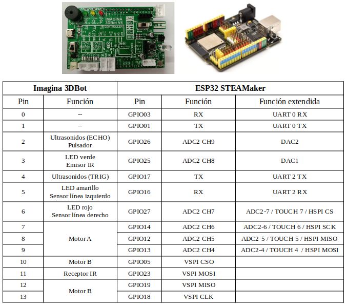
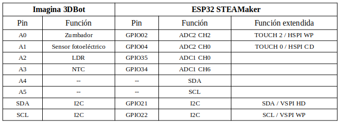
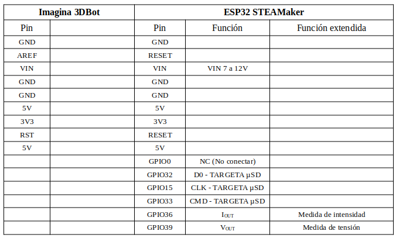

# Asociación de pines y componentes

## **Imagina 3DBot**
La asociación de pines analógicos de entrada/salida con componentes es la siguiente:

* A0 / GPIO02 --> Zumbador
* A1 / GPIO04 --> Cualquier sensor o actuador
* A2 / GPIO35 --> Sensor de luz (LDR)
* A3 / GPIO34 --> Sensor de temperatura (NTC)
* A4 --> Bus I2C
* A5 --> Bus I2C

La asociación de pines digitales de entrada/salida con componentes es la siguiente:

* D0 / RX0 --> Bluetooth RX
* D1 / TX0 --> Bluetooth TX
* D2 / GPIO26 --> Sensor de ultrasonidos (ECHO), pulsador
* D3 / GPIO25 --> <b>LED verde</b>, <u><b>emisor infrarrojos</u></b>
* D4 / GPIO17 --> Sensor de ultrasonidos (TRIG)
* D5 / GPIO16 --> <b>LED amarillo</b>, <u><b>sensor de línea izquierdo</u></b>
* D6 / GPIO27 --> <b>LED rojo</b>, <u><b>sensor de línea derecho</u></b>
* D7 / GPIO14 --> Motor A (izquierdo)
* D8 / GPIO12 --> Motor A
* D9 / GPIO13 --> Motor A
* D10 / GPIO05 --> Motor B (derecho)
* D11 / GPIO23 --> Receptor de infrarrojos
* D12 / GPIO19 --> Motor B
* D13 / GPIO18 --> Motor B

## **Pines Imagina 3DBot - ESP32 STEAMakers**
El grupo de pines D0 a D13 tienen la siguiente correspondencia entre las dos placas:

  

El grupo de pines A0 a A5, SDA y SCL tienen la siguiente correspondencia entre las dos placas:

  

El resto de pines tienen la siguiente correspondencia entre las dos placas:

  

