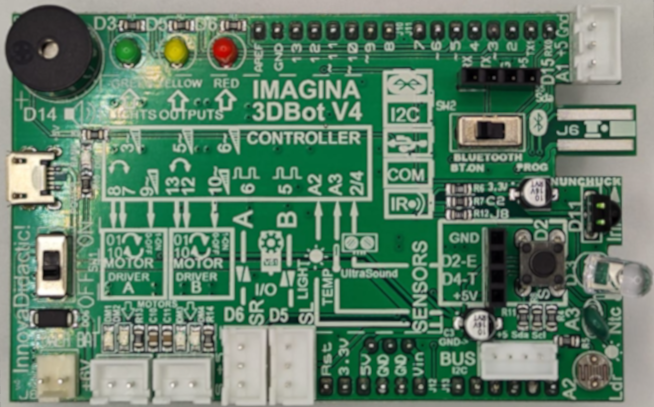

# Placa Imagina 3DBot
El aspecto de la cara anterior o top de la placa se ve en la imagen siguiente:

  
*Cara top de la placa Imagina*

En la imagen siguiente vemos la placa con un módulo Bluetooth insertado en su zócalo.

  
*Cara top de la placa Imagina con un módulo Bluetooth*

El aspecto de la cara posterior o bottom de la placa se ve en la imagen siguiente:

  
*Cara bottom de la placa Imagina*

La imagen siguiente nos muestra de forma gráfica la funcionalidad de los distintos elementos de la placa Imagina 3DBot V4:

  
*Elementos que conforman  la placa Imagina*

