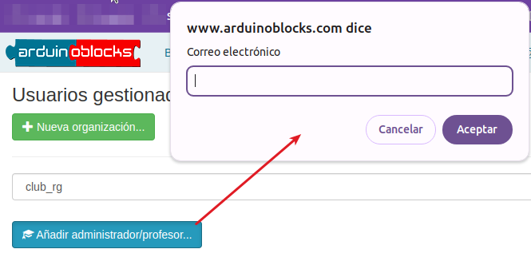

# Usuarios gestionados
Permite a un usuario registrado con correo electrónico, crear y administrar nuevas cuentas de usuario dentro de una organización, centro educativo o institución.

Permite a los profesores crear usuarios para sus alumnos.

Permite crear cuentas a usuarios que no disponen de correo electrónico o que su correo está limitado por políticas del centro.

Los usuarios pueden fijar su propia clave, el administrador podrá regenerar nuevas claves en caso de pérdida.

Los usuarios gestionados tienen algunas limitaciones:

- No pueden compartir proyectos públicamente ni con otros usuarios.
- No pueden importar proyectos desde archivo ni desde otros proyectos compartidos.
- No pueden adjuntar archivos a los proyectos.
- La información del perfil sólo la puede modificar el administrador/profesor.
- Pueden crear proyectos personales y se podrán unir a proyectos como estudiante si el código de proyecto pertenece a un profesor que es administrador de la organización.

  
*Usuarios gestionados*  

Para acceder, una vez iniciada sesión en Arduinoblocks, hacemos clic sobre nuestro nombre de usuario (parte superior derecha) y escogemos 'Usuarios gestionados'.

  
*Acceso a Usuarios gestionados*  

## **Crear organización**
Haz clic en el botón 'Nueva organización':

  
*Nueva organización*  

* El nombre de la organización debe representar al centro, organización, academia, institución, curso, ...
* La longitud mínima del nombre es de 6 caracteres.
* Los caracteres permitidos son: **a-z 0-9 _**
* No se permiten espacios ni letras mayúsculas en el nombre
* Dentro de la organización las cuentas serán: [nombre].[organización]

Escribe el nombre de la organización y clica en el botón 'Nuevo dominio':

  
*Nuevo dominio*  

Aparecerá una página con un contenido similar al siguiente:

  
*Usuarios gestionados con un dominio*  

## **Crear usuario gestionado**

* No podrán crearse dos usuarios iguales para la misma organización.
* El usuario no podrá cambiar ni el identificador de usuario ni el nombre descriptivo.
* El usuario podrá cambiar su clave.
* La longitud mínima del identificador es de 6 caracteres.
* Los caracteres permitidos son: **a-z 0-9 _**

Haz clic en el botón 'Nuevo usuario':

  
*Nuevo usuario gestionado*  

Cuando tengamos los datos listos hacemos clic en el botón 'Nuevo usuario gestionado' y en la página de 'Usuarios gestionados' mostrará el nuevo usuario:

  
*Nuevo usuario gestionado*  

Diferencias entre los perfiles de administrador principal y usuario gestionado:

  
*Diferencias entre usuarios*  

## **Eliminar organización y/o usuarios**
Justo debajo de la lista de usuarios tenemos los dos botones siguientes:

  
*Botones eliminar usuarios y organización*  

Con el botón 'Eliminar todos los usuarios' podemos eliminar todos los usuarios de una organización. Con el botón 'Eliminar organización + todos los usuarios' se eliminarán la organización y todos los usuarios y sus proyectos.

El único usuario que dispone de estas dos opciones es el creador del dominio.

Para aliminar un usuario concreto tenemos disponible la papelera a la derecha de su nombre.

## **Añadir coadministradores**

* Podemos añadir a otros usuarios como coadministradores de la organización.
* Sólo el usuario administrador principal (creador de la organización) puede eliminarlos.
* Los usuarios coadministradores no pueden añadir ni eliminar otros coadministradores.
* Los usuarios coadministradores pueden gestionar a los usuarios como el usuario administrador principal.

Para añadir un coadministrador, en la página principal de usuarios gestionados, hacemos clic en el botón 'Añadir administrador/profesor...'. Pedirá el correo electrónico del coadministrador:

  
*Añadiendo usuario coadministrador*  

## **Iniciar sesión desde una cuenta gestionada**
En la ventana de inicio de sesión, en 'Correo electrónico' el usuario debe escribir el correo electrónico otorgado en la organización que tendrá un formato de tipo 'nombre.organización':

  
*Inicio de sesión como usuario gestionado*  

## **Nuevo proyecto de usuario gestionado**
Una vez iniciada la sesión, el usuario gestionado puede iniciar un nuevo proyecto personal clicando en el botón 'Mis proyectos' o unirse al proyecto de un profesor clicando en el botón 'Empezar un nuevo proyecto!':

  
*Opciones tras inicio de sesión de usuario gestionado*  

En el primer caso se mostrará un listado de los proyectos del usuario gestionado y en el segundo caso el usuario gestionado puede iniciar un proyecto personal o escribir el código del proyecto y clicar en el botón 'Unirme al proyecto de mi profesor':

  
*Opciones de 'Empezar un nuevo proyecto!'*  

***
**IMPORTANTE: El profesor que genera el código debe ser administrador de la organización a la que pertenece el usuario.**
***

