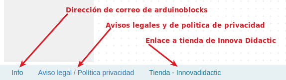

# Introducción a Arduinoblocks
**Arduinoblocks** es una plataforma web de funcionamiento en línea (online) donde podemos programar las placas soportadas de forma visual sin necesidad de conocer el lenguaje C++ que utiliza el IDE de Arduino, aunque dicho lenguaje en realidad está detrás de los bloques. Las placas soportadas a fecha de publicación de esta web son:

  
*Placas soportadas*

La programación con **Arduinoblocks** se hace con bloques al estilo de App Inventor, Scratch, Snap!, MicroBlocks u otros. No hay que escribir líneas de código y no nos permitirá unir bloques incompatibles, evitando así posibles errores de sintaxis.

La plataforma **Arduinoblocks** genera, compila y sube el programa a la placa por medio de la conexión USB. Una vez subido el programa, la placa microcontrolada no necesitará estar conectada al ordenador para funcionar, pudiendola alimentar con baterias o una fuente de alimentación para que funcione de forma autonoma.

**Arduinoblocks** actualmente funciona con los navegadores de última generación: Mozilla Firefox, Google Chrome, Falkon, Chromium, Microsof Edge, Opera y Safari.

Registrándonos como usuarios en la plataforma **Arduinoblocks** podemos aprovechar las siguientes posibilidades:

- Guardar tus proyectos en la nube de **ArduinoBlocks**
- Añadir información al proyecto: descripción, componentes utilizados, imágenes, etc.
- Añadir archivos adjuntos relacionados con el proyecto: esquemas, fotos, archivos para impresión 3D, aplicaciones…
- Compartir proyectos con el resto del mundo
- Importar proyectos compartidos por otros usuarios
- Valorar y comentar proyectos
- Programar directamente la placa microcontrolada desde el propio navegador (con la aplicación ArduinoBlocks-Connector)
- Utilizar la consola serie desde el propio navegador

## Software necesario
Para llevar a cabo la **programación** de las **actividades** es necesario estar registrado en **Arduinoblocks** y se recomienda hacerlo con un nombre real para posteriormente facilitar la localización si es necesaria y se tiene que hacer con un correo válido pues se necesita confirmación para crear la cuenta.

* La tarea es sencilla y está perfectamente descrita en el Free Book (online & updated) que podemos encontrar en los recursos de la plataforma [www.arduinoblocks.com](www.arduinoblocks.com).
* Creamos un "nuevo usuario" utilizando para ello una cuenta de correo válida donde vamos a recibir un correo de confirmación para activarla.
* Ya estamos en condiciones de crear nuestros propios proyectos en la plataforma como veremos mas adelante.

  
*Crear un nuevo proyecto*

* Descarga e instala en tu ordenador y para tu sistema operativo la última versión de [ArduinoBlocks - Connector](http://www.arduinoblocks.com/web/site/abconnector5). Este programa vamos a necesitarlo para poder comunicar nuestra placa con la plataforma a través del puerto USB de nuestro ordenador.

En los manuales de referencia disponibles en la plataforma están todos los detalles sobre como llevar a cabo estas tareas. La versión 5 del programa una vez iniciado la vemos en la imagen siguiente:

El programa debe estar en ejecución, minimizado para que no nos moleste, siempre que queramos grabar un programa y tiene el aspecto que vemos en la figura siguiente:

  
*ArduinoBlocks Connector*

## **Plataforma**
El aspecto de la plataforma al entrar lo vemos en la imagen siguiente:

  
*Portada de la plataforma ArduinoBlocks*

Podemos programar nuestra placa de control de diversas formas de las que las mas comunes son, a partir del IDE de Arduino o mediante bloques, que será el método que sigamos. Programar mediante el IDE requiere teclear instrucciones de código mientras que con ArduinoBlocks estas instrucciones se sustituyen por bloques tipo puzzle que evitan errores de sintaxis. Evidentemente detrás de cada bloque en realidad lo que hay son instrucciones y **Arduinoblocks** nos va a permitir verlas y exportarlas. En la imagen siguiente tenemos una comparativa entre bloques de código e instrucciones en el IDE.

  
*Comparativa entre bloques y código*

Es importante entender que la programación con **Arduinoblocks** simplifica la iniciación en el pensamiento computacional permitiendo realizar tareas complejas de una forma sencilla.

### Inicio de sesión
Para trabajar tenemos que iniciar sesión haciendo clic en **Iniciar sesión**:

  
*Botón y entrada inicio de sesión*

Una vez iniciada sesión tendremos acceso a nuestros proyectos en la nube y a todas las ventajas de la comunidad **Arduinoblocks**.

### Creación de un nuevo proyecto
Para iniciar un nuevo proyecto hacemos clic en el menú Proyectos --> Nuevo proyecto:

  
*Nuevo proyecto*

Seleccionamos el tipo de proyecto:

  
*Tipo de proyecto*

En caso de seleccionar un proyecto personal (el caso mas usual) a continuación tenemos que seleccionar el tipo de placa a utilizar. Hay que indicar un nombre descriptivo, preferiblemente corto, y una descripción mas detallada. En la sección componentes se puede indicar el listado de material necesario para el llevar a cabo el proyecto.

  
*Datos del proyecto*

Los editores de texto asociados son muy sencillos de manejar y se pueden crear enlaces a información detallada del componente o donde comprarlo.

### Area de programación
En la figura siguiente vemos destacadas las principales secciones del área de programación.

  
*Principales secciones del área de programación*

Para añadir bloques al programa los arrastramos desde la barra de herramientas al área de programación, insertandolos dentro del bloque Inicializar o del bloque Bucle, o independiente si se trata de una función.

Los bloques que estén fuera del bloque Inicializar o del bloque Bucle del programa principal serán ignorados a la hora de generar el programa (excepto los bloques de funciones).

**Arduinoblocks** genera el código C++ a partir de los bloques. El programa puede compilarse y subirse directamente a la placa gracias a la aplicación Arduinoblocks-Connector. Sin embargo, si queremos ver o descargar el código lo podemos hacer desde el área de bloques.

  
*Descarga o visualización del código*

Si descargamos o copiamos el código generado por Arduinoblocks en el IDE de Arduino podemos necesitar algunas librerías no incluidas en nuestro IDE.

Para solucionarlo debemos descargarlas y añadirlas a Arduino IDE para una correcta compilación del programa, o utilizar la opción descargar .zip para Arduino IDE, lo que nos facilitará un archivo comprimido con el código de nuestro programa y todas las librerías necesarias incluidas en la misma carpeta.

Más información sobre las [librerías de ArduinoBlocks](http://www.arduinoblocks.com/web/help/libraries)

La opción más rápida y sencilla es la compilación y programación directa desde el propio navegador junto a la aplicación [ArduinoBlocks-Connector](http://www.arduinoblocks.com/web/site/abconnector5)

### Area de información
Un proyecto electrónico debe estar siempre correctamente documentado.

En la sección *Información* podemos añadir información o modificar la indicada durante la creación del proyecto.

  
*Información del proyecto*

En la figura siguiente vemos un ejemplo de documentación para un proyecto concreto.

  
*Información del proyecto*

Seleccionando la opción *Proyecto público* podemos hacer que nuestro proyecto esté disponible de forma pública para que otros usuarios lo busquen y localicen (sin posibilidad de editar) y que puedan importar una copia para tenerlo dentro de sus propios contenidos.

  
*Información del proyecto: Proyecto público*

Al marcar nuestro proyecto como "público" aparecerá en la lista de búsqueda de proyectos compartidos para todos los usuarios de Arduinoblocks.

### Area de ficheros adjuntos
De igual forma podemos adjuntar imágenes, hojas de datos o cualquier otro archivo relacionado con el proyecto.

  
*Archivos*

### Guardar
**Arduinoblocks** guarda automáticamente el proyecto cada cierto tiempo. En el caso de querer asegurarnos el guardado podemos clicar en el botón “Guardar”.

  
*Guardar*

También podemos crear un nuevo proyecto a partir de la actual pulsando la opción "Guardar como...". Automáticamente se abrirá el nuevo proyecto creado a partir del primero.

### Barra de información
En la parte inferior derecha podemos obtener la información de guardado y algunos avisos que nos muestra la aplicación.

  
*Barra de información*

En la parte inferior izquierda de la barra tenemos las opciones que se muestran en la figura siguiente:

  
*Barra de información*

### Importar proyecto
Si accedemos a visualizar un proyecto compartido por otro usuario, aparecerá un botón “Importar a mis proyectos”, con el que podemos crear una copia del proyecto a nuestros proyectos personales para poder modificarlo según nuestras propias necesidades. En la animación vemos el proceso de búsqueda, su resultado y como nos aparece el botón *Importar a mis proyectos* cuando seleccionamos uno de ellos.

  
*Importar proyecto*

El resultado de hacer clic en el botón *Importar a mis proyectos* lo vemos en la figura siguiente:

  
*Importar proyecto*

### Iconos del editor

  
*Iconos del editor*

En el [video](https://www.facebook.com/watch/?v=384200869917887) podemos ver el uso de la mochila.

## **Área de programación**

### Estructura de un proyecto
Un proyecto tipo Arduino tiene siempre dos estructuras importantes en su interior, y esto se ve reflejado claramente al crear un nuevo proyecto en Arduinoblocks:

* Bloque 'Inicializar' o 'Setup'

    El contenido de este bloque se ejecuta una sola vez duante el inicio del microcontrolador, o si pulsamos el botón de reset y la placa se reinicia
    
    El bloque se utiliza para inicializar variables, configurar sensores, actuadores, periféricos, etc

* Bloque 'Bucle' o 'Loop'

    El contenido de este bloque se repite indefinidamente
    
    Dentro de este bloque añadiremos los bloques de nuestro programa con la funcionalidad deseada

**Cualquier bloque que no esté dentro del bloque 'Inicializar' o del bloque 'Bucle' y no forme parte de una función será ignorado a la hora de compilar el código.**

En la figura siguiente vemos un ejemplo que al al iniciar se establece la variable a 0; se envía y se incrementa cada segundo indefinidamente.

  
*[Enlace a ejemplo 3DB_Ej1](http://www.arduinoblocks.com/web/project/1645783)*

En el siguiente ejemplo, al iniciar (o hacer reset) se envía un mensaje por el puerto serie; el LED rojo se enciende; espera 500 ms; se apaga y espera otros 500 ms (este ciclo se repetirá indefinidamente).

  
*[Enlace a ejemplo 3DB_Ej2](http://www.arduinoblocks.com/web/project/1645788)*

**Importante**: el “bootloader”  normalmente tiene configurada la opción de realizar un reset al microcontrolador cuando se inicia una conexión serie. Por tanto, si conectamos con la consola serie del ordenador hay que tener en cuenta que se reiniciará el programa y se ejecutará el bloque “Inicializar”.

### Configuración de bloques
Algunos bloques permiten configurar o alterar su funcionamiento. Para desplegar las opciones posibles pulsamos sobre el icono superior izquierdo del bloque con apariencia de signo mas (+). En la animación siguiente vemos ejemplos de lo dicho.

  
*Configurando bloques*  

### Comentarios
Si necesitamos añadir un comentario a un bloque desplegamos las opciones del mismo clicando con el botón derecho del ratón y escogiendo 'Añadir comentario', aparecerá un signo de interrogación sobre el que podemos hacer clic para que se abra un bocadillo de texto donde podemos escribir nuestro comentario.

  
*Comentarios*  

Otras opciones de bloque disponibles al pulsar el botón derecho del ratón son:

  * Duplicar
    Crea una copia del bloque actual

* Entradas externas (en linea)
    Modifica el aspecto del bloque de forma compacta o una línea

* Contraer / Expandir bloque
    Reduce el tamaño del bloque para ahorrar espacio mientras no necesitamos editarlo

* Desactivar bloque
    El compilador no tendrá en cuenta este bloque

* Eliminar / Eliminar x bloques
    Elimina el bloque o el conjunto de bloques

* Ayuda
    Abre un enlace con ayuda sobre la función del bloque.
