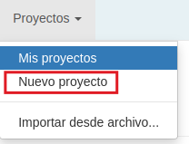
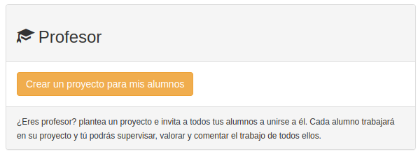
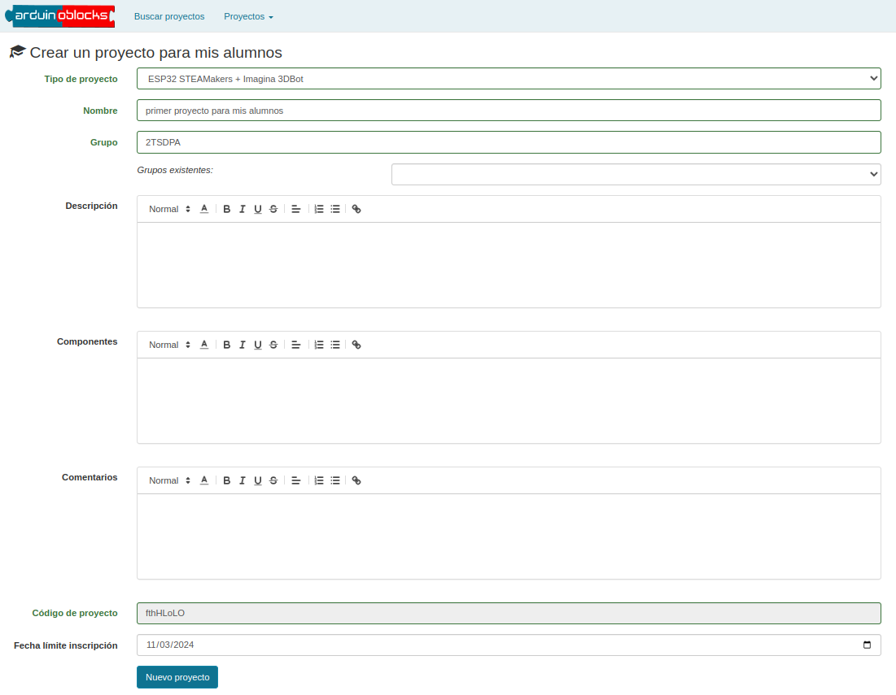
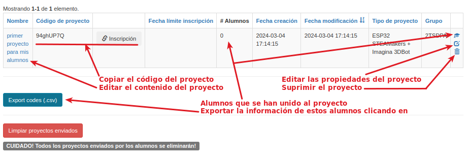
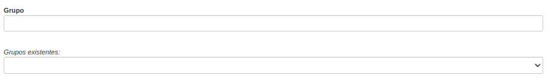
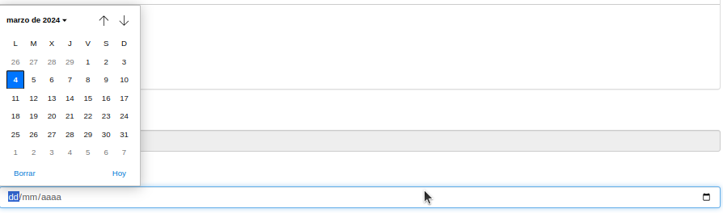

# Creación de proyectos para alumnos
Tanto si tus alumnos se han dado de alta con una cuenta propia como si has creado sus usuarios gestionados, como profesor puedes crear proyectos e invitar a tus alumnos a unirse a ellos.

De esta forma, cada alumno trabajará en su proyecto y tú podrás supervisar, valorar y comentar el trabajo realizado por todos ellos.

Empieza iniciando sesión en ArduinoBlocks y clicando en Proyectos → Nuevo proyecto:

  
*Creación de un nuevo proyecto*  

De las 3 opciones que aparecen, elige la de 'Crear un proyecto para mis alumnos':

  
*Crear un proyecto para mis alumnos*  

Selecciona el 'Tipo de proyecto' y escribe un 'Nombre'. Éstos son los dos campos obligatorios del formulario. El resto de campos es opcional. Pulsa en el botón 'Nuevo proyecto':

  
*Crear un proyecto para mis alumnos*  

El nuevo proyecto aparece en la página 'Mis proyectos':

  
*Proyecto para alumnos*  

¡Ten cuidado! ¡La acción de borrado es irreversible!

En la página de creación/edición de un proyecto para alumnos puedes crear un grupo nuevo o seleccionar un grupo de entre los existentes (creados anteriormente). Esta opción la encontrarás en el tercer campo del formulario:

  
*Seleccionar grupo*  

También puedes establecer una fecha límite para la inscripción en el proyecto. Esta opción la encontrarás en el último campo del formulario:

  
*Fecha límite de inscripción*  

